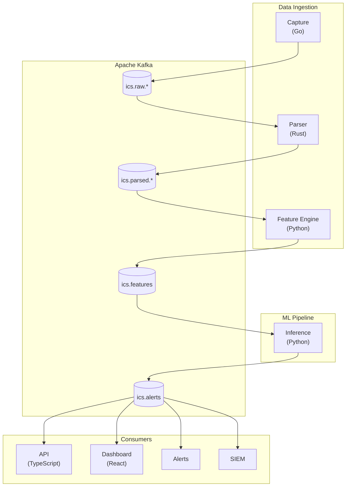

# ICS Network Anomaly Detection Engine

A machine learning system for detecting anomalies in Industrial Control System (ICS) network traffic.

## Overview

This project demonstrates expertise in:

- **Time-series anomaly detection** for ICS/OT environments
- **End-to-end ML pipelines** from data ingestion to alerting
- **Production-ready architecture** with monitoring and observability
- **Domain-specific security** understanding of ICS protocols and threats

## Architecture



## Quick Start

```bash
# Clone the repository
git clone https://github.com/caverac/ics-anomaly-detection.git
cd ics-anomaly-detection

# Install dependencies
yarn install

# Start the documentation site
yarn docs:dev
```

## Documentation

Full documentation is available at the docs site:

```bash
yarn docs:dev
# Open http://localhost:3000
```

Documentation includes:

- [Architecture](/architecture/system-context) - System design and C4 diagrams
- [ML Pipeline](/ml-pipeline/data-ingestion) - Feature engineering and models
- [Simulation](/simulation/traffic-generator) - Attack scenario testing
- [Operations](/operations/monitoring) - Monitoring and alerting

## Project Structure

```
ics-anomaly-detection/
├── packages/
│   ├── capture/        # Go - Packet capture from network interfaces
│   ├── parser/         # Rust - ICS protocol parsing (Modbus, DNP3, OPC-UA)
│   ├── feature-engine/ # Python - Time-window feature extraction
│   ├── simulator/      # Python - ICS traffic simulation
│   ├── docs/           # Docusaurus documentation site
│   ├── api/            # TypeScript REST API (coming soon)
│   └── dashboard/      # React dashboard (coming soon)
├── config/             # Grafana/Prometheus configuration
├── docker-compose.yml  # Local development stack
├── package.json        # Yarn workspaces monorepo
└── Makefile            # Build automation
```

## Technology Stack

| Layer | Technology |
|-------|------------|
| Language | TypeScript, Python, Go, Rust |
| ML Framework | PyTorch, scikit-learn |
| Stream Processing | Apache Kafka |
| Storage | TimescaleDB, PostgreSQL, Redis |
| Monitoring | Prometheus, Grafana |
| Containerization | Docker, Kubernetes |

## Skills Demonstrated

- **Machine Learning**: Anomaly detection (Isolation Forest, LSTM-AE, One-Class SVM)
- **Time Series Analysis**: Feature engineering from ICS traffic patterns
- **Production Systems**: Model serving, monitoring, versioning
- **ICS/OT Security**: Protocol parsing (Modbus, DNP3, OPC-UA), threat detection
- **System Design**: Microservices, event streaming, observability

## License

MIT
