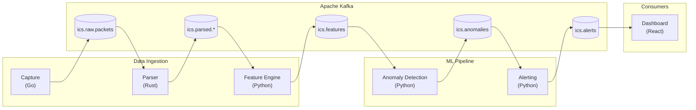

# ICS Network Anomaly Detection Engine

A machine learning system for detecting anomalies in Industrial Control System (ICS) network traffic.

## Overview

This project demonstrates expertise in:

- **Time-series anomaly detection** for ICS/OT environments
- **End-to-end ML pipelines** from data ingestion to alerting
- **Production-ready architecture** with monitoring and observability
- **Domain-specific security** understanding of ICS protocols and threats

## Architecture



## Quick Start

```bash
# Clone the repository
git clone https://github.com/caverac/ics-anomaly-detection.git
cd ics-anomaly-detection

# Install Node.js dependencies
yarn install

# Start the full pipeline with dashboard
make dev-dashboard

# Open the dashboard
open http://localhost:3090
```

## Tooling

This project uses two tools with clear responsibilities:

| Tool       | Responsibility                                             |
| ---------- | ---------------------------------------------------------- |
| **`make`** | Docker/infrastructure operations, starting services        |
| **`yarn`** | Code quality (lint, format, typecheck), building artifacts |

### Development Commands (make)

```bash
make dev            # Start Kafka + Simulator + Parser + Feature Engine
make dev-full       # Add Anomaly Detection
make dev-alerting   # Add Alerting Service
make dev-dashboard  # Add React Dashboard (full pipeline)
make debug          # Add Kafka UI at localhost:8080
make monitoring     # Add Prometheus + Grafana
make status         # Show status of all services
make clean          # Remove all containers and volumes
```

### Code Quality Commands (yarn)

```bash
yarn lint           # Lint JS/TS code
yarn format         # Check formatting
yarn typecheck      # TypeScript checks
yarn test           # Run tests
yarn build          # Build docs + dashboard
yarn dev:docs       # Start docs dev server
yarn dev:dashboard  # Start dashboard dev server
```

### Test Attack Simulation

```bash
# Start reconnaissance attack
curl -X POST http://localhost:8083/attack/start \
  -H "Content-Type: application/json" \
  -d '{"mode": "reconnaissance"}'

# View alerts
curl http://localhost:8084/alerts | jq

# View incidents
curl http://localhost:8084/incidents | jq
```

## Documentation

Full documentation is available at the docs site:

```bash
yarn dev:docs
# Open http://localhost:3000
```

## Project Structure

```
ics-anomaly-detection/
├── packages/
│   ├── capture/           # Go - Packet capture from network interfaces
│   ├── parser/            # Rust - ICS protocol parsing (Modbus, DNP3, OPC-UA)
│   ├── feature-engine/    # Python - Time-window feature extraction
│   ├── anomaly-detection/ # Python - ML-based anomaly detection (ensemble models)
│   ├── alerting/          # Python - Alert correlation, deduplication, notifications
│   ├── dashboard/         # React - Real-time monitoring dashboard
│   ├── simulator/         # Python - ICS traffic simulation & attack scenarios
│   └── docs/              # Docusaurus documentation site
├── .github/workflows/     # GitHub Actions CI/CD
├── config/                # Grafana/Prometheus configuration
├── docker-compose.yml     # Local development stack
├── package.json           # Yarn workspaces monorepo
└── Makefile               # Docker/infrastructure automation
```

## Services

| Service           | Port | Description                  |
| ----------------- | ---- | ---------------------------- |
| Dashboard         | 3090 | React monitoring UI          |
| Docs              | 3000 | Docusaurus documentation     |
| Alerting API      | 8084 | Alert/incident management    |
| Simulator API     | 8083 | Traffic simulation control   |
| Anomaly Detection | 8085 | ML inference service         |
| Feature Engine    | 8082 | Feature extraction metrics   |
| Kafka             | 9094 | External broker access       |
| Kafka UI          | 8080 | Topic browser (debug mode)   |
| Grafana           | 3001 | Dashboards (monitoring mode) |
| Prometheus        | 9090 | Metrics (monitoring mode)    |
| Redis             | 6379 | Incident state storage       |

## Technology Stack

| Layer             | Technology                       |
| ----------------- | -------------------------------- |
| Languages         | Python, Go, Rust, TypeScript     |
| ML Framework      | PyTorch, scikit-learn            |
| Stream Processing | Apache Kafka (KRaft mode)        |
| Storage           | Redis                            |
| Frontend          | React 19, Vite 7, Tailwind CSS 4 |
| Monitoring        | Prometheus, Grafana              |
| Containerization  | Docker                           |

## ML Pipeline

The anomaly detection pipeline uses an ensemble of models:

- **Isolation Forest** - Unsupervised outlier detection
- **LSTM Autoencoder** - Sequence-based anomaly detection
- **One-Class SVM** - Boundary-based classification

Features are extracted from 60-second time windows including:

- Inter-arrival time statistics (mean, std, min, max)
- Function code distribution and entropy
- Address range and access patterns
- Request/response ratios

## Alerting System

The alerting service provides:

- **Correlation Engine** - Groups anomalies by source/destination/protocol
- **Deduplication** - Suppresses duplicate alerts within time windows
- **Priority Escalation** - Automatic P4 → P1 escalation based on thresholds
- **Incident Management** - Acknowledge and resolve incidents via API
- **Notifications** - Console, webhook, and Slack channels

## CI/CD

The project includes GitHub Actions for continuous integration:

```bash
# Run JS/TS CI locally
yarn ci

# Run full CI (includes Docker builds)
yarn ci && make ci
```

The CI pipeline runs:

1. **Lint** - ESLint, Prettier, ruff, clippy, golangci-lint
2. **Typecheck** - TypeScript, mypy
3. **Test** - All unit tests
4. **Build** - Docs, dashboard, Docker images

## License

MIT
