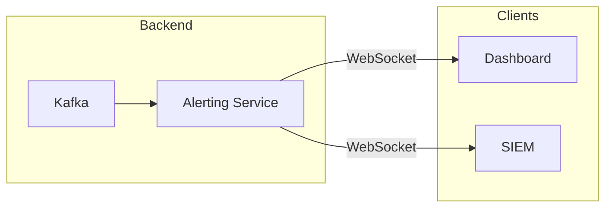

# WebSocket API

Real-time event streaming via WebSocket.

:::note Not Implemented
The WebSocket API described below is a planned feature for real-time alert streaming. It is not currently implemented in the system.

For real-time monitoring, use:

- **Dashboard**: http://localhost:5173 (polls alerting API)
- **Kafka Consumer**: Direct subscription to `ics.anomalies` or `ics.alerts` topics
  :::

## Planned Architecture



## Planned Connection

```javascript
const ws = new WebSocket('ws://localhost:8084/ws')

ws.onopen = () => {
  console.log('Connected to alert stream')
}

ws.onmessage = (event) => {
  const alert = JSON.parse(event.data)
  console.log('New alert:', alert)
}
```

## Planned Message Types

### Alert Event

```json
{
  "type": "alert",
  "data": {
    "id": "alert-123",
    "timestamp": "2024-01-15T10:30:00Z",
    "severity": "HIGH",
    "anomaly_type": "RECONNAISSANCE",
    "source_ip": "192.168.1.50",
    "ensemble_score": 0.89
  }
}
```

### Incident Update

```json
{
  "type": "incident_update",
  "data": {
    "id": "incident-456",
    "status": "ACTIVE",
    "priority": "P2",
    "anomaly_count": 5
  }
}
```

## Current Alternatives

### Dashboard Auto-Refresh

The React dashboard polls the alerting API every 5 seconds:

```typescript
// Dashboard uses React Query with auto-refetch
const { data: alerts } = useQuery({
  queryKey: ['alerts'],
  queryFn: fetchAlerts,
  refetchInterval: 5000
})
```

### Direct Kafka Subscription

For programmatic access, subscribe directly to Kafka topics:

```bash
# Watch anomalies in real-time
docker compose exec kafka kafka-console-consumer.sh \
  --bootstrap-server localhost:9092 \
  --topic ics.anomalies \
  --from-latest

# Watch alerts
docker compose exec kafka kafka-console-consumer.sh \
  --bootstrap-server localhost:9092 \
  --topic ics.alerts \
  --from-latest
```

### Python Kafka Consumer

```python
from confluent_kafka import Consumer

consumer = Consumer({
    'bootstrap.servers': 'localhost:9092',
    'group.id': 'my-alert-consumer',
    'auto.offset.reset': 'latest'
})

consumer.subscribe(['ics.alerts'])

while True:
    msg = consumer.poll(1.0)
    if msg is not None:
        alert = json.loads(msg.value())
        print(f"Alert: {alert['title']}")
```
