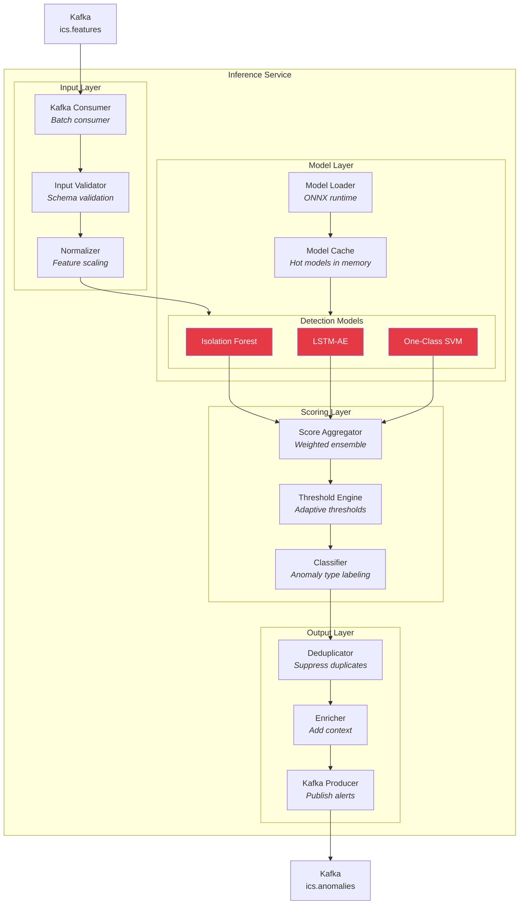
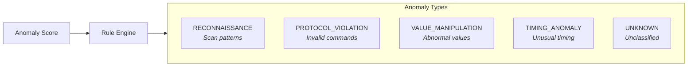
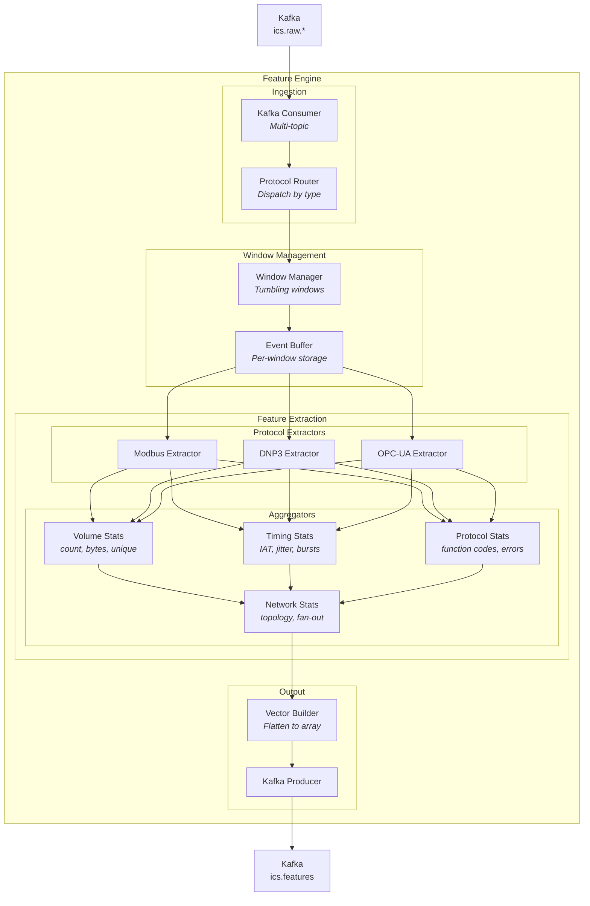
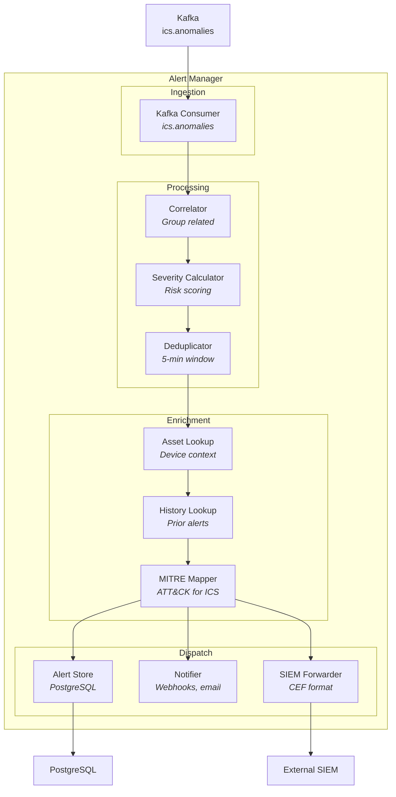
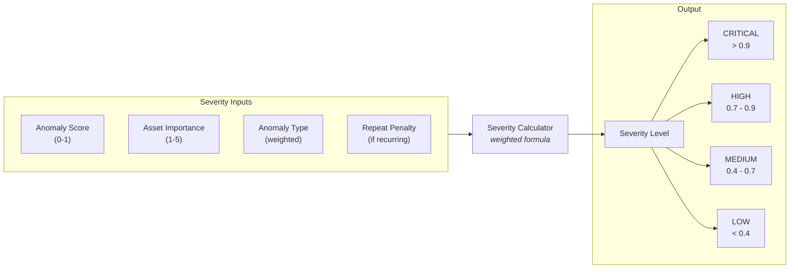

# Component Architecture

This page details the internal components of key containers.

## Inference Service Components

The Inference Service is the core ML engine responsible for real-time anomaly detection.



### Component Responsibilities

#### Input Layer

| Component       | Responsibility          | Key Logic                                 |
| --------------- | ----------------------- | ----------------------------------------- |
| Kafka Consumer  | Consume feature vectors | Batch consumption (100 msgs), auto-commit |
| Input Validator | Validate feature schema | JSON Schema validation, null handling     |
| Normalizer      | Scale features          | Z-score normalization using stored stats  |

#### Model Layer

| Component        | Responsibility             | Key Logic                                 |
| ---------------- | -------------------------- | ----------------------------------------- |
| Model Loader     | Load models from registry  | ONNX format, warm-up inference            |
| Model Cache      | Keep models in memory      | LRU cache, version tracking               |
| Isolation Forest | Point anomaly detection    | Ensemble of 100 trees, contamination=0.01 |
| LSTM-AE          | Sequence anomaly detection | 2-layer LSTM, reconstruction error        |
| One-Class SVM    | Boundary-based detection   | RBF kernel, nu=0.01                       |

#### Scoring Layer

| Component        | Responsibility       | Key Logic                               |
| ---------------- | -------------------- | --------------------------------------- |
| Score Aggregator | Combine model scores | Weighted average (configurable weights) |
| Threshold Engine | Dynamic thresholding | Per-device, time-of-day adaptive        |
| Classifier       | Label anomaly type   | Rule-based + learned patterns           |

**Anomaly Type Classification:**



#### Output Layer

| Component      | Responsibility            | Key Logic                           |
| -------------- | ------------------------- | ----------------------------------- |
| Deduplicator   | Suppress duplicate alerts | Time window (5min), similarity hash |
| Enricher       | Add contextual data       | Device info, historical baseline    |
| Kafka Producer | Publish to alert topic    | Async batched writes                |

---

## Feature Engine Components



### Window Management Strategy

```mermaid
gantt
    title Feature Windows
    dateFormat X
    axisFormat %s

    section 1-minute
    Window 1  :0, 60
    Window 2  :60, 120
    Window 3  :120, 180

    section 5-minute
    Window 1  :0, 300
    Window 2  :300, 600

    section 15-minute
    Window 1  :0, 900
```



**Window Configuration:**

| Window    | Duration | Overlap | Use Case                |
| --------- | -------- | ------- | ----------------------- |
| 1-minute  | 60s      | 0%      | High-frequency patterns |
| 5-minute  | 300s     | 0%      | Medium-term trends      |
| 15-minute | 900s     | 0%      | Long-term baselines     |

### Feature Vector Structure

```typescript
interface FeatureVector {
  // Metadata
  timestamp: string
  window_end: string
  source_ip: string
  dest_ip: string
  protocol: string

  // Volume features (per window size)
  msg_count_1m: number
  msg_count_5m: number
  msg_count_15m: number
  bytes_total_1m: number
  bytes_total_5m: number
  unique_sources_5m: number

  // Timing features
  inter_arrival_mean_1m: number
  inter_arrival_std_1m: number
  inter_arrival_max_1m: number
  burst_score_1m: number

  // Protocol features (Modbus example)
  function_code_entropy_5m: number
  read_write_ratio_5m: number
  error_rate_5m: number
  new_register_addresses_5m: number

  // Network features
  unique_device_pairs_15m: number
  fan_out_ratio_15m: number
  scan_score_15m: number

  // Total: ~150 features
}
```

---

## Alert Manager Components



### Severity Calculation



**Severity Formula:**

```
severity = (anomaly_score * 0.4) +
           (asset_importance / 5 * 0.3) +
           (type_weight * 0.2) +
           (repeat_penalty * 0.1)
```

### MITRE ATT&CK for ICS Mapping

| Anomaly Type       | MITRE Technique                          |
| ------------------ | ---------------------------------------- |
| RECONNAISSANCE     | T0846 - Remote System Discovery          |
| PROTOCOL_VIOLATION | T0855 - Unauthorized Command Message     |
| VALUE_MANIPULATION | T0879 - Damage to Property               |
| TIMING_ANOMALY     | T0882 - Theft of Operational Information |
