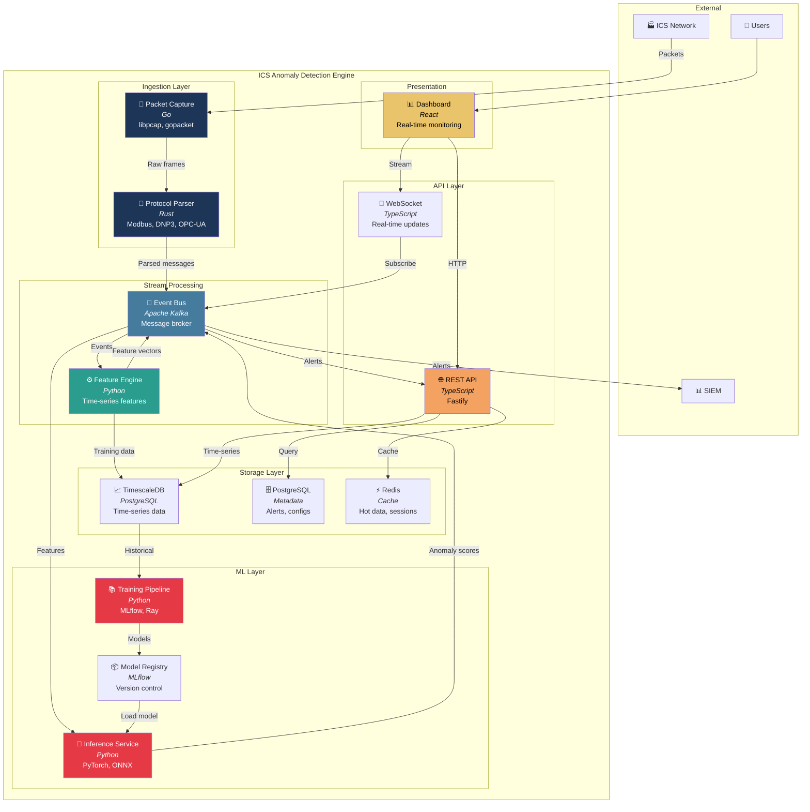
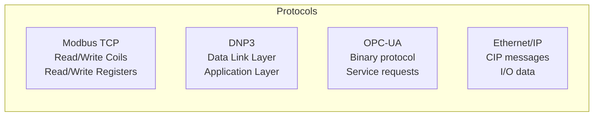
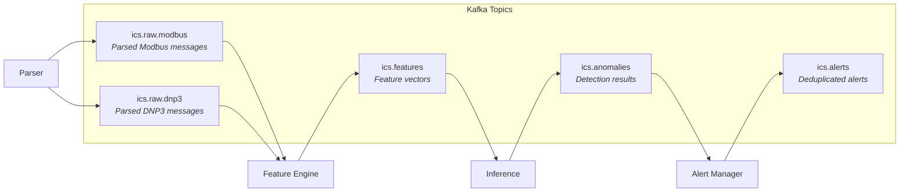
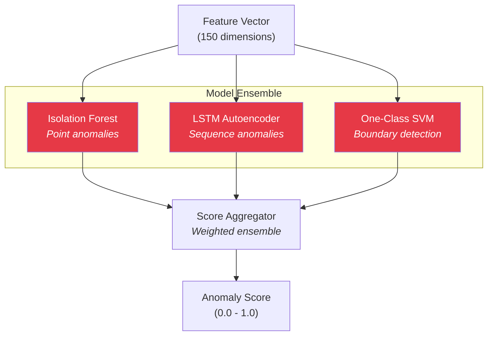
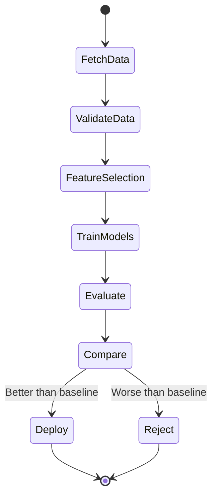

# Container Architecture

The Container diagram shows the high-level technical building blocks of the system.

## Container Overview



## Container Details

### Ingestion Layer

#### Packet Capture Service

| Attribute | Value |
|-----------|-------|
| Language | Go |
| Purpose | High-performance packet capture |
| Libraries | libpcap, gopacket |
| Input | Network TAP / SPAN port |
| Output | Raw Ethernet frames to Parser |

**Key Responsibilities:**
- Zero-copy packet capture from network interface
- BPF filtering for ICS protocol ports
- Buffering for burst traffic handling
- Health monitoring and stats export

**Resource Profile:**
- CPU: Low (kernel-offloaded capture)
- Memory: 512MB buffer pool
- Network: Line-rate capable

#### Protocol Parser

| Attribute | Value |
|-----------|-------|
| Language | Rust |
| Purpose | ICS protocol dissection |
| Libraries | nom (parser combinators) |
| Input | Raw frames from Capture |
| Output | Structured messages to Kafka |

**Supported Protocols:**



**Output Schema (Kafka message):**

```json
{
  "timestamp": "2024-01-15T10:30:00.123Z",
  "protocol": "modbus",
  "src_ip": "192.168.1.10",
  "dst_ip": "192.168.1.100",
  "src_port": 49152,
  "dst_port": 502,
  "function_code": 3,
  "unit_id": 1,
  "register_address": 100,
  "register_count": 10,
  "response_time_ms": 12.5,
  "payload_size": 48,
  "raw_hex": "000100000006010300640010"
}
```

### Stream Processing Layer

#### Event Bus (Kafka)

| Attribute | Value |
|-----------|-------|
| Technology | Apache Kafka |
| Purpose | Event streaming backbone |
| Topics | See topic list below |

**Topic Architecture:**



**Retention Policy:**
- Raw messages: 7 days
- Features: 30 days
- Alerts: 1 year

#### Feature Engine

| Attribute | Value |
|-----------|-------|
| Language | Python |
| Purpose | Time-series feature extraction |
| Libraries | NumPy, Pandas, tsfresh |
| Input | Parsed protocol messages |
| Output | Feature vectors |

**Feature Categories:**

| Category | Features | Window |
|----------|----------|--------|
| Volume | msg_count, bytes_total, unique_sources | 1m, 5m, 15m |
| Timing | inter_arrival_mean, inter_arrival_std, burst_score | 1m, 5m |
| Protocol | function_code_dist, error_rate, new_unit_ids | 5m, 15m |
| Network | unique_pairs, fan_out_ratio, scan_score | 5m, 15m |
| Payload | register_entropy, value_change_rate, outlier_values | 1m, 5m |

### ML Layer

#### Inference Service

| Attribute | Value |
|-----------|-------|
| Language | Python |
| Framework | PyTorch (ONNX runtime) |
| Purpose | Real-time anomaly scoring |
| SLA | < 50ms p99 latency |

**Model Ensemble:**



#### Training Pipeline

| Attribute | Value |
|-----------|-------|
| Orchestration | Ray |
| Tracking | MLflow |
| Schedule | Daily retrain (configurable) |
| Data Source | TimescaleDB (labeled + unlabeled) |

**Training Workflow:**



### Storage Layer

#### TimescaleDB (Time-Series)

| Attribute | Value |
|-----------|-------|
| Base | PostgreSQL 15 |
| Extension | TimescaleDB 2.x |
| Purpose | Feature storage, historical analysis |

**Schema:**

```sql
-- Hypertable for features
CREATE TABLE features (
    time        TIMESTAMPTZ NOT NULL,
    source_ip   INET,
    dest_ip     INET,
    protocol    TEXT,
    features    JSONB,
    PRIMARY KEY (time, source_ip, dest_ip)
);

SELECT create_hypertable('features', 'time');

-- Continuous aggregates for dashboards
CREATE MATERIALIZED VIEW features_hourly
WITH (timescaledb.continuous) AS
SELECT
    time_bucket('1 hour', time) AS bucket,
    source_ip,
    AVG((features->>'msg_count')::float) AS avg_msg_count,
    MAX((features->>'anomaly_score')::float) AS max_anomaly
FROM features
GROUP BY bucket, source_ip;
```

### API Layer

#### REST API

| Attribute | Value |
|-----------|-------|
| Language | TypeScript |
| Framework | Fastify |
| Auth | JWT + API Keys |
| Docs | OpenAPI 3.0 |

**Key Endpoints:**

| Method | Path | Description |
|--------|------|-------------|
| GET | `/api/v1/alerts` | List alerts (paginated) |
| GET | `/api/v1/alerts/:id` | Alert details |
| PATCH | `/api/v1/alerts/:id` | Update alert status |
| GET | `/api/v1/devices` | Discovered devices |
| GET | `/api/v1/metrics` | System health metrics |
| POST | `/api/v1/models/reload` | Hot-reload models |

### Presentation Layer

#### Dashboard

| Attribute | Value |
|-----------|-------|
| Framework | React 18 |
| State | Zustand |
| Charts | Apache ECharts |
| Real-time | WebSocket |

**Key Views:**
- **Overview**: System health, alert summary, top anomalies
- **Alerts**: Filterable alert list with severity/status
- **Investigation**: Alert drill-down with context
- **Devices**: Asset inventory with baseline status
- **Models**: ML model performance metrics
