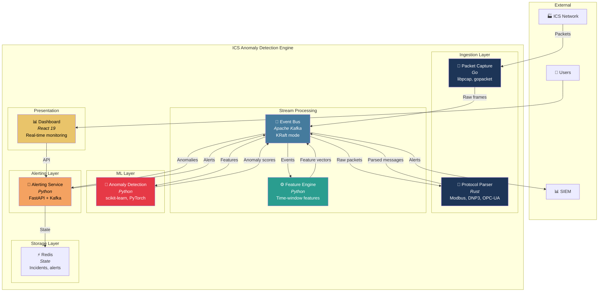
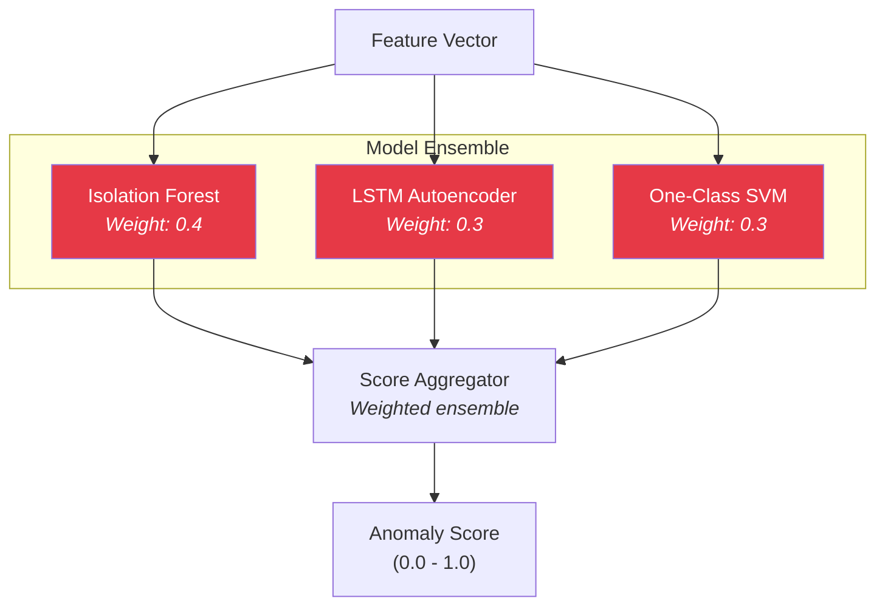

# Container Architecture

The Container diagram shows the high-level technical building blocks of the system.

## Container Overview



## Container Details

### Ingestion Layer

#### Packet Capture Service

| Attribute | Value |
|-----------|-------|
| Language | Go |
| Location | `packages/capture/` |
| Purpose | High-performance packet capture |
| Libraries | libpcap, gopacket |
| Input | Network TAP / SPAN port |
| Output | Raw Ethernet frames to Kafka |

**Key Responsibilities:**
- Zero-copy packet capture from network interface
- BPF filtering for ICS protocol ports
- Buffering for burst traffic handling
- Publishes to `ics.raw.packets` topic

#### Protocol Parser

| Attribute | Value |
|-----------|-------|
| Language | Rust |
| Location | `packages/parser/` |
| Purpose | ICS protocol dissection |
| Libraries | nom (parser combinators) |
| Input | Raw frames from Kafka |
| Output | Structured messages to Kafka |

**Supported Protocols:**

| Protocol | Port | Topic |
|----------|------|-------|
| Modbus TCP | 502 | `ics.parsed.modbus` |
| DNP3 | 20000 | `ics.parsed.dnp3` |
| OPC-UA | 4840 | `ics.parsed.opcua` |

**Output Schema (Kafka message):**

```json
{
  "timestamp": "2024-01-15T10:30:00.123Z",
  "protocol": "modbus",
  "src_ip": "192.168.1.10",
  "dst_ip": "192.168.1.100",
  "src_port": 49152,
  "dst_port": 502,
  "function_code": 3,
  "unit_id": 1,
  "address": 100,
  "quantity": 10,
  "is_response": false,
  "payload_size": 48
}
```

### Stream Processing Layer

#### Event Bus (Kafka)

| Attribute | Value |
|-----------|-------|
| Technology | Apache Kafka (KRaft mode) |
| Purpose | Event streaming backbone |
| Mode | Single-node, no Zookeeper |

**Topic Architecture:**

| Topic | Description | Producers | Consumers |
|-------|-------------|-----------|-----------|
| `ics.raw.packets` | Raw captured packets | Capture, Simulator | Parser |
| `ics.parsed.modbus` | Parsed Modbus messages | Parser | Feature Engine |
| `ics.parsed.dnp3` | Parsed DNP3 messages | Parser | Feature Engine |
| `ics.parsed.opcua` | Parsed OPC-UA messages | Parser | Feature Engine |
| `ics.features` | Feature vectors | Feature Engine | Anomaly Detection |
| `ics.anomalies` | Detection results | Anomaly Detection | Alerting |
| `ics.alerts` | Deduplicated alerts | Alerting | Dashboard, SIEM |

#### Feature Engine

| Attribute | Value |
|-----------|-------|
| Language | Python |
| Location | `packages/feature-engine/` |
| Purpose | Time-series feature extraction |
| Libraries | NumPy, confluent-kafka, pydantic |
| Input | Parsed protocol messages |
| Output | Feature vectors |

**Feature Categories:**

| Category | Features |
|----------|----------|
| Volume | message_count, bytes_total, bytes_mean, bytes_std |
| Timing | iat_mean, iat_std, iat_min, iat_max, iat_median |
| Protocol | fc_unique_count, fc_entropy, fc_read_ratio, fc_write_ratio |
| Address | addr_unique_count, addr_range, addr_mean, addr_std |

### ML Layer

#### Anomaly Detection Service

| Attribute | Value |
|-----------|-------|
| Language | Python |
| Location | `packages/anomaly-detection/` |
| Framework | scikit-learn, PyTorch |
| Purpose | Real-time anomaly scoring |
| Input | Feature vectors from Kafka |
| Output | Anomaly results to Kafka |

**Model Ensemble:**



**Classification Levels:**

| Level | Score Range | Description |
|-------|-------------|-------------|
| NORMAL | 0.0 - 0.3 | Expected behavior |
| SUSPICIOUS | 0.3 - 0.5 | Worth monitoring |
| ANOMALY | 0.5 - 0.8 | Significant deviation |
| CRITICAL | 0.8 - 1.0 | Likely attack |

### Alerting Layer

#### Alerting Service

| Attribute | Value |
|-----------|-------|
| Language | Python |
| Location | `packages/alerting/` |
| Framework | FastAPI, confluent-kafka |
| Purpose | Alert correlation and notification |
| API Port | 8084 |
| State | Redis |

**Components:**

| Component | Responsibility |
|-----------|---------------|
| Correlation Engine | Groups anomalies by src_ip:dst_ip:protocol |
| Deduplication Tracker | Suppresses duplicates within 60s window |
| Escalation Manager | Auto-escalates priority (P4→P1) based on count |
| Notification Manager | Dispatches to console, webhook, Slack, Splunk, Syslog |

**API Endpoints:**

| Method | Path | Description |
|--------|------|-------------|
| GET | `/health` | Health check |
| GET | `/metrics` | Prometheus metrics |
| GET | `/alerts` | List alerts |
| GET | `/alerts/{id}` | Get alert details |
| POST | `/alerts/{id}/acknowledge` | Acknowledge alert |
| GET | `/incidents` | List incidents |
| GET | `/incidents/{id}` | Get incident details |

### Storage Layer

#### Redis

| Attribute | Value |
|-----------|-------|
| Purpose | State storage for alerting |
| Data | Incidents, alerts, deduplication keys |

**Data Structures:**

| Key Pattern | Type | TTL |
|-------------|------|-----|
| `incident:{id}` | Hash | 24 hours |
| `alert:{id}` | Hash | 7 days |
| `dedup:{key}` | String | 60 seconds |
| `incidents:active` | Set | - |

### Presentation Layer

#### Dashboard

| Attribute | Value |
|-----------|-------|
| Framework | React 19 |
| Location | `packages/dashboard/` |
| Build Tool | Vite 7 |
| Styling | Tailwind CSS 4 |
| Port | 3090 |

**Key Views:**
- **Dashboard**: System health, alert summary
- **Alerts**: Filterable alert list with severity/status
- **Incidents**: Incident management with priority
- **Network**: Network topology view
- **Settings**: System status

**API Integration:**

The dashboard proxies requests through Vite to the alerting service:

```
Dashboard (:3090) → /api/* → Alerting Service (:8084)
```
