# Data Flow Architecture

This page describes how data flows through the system from capture to alert.

## End-to-End Data Flow

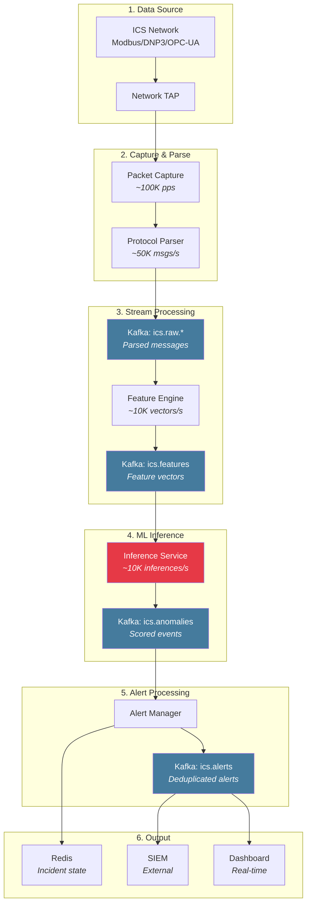

## Detailed Stage Flows

### Stage 1: Packet Capture Flow

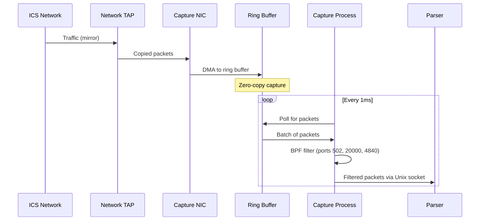

**Performance Characteristics:**

| Metric | Value |
|--------|-------|
| Max throughput | 10 Gbps line rate |
| Latency (TAP to Parser) | < 1ms p99 |
| Packet loss at max load | < 0.01% |
| Buffer size | 512MB ring buffer |

### Stage 2: Protocol Parsing Flow

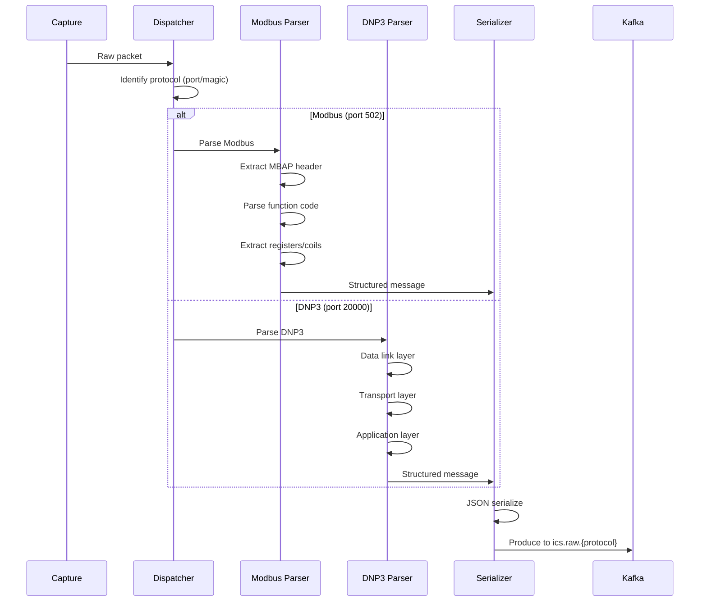

**Parser Output Schema:**

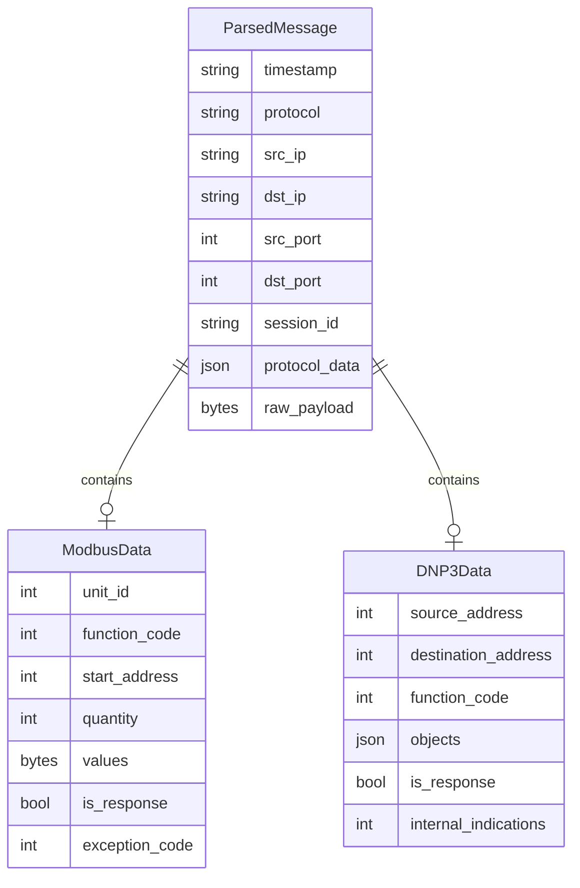

### Stage 3: Feature Extraction Flow

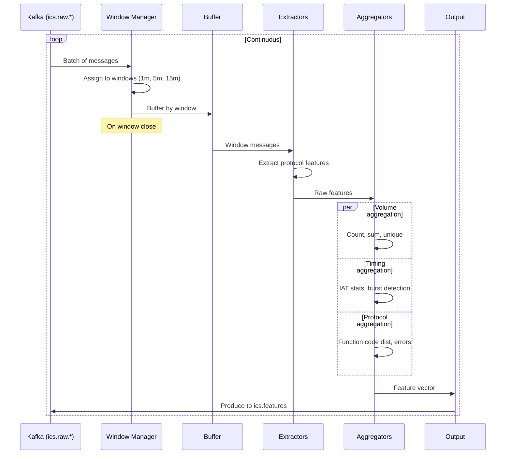

**Feature Window State Machine:**

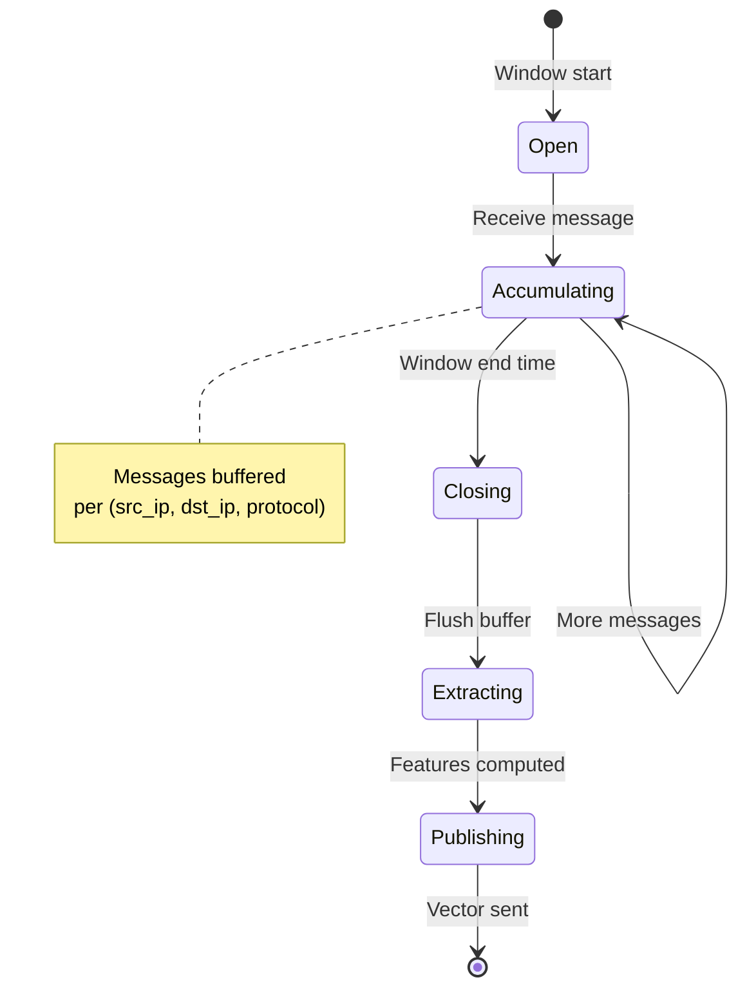

### Stage 4: ML Inference Flow

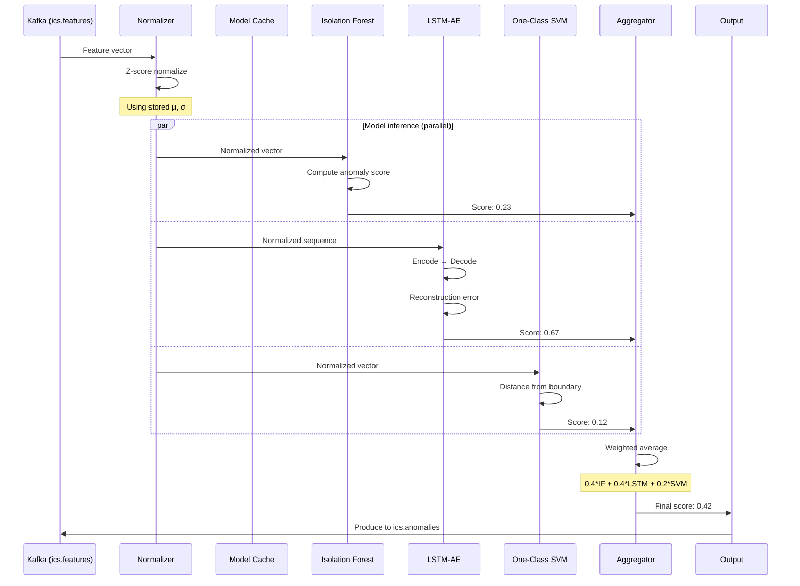

**Inference Latency Breakdown:**

```mermaid
gantt
    title Inference Latency (p99)
    dateFormat X
    axisFormat %L ms

    section Pipeline
    Kafka consume     :0, 5
    Normalization     :5, 7
    Isolation Forest  :7, 12
    LSTM-AE          :7, 25
    One-Class SVM    :7, 10
    Aggregation      :25, 27
    Kafka produce    :27, 32

    section SLA
    Target (50ms)    :crit, 0, 50
```

### Stage 5: Alert Processing Flow

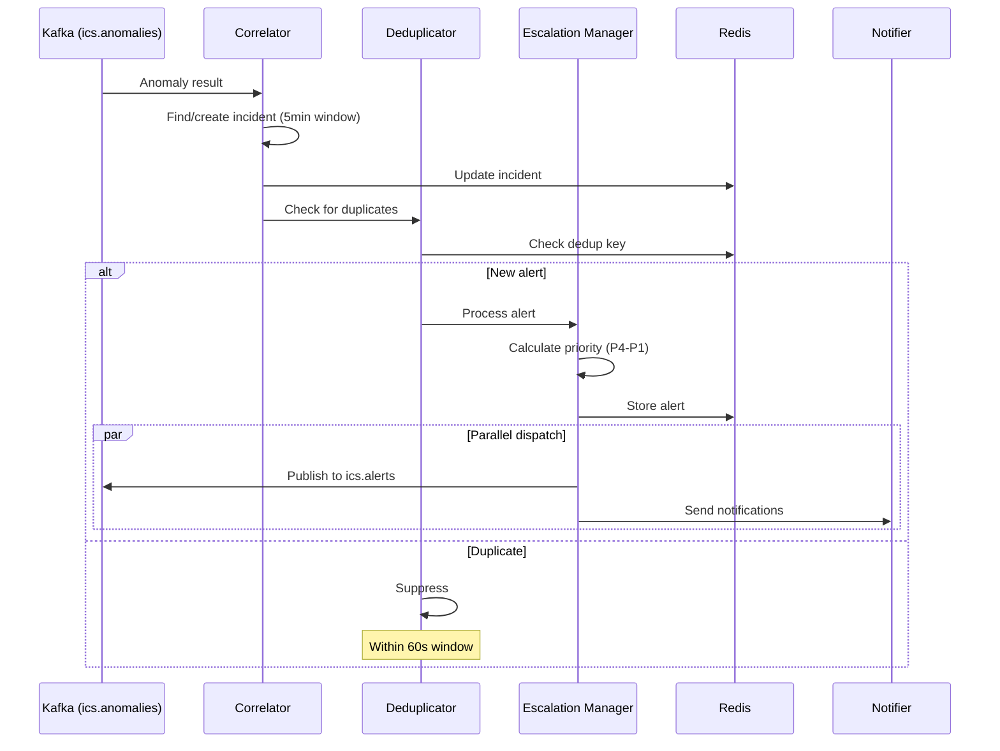

## Data Retention Policy

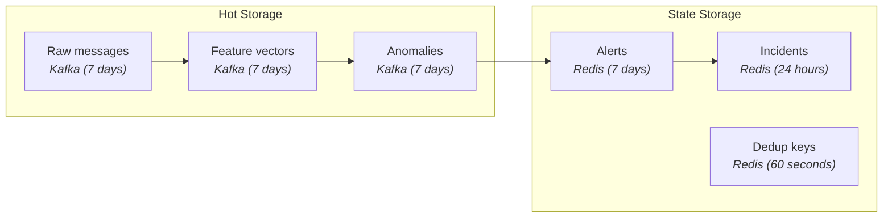

**Retention Settings:**

| Data | Storage | TTL |
|------|---------|-----|
| Raw packets | Kafka | 7 days |
| Parsed messages | Kafka | 7 days |
| Feature vectors | Kafka | 7 days |
| Anomaly results | Kafka | 7 days |
| Alerts | Redis | 7 days |
| Incidents | Redis | 24 hours |
| Deduplication keys | Redis | 60 seconds |

## Throughput & Scaling

| Stage | Single Instance | Horizontal Scaling |
|-------|-----------------|-------------------|
| Packet Capture | 100K pps | Multiple interfaces |
| Protocol Parser | 50K msgs/s | Partition by source IP |
| Feature Engine | 10K vectors/s | Partition by Kafka partition |
| Inference Service | 10K inferences/s | Replicas + GPU optional |
| Alert Manager | 1K alerts/s | Single instance sufficient |

**Kafka Partition Strategy:**

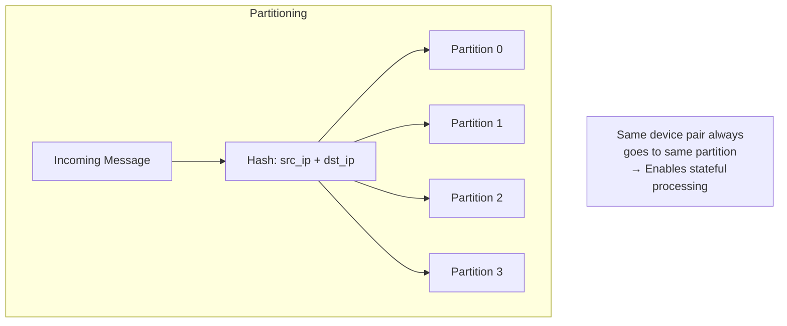
