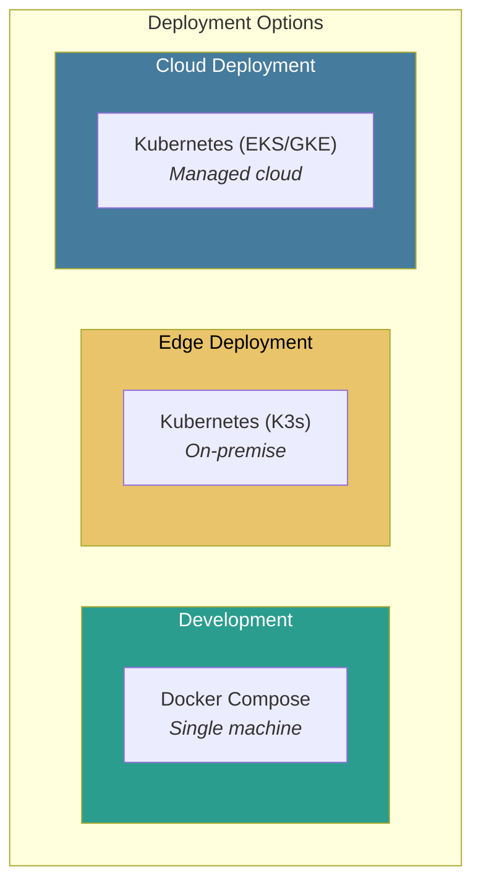
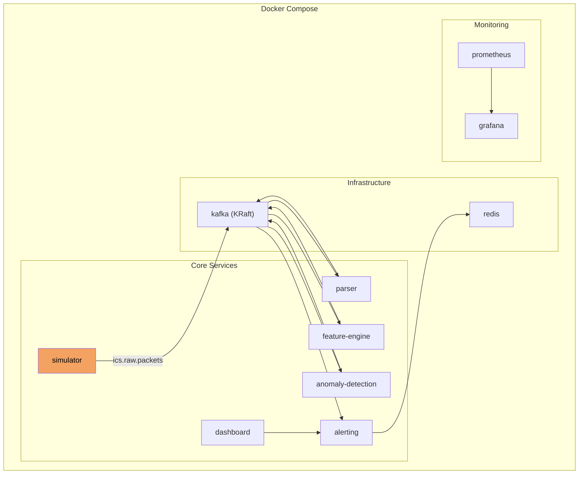
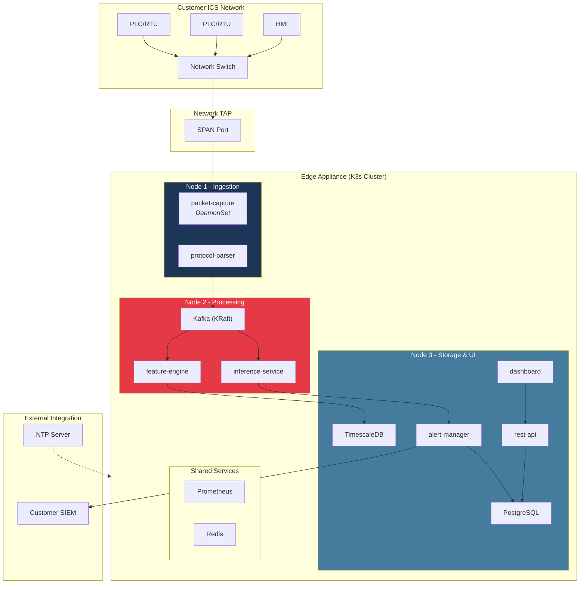
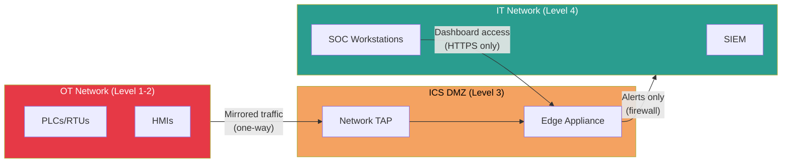
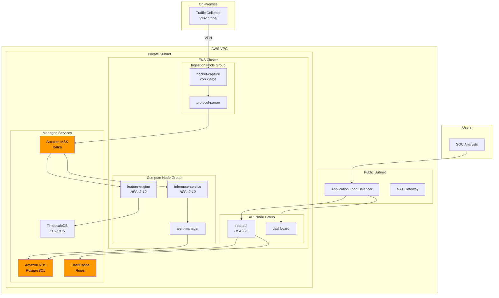
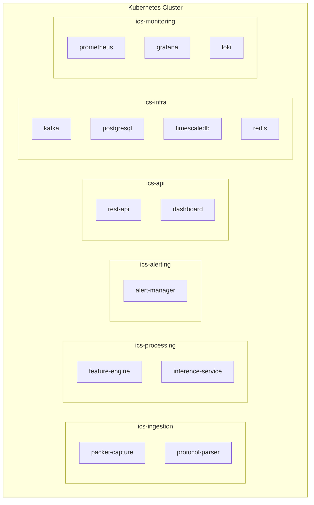
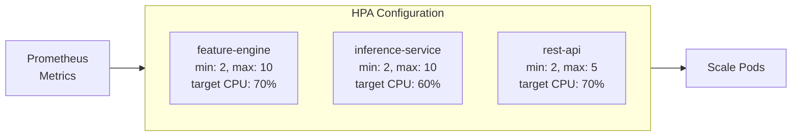
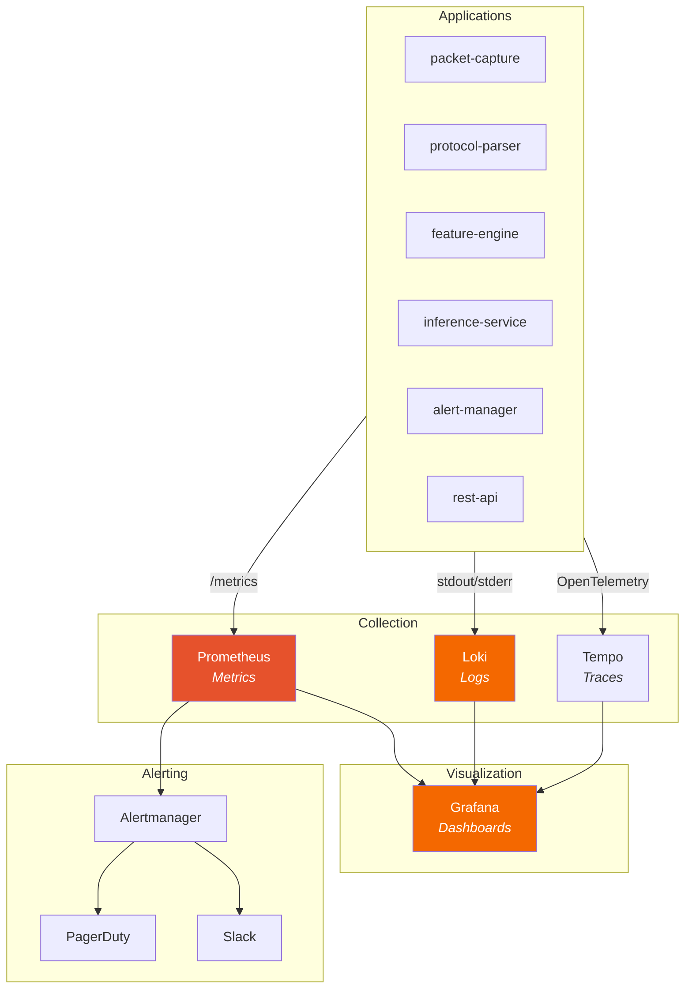
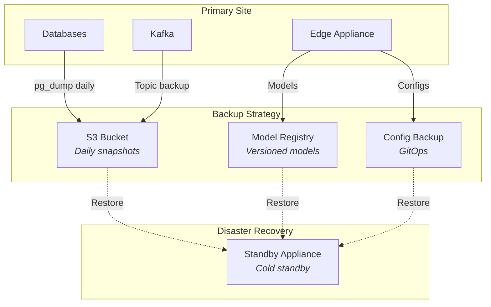

# Deployment Architecture

This page describes the deployment topology and infrastructure requirements.

## Deployment Options

The system supports three deployment models:



---

## Development Environment

Single-machine deployment for local development and testing.



**Resource Requirements (Development):**

| Component | CPU | Memory | Storage |
|-----------|-----|--------|---------|
| Kafka (KRaft) | 1 core | 1 GB | 10 GB |
| Redis | 0.5 core | 256 MB | 1 GB |
| Simulator | 0.5 core | 256 MB | - |
| Parser | 1 core | 512 MB | - |
| Feature Engine | 0.5 core | 512 MB | - |
| Anomaly Detection | 1 core | 1 GB | - |
| Alerting | 0.5 core | 256 MB | - |
| Dashboard | 0.5 core | 256 MB | - |
| **Total** | **~6 cores** | **~5 GB** | **11 GB** |

---

## Edge Deployment (On-Premise)

Production deployment at customer site, optimized for resource constraints.



**Edge Hardware Specification:**

| Node | Role | CPU | Memory | Storage | NIC |
|------|------|-----|--------|---------|-----|
| Node 1 | Ingestion | 4 cores | 8 GB | 100 GB SSD | 10 GbE (capture) |
| Node 2 | Processing | 8 cores | 32 GB | 500 GB NVMe | 1 GbE |
| Node 3 | Storage/UI | 4 cores | 16 GB | 1 TB SSD | 1 GbE |

**Network Segmentation:**



---

## Cloud Deployment

Managed Kubernetes deployment for cloud-based or hybrid scenarios.



**AWS Resource Sizing:**

| Service | Instance/Size | Quantity | Purpose |
|---------|--------------|----------|---------|
| EKS | Managed | 1 cluster | Container orchestration |
| EC2 (Ingestion) | c5n.xlarge | 2 | High-network capture |
| EC2 (Compute) | c5.2xlarge | 2-10 | ML inference |
| EC2 (API) | t3.large | 2-5 | API serving |
| MSK | kafka.m5.large | 3 brokers | Event streaming |
| RDS | db.r5.large | 1 (Multi-AZ) | Alert storage |
| TimescaleDB | i3.xlarge | 1 | Time-series |
| ElastiCache | cache.r5.large | 1 | Caching |

---

## Kubernetes Resources

### Namespace Structure



### Resource Quotas

```yaml
# Per-namespace resource quotas
apiVersion: v1
kind: ResourceQuota
metadata:
  name: ics-processing-quota
  namespace: ics-processing
spec:
  hard:
    requests.cpu: "16"
    requests.memory: "64Gi"
    limits.cpu: "32"
    limits.memory: "128Gi"
    pods: "20"
```

### Horizontal Pod Autoscaler



---

## Observability Stack



**Key Metrics:**

| Category | Metric | Alert Threshold |
|----------|--------|-----------------|
| Ingestion | `packets_captured_total` | Drop > 0.1% |
| Ingestion | `parse_errors_total` | > 100/min |
| Processing | `feature_extraction_latency_p99` | > 1s |
| ML | `inference_latency_p99` | > 50ms |
| ML | `model_prediction_errors` | > 10/min |
| Alerting | `alerts_generated_total` | Anomaly spike |
| API | `http_request_duration_p99` | > 500ms |

---

## Disaster Recovery



**Recovery Objectives:**

| Metric | Target | Strategy |
|--------|--------|----------|
| RPO (Recovery Point Objective) | 1 hour | Hourly Kafka topic backup |
| RTO (Recovery Time Objective) | 4 hours | Cold standby + automated restore |
| Model Recovery | 15 minutes | Model registry with versioning |
| Config Recovery | 5 minutes | GitOps (ArgoCD) |
