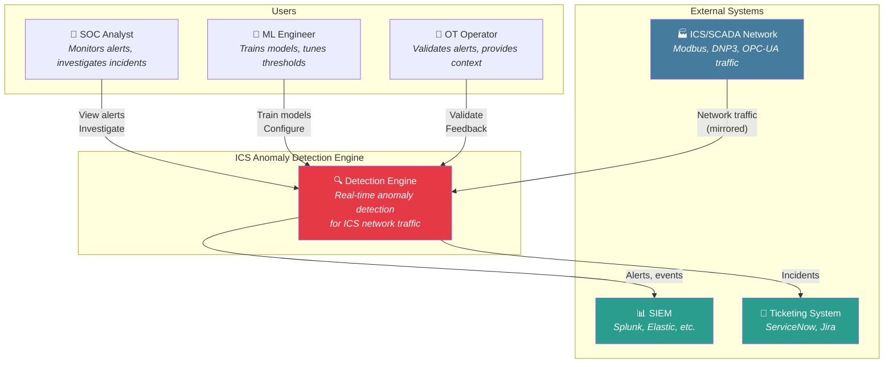
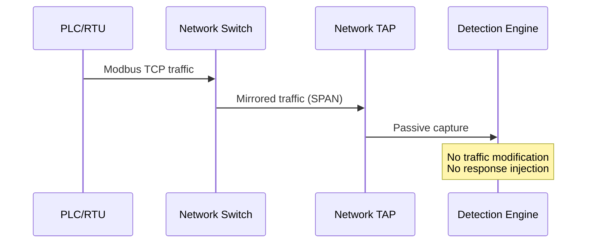
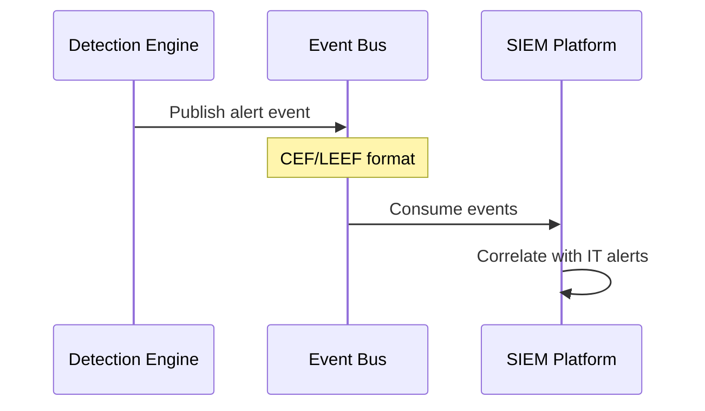

# System Context

The System Context diagram shows the ICS Anomaly Detection Engine and its relationships with external systems and users.

## Context Diagram

## System Boundaries

### In Scope

| Component | Description |
|-----------|-------------|
| Traffic Capture | Passive network monitoring via SPAN/TAP |
| Protocol Parsing | Modbus TCP, DNP3, OPC-UA, Ethernet/IP |
| Feature Extraction | Time-series features from parsed traffic |
| Anomaly Detection | ML-based detection (unsupervised + supervised) |
| Alert Generation | Severity classification and deduplication |
| Dashboard | Real-time visualization and investigation |
| API | Programmatic access for integrations |

### Out of Scope

| Component | Reason |
|-----------|--------|
| Active response | This is a detection system, not prevention |
| Inline deployment | Passive monitoring only (safety-critical) |
| Asset inventory | Assumes asset data from existing CMDB |
| Vulnerability scanning | Separate concern, different tooling |

## External System Interactions

### ICS/SCADA Network (Data Source)

**Integration Method:** Passive network tap (SPAN port mirror)

**Data Format:** Raw packets (PCAP compatible)

**Protocols Supported:**
- Modbus TCP (port 502)
- DNP3 (port 20000)
- OPC-UA (port 4840)
- Ethernet/IP (port 44818)

### SIEM Integration

**Integration Method:** Event streaming (Kafka) or Syslog (UDP/TCP)

**Data Format:** CEF (Common Event Format) or JSON

**Alert Fields:**
- `timestamp` - Event time (UTC)
- `source_ip` - Origin device
- `dest_ip` - Target device
- `protocol` - ICS protocol detected
- `anomaly_type` - Classification
- `severity` - Critical/High/Medium/Low
- `confidence` - Model confidence score
- `raw_features` - Feature vector for investigation

## User Personas

### SOC Analyst

**Goals:**
- Quickly triage ICS-related alerts
- Investigate potential incidents
- Escalate confirmed threats to OT team

**Interactions:**
- Dashboard: Real-time alert feed
- Alert details: Context, related events
- Search: Historical queries

### ML Engineer

**Goals:**
- Improve model accuracy
- Reduce false positives
- Adapt to new threat patterns

**Interactions:**
- Training pipeline: Retrain models
- Metrics: Model performance monitoring
- Configuration: Threshold tuning

### OT Operator

**Goals:**
- Validate alerts in operational context
- Provide ground truth feedback
- Identify maintenance vs. attack

**Interactions:**
- Alert validation: Mark true/false positives
- Context: Add operational notes
- Exceptions: Whitelist known behaviors
