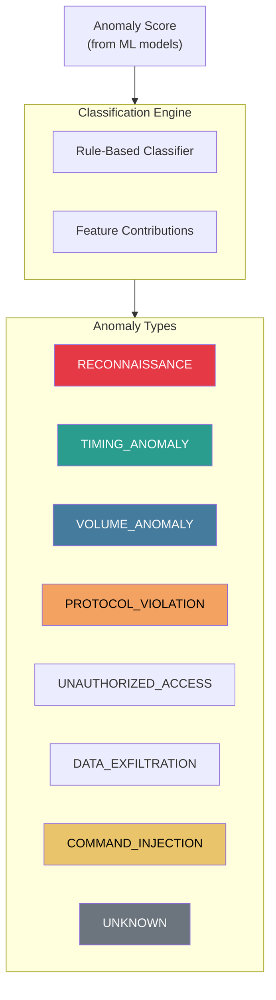
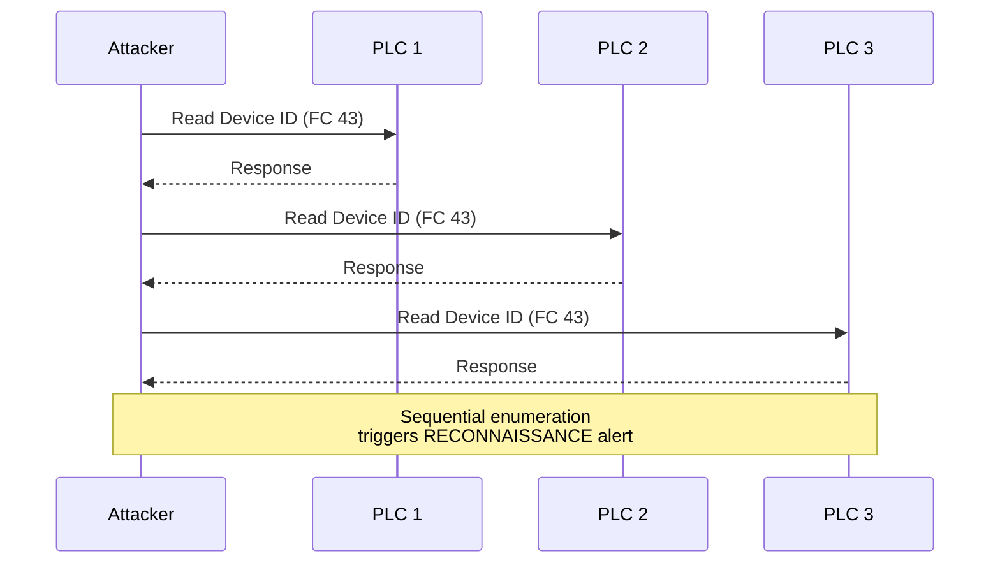
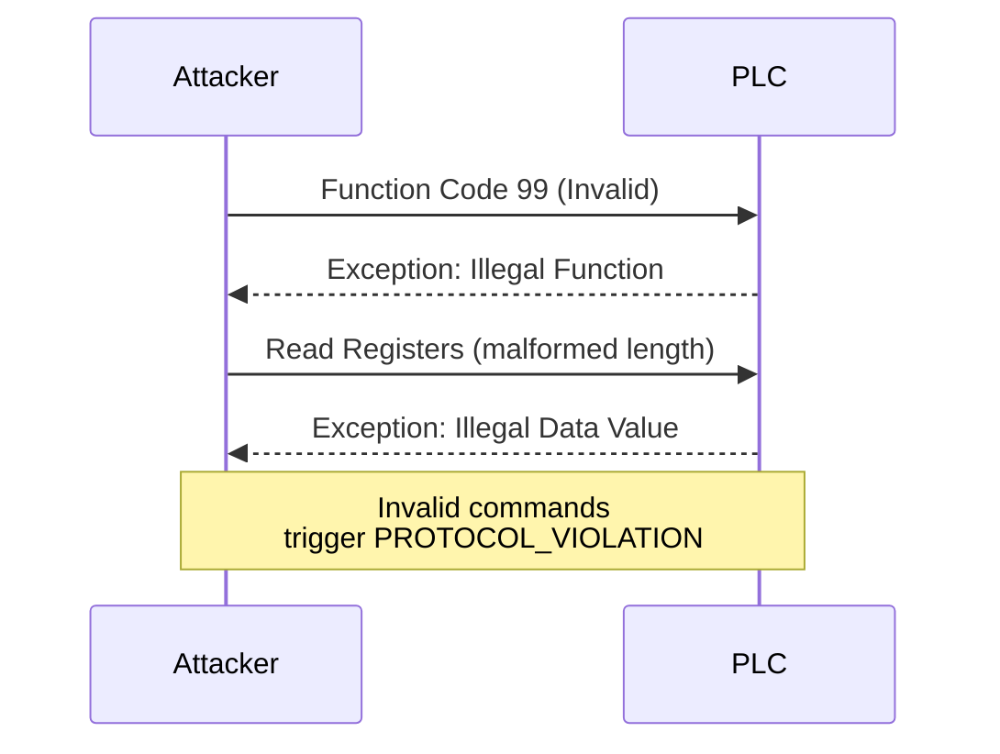
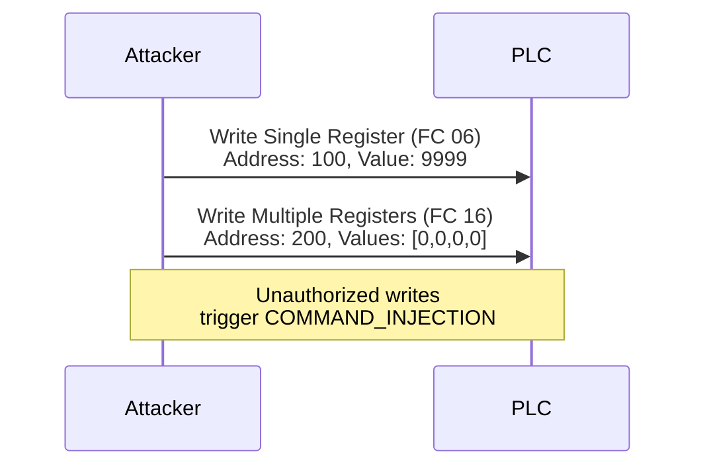
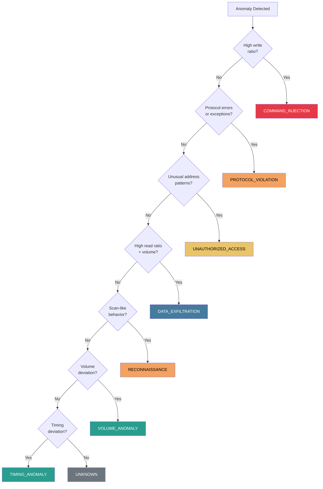

# Anomaly Types

The system classifies detected anomalies into distinct categories for actionable alerting.

## Anomaly Classification

## Type: RECONNAISSANCE

**Description:** Scanning or enumeration activity targeting ICS devices.

**Indicators:**

- High number of unique destination IPs from single source
- Sequential address scanning
- Device ID requests (Modbus FC 43)
- Probing of multiple protocols/ports

**MITRE Mapping:** T0846 (Remote System Discovery)

**Detection Features:**
| Feature | Normal | Anomalous |
|---------|--------|-----------|
| `fc_unique_count` | 2-4 | > 10 |
| `addr_range` | < 100 | > 1000 |
| `fc_diagnostic_ratio` | < 0.1 | > 0.5 |

---

## Type: TIMING_ANOMALY

**Description:** Deviations from expected communication timing patterns.

**Indicators:**

- Inter-arrival time deviation
- Missing expected polls
- Burst traffic patterns
- Irregular request spacing

**MITRE Mapping:** T0882 (Theft of Operational Information)

**Detection Features:**
| Feature | Normal | Anomalous |
|---------|--------|-----------|
| `iat_std` | < 0.1s | > 1.0s |
| `iat_max` | < 2s | > 10s |
| `message_count` deviation | < 10% | > 50% |

---

## Type: VOLUME_ANOMALY

**Description:** Abnormal traffic volume compared to baseline.

**Indicators:**

- Significantly higher message count than normal
- Unusually large payload sizes
- Traffic spikes or drops

**Detection Features:**
| Feature | Normal | Anomalous |
|---------|--------|-----------|
| `message_count` | baseline ± 10% | > 2x baseline |
| `bytes_total` | baseline ± 20% | > 3x baseline |
| `bytes_max` | < 256 | > 1024 |

---

## Type: PROTOCOL_VIOLATION

**Description:** Traffic that violates ICS protocol specifications.

**Indicators:**

- Invalid function codes
- Malformed packet structure
- Unexpected response codes
- Exception responses

**MITRE Mapping:** T0855 (Unauthorized Command Message)

**Detection Features:**
| Feature | Normal | Anomalous |
|---------|--------|-----------|
| `exception_ratio` | < 1% | > 10% |
| `exception_count` | 0-2 | > 10 |
| `fc_entropy` | Low | Very high |

---

## Type: UNAUTHORIZED_ACCESS

**Description:** Access to restricted or unusual register addresses.

**Indicators:**

- Access to addresses outside normal range
- New address patterns not seen in baseline
- Access to configuration registers

**MITRE Mapping:** T0821 (Modify Controller Tasking)

**Detection Features:**
| Feature | Normal | Anomalous |
|---------|--------|-----------|
| `addr_unique_count` | < 20 | > 100 |
| `addr_range` | consistent | expanded |
| `unit_id_unique_count` | 1-3 | > 10 |

---

## Type: DATA_EXFILTRATION

**Description:** Unusual data extraction patterns indicating information theft.

**Indicators:**

- Large number of read operations
- Sequential register reads
- High data volume extraction
- Unusual read patterns

**MITRE Mapping:** T0882 (Theft of Operational Information)

**Detection Features:**
| Feature | Normal | Anomalous |
|---------|--------|-----------|
| `fc_read_ratio` | balanced | > 0.95 |
| `qty_mean` | < 10 | > 50 |
| `bytes_total` | normal | very high |

---

## Type: COMMAND_INJECTION

**Description:** Unauthorized write operations or malicious commands.

**Indicators:**

- Unexpected write commands
- Write operations from new sources
- Dangerous function codes
- Unusual write patterns

**MITRE Mapping:** T0831 (Manipulation of Control)

**Detection Features:**
| Feature | Normal | Anomalous |
|---------|--------|-----------|
| `fc_write_ratio` | < 0.2 | > 0.5 |
| `request_ratio` deviation | stable | sudden change |
| New write addresses | 0 | > 0 |

---

## Type: UNKNOWN

**Description:** Anomalous behavior that doesn't match known patterns.

**When Used:**

- High anomaly score from ML models
- No rule-based classification matches
- Potentially novel attack technique

**Action Required:**

- Manual investigation
- Possible model retraining opportunity

---

## Severity Mapping

| Type                | Default Severity | Rationale                       |
| ------------------- | ---------------- | ------------------------------- |
| COMMAND_INJECTION   | Critical         | Direct process impact           |
| PROTOCOL_VIOLATION  | Critical         | Indicates active attack         |
| UNAUTHORIZED_ACCESS | High             | Potential reconnaissance/attack |
| DATA_EXFILTRATION   | High             | Information theft               |
| RECONNAISSANCE      | High             | Precursor to attack             |
| VOLUME_ANOMALY      | Medium           | May indicate issues             |
| TIMING_ANOMALY      | Medium           | May indicate collection         |
| UNKNOWN             | Medium           | Requires investigation          |

## Classification Decision Tree

