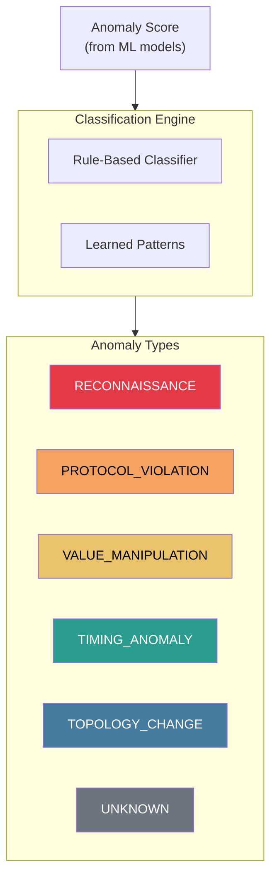
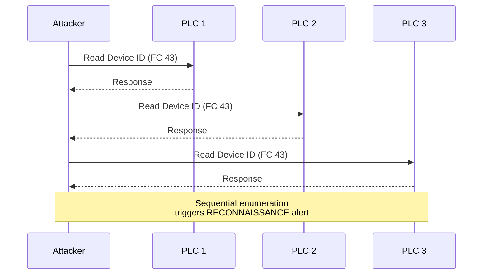
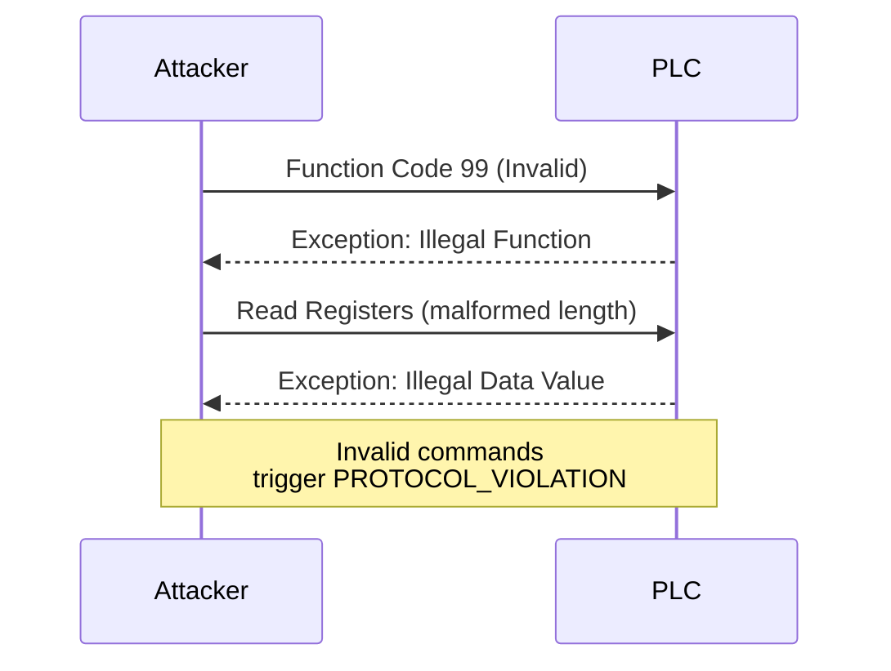
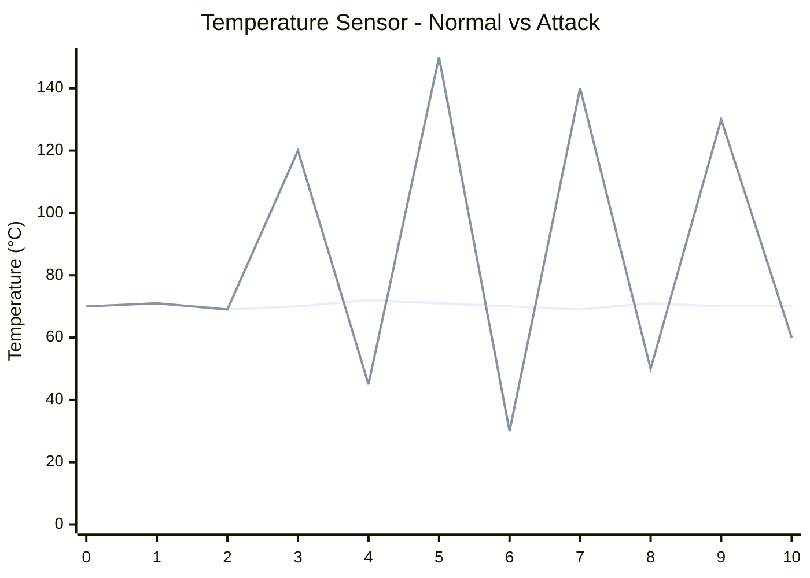
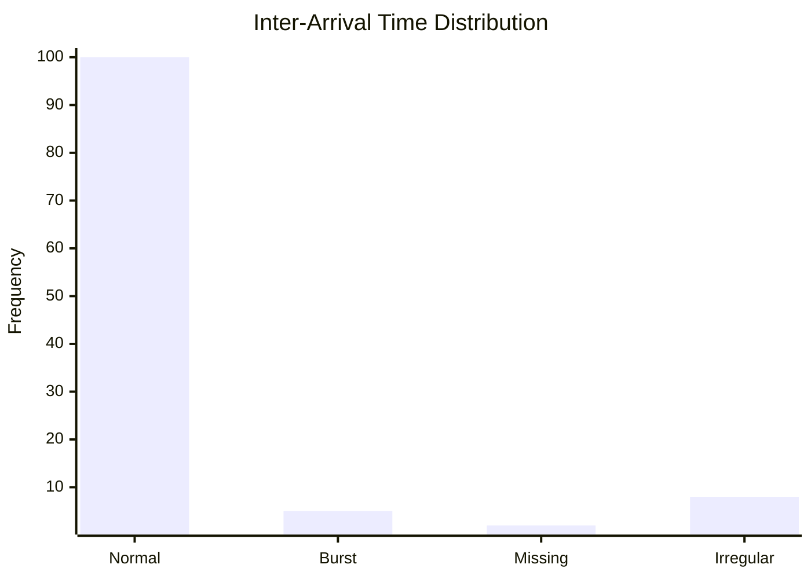
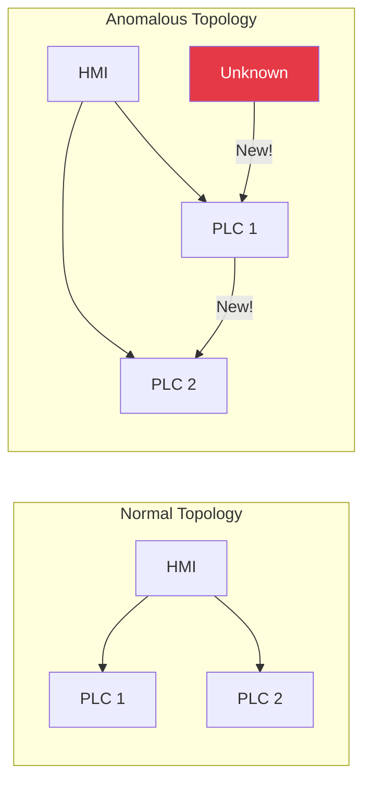
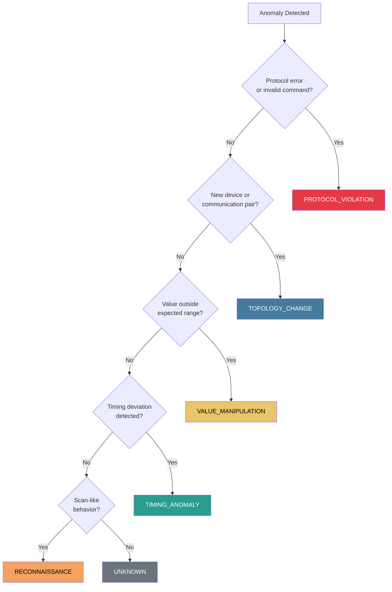

# Anomaly Types

The system classifies detected anomalies into distinct categories for actionable alerting.

## Anomaly Classification

## Type: RECONNAISSANCE

**Description:** Scanning or enumeration activity targeting ICS devices.

**Indicators:**
- High number of unique destination IPs from single source
- Sequential address scanning
- Failed connection attempts
- Probing of multiple protocols/ports

**MITRE Mapping:** T0846 (Remote System Discovery)

**Detection Features:**
| Feature | Normal | Anomalous |
|---------|--------|-----------|
| `unique_destinations_5m` | 2-5 | > 20 |
| `scan_score_15m` | < 0.1 | > 0.7 |
| `failed_connections_5m` | 0-2 | > 10 |

---

## Type: PROTOCOL_VIOLATION

**Description:** Traffic that violates ICS protocol specifications.

**Indicators:**
- Invalid function codes
- Malformed packet structure
- Unexpected response codes
- Protocol state violations

**MITRE Mapping:** T0855 (Unauthorized Command Message)

**Detection Features:**
| Feature | Normal | Anomalous |
|---------|--------|-----------|
| `error_rate_5m` | < 1% | > 10% |
| `invalid_function_codes` | 0 | > 0 |
| `exception_responses_5m` | < 2 | > 10 |

---

## Type: VALUE_MANIPULATION

**Description:** Process values outside expected ranges or changing abnormally.

**Indicators:**
- Values outside historical bounds
- Sudden large changes in setpoints
- Oscillating values
- Values inconsistent with physical constraints

**MITRE Mapping:** T0831 (Manipulation of Control)

**Detection Features:**
| Feature | Normal | Anomalous |
|---------|--------|-----------|
| `value_change_rate_1m` | < 5% | > 50% |
| `out_of_range_values_5m` | 0 | > 3 |
| `value_entropy_5m` | Low | High |

---

## Type: TIMING_ANOMALY

**Description:** Deviations from expected communication timing patterns.

**Indicators:**
- Inter-arrival time deviation
- Missing expected polls
- Burst traffic patterns
- Communication outside scheduled windows

**MITRE Mapping:** T0882 (Theft of Operational Information)

**Detection Features:**
| Feature | Normal | Anomalous |
|---------|--------|-----------|
| `inter_arrival_std_1m` | < 10ms | > 100ms |
| `burst_score_1m` | < 0.2 | > 0.8 |
| `missed_polls_5m` | 0 | > 5 |

---

## Type: TOPOLOGY_CHANGE

**Description:** New or unexpected communication relationships.

**Indicators:**
- New source-destination pairs
- Communication from unexpected subnets
- New protocols on existing pairs
- Changes in communication direction

**MITRE Mapping:** T0846 (Remote System Discovery), Lateral Movement

**Detection Features:**
| Feature | Normal | Anomalous |
|---------|--------|-----------|
| `new_source_ips_15m` | 0 | > 0 |
| `new_pairs_15m` | 0 | > 0 |
| `topology_delta_score` | 0 | > 0.5 |

---

## Type: UNKNOWN

**Description:** Anomalous behavior that doesn't match known patterns.

**When Used:**
- High anomaly score from ML models
- No rule-based classification matches
- Potentially novel attack technique

**Action Required:**
- Manual investigation
- Possible model retraining opportunity

---

## Severity Mapping

| Type | Default Severity | Rationale |
|------|-----------------|-----------|
| PROTOCOL_VIOLATION | Critical | Indicates active attack or misconfiguration |
| VALUE_MANIPULATION | Critical | Direct process impact |
| RECONNAISSANCE | High | Precursor to attack |
| TOPOLOGY_CHANGE | High | Potential lateral movement |
| TIMING_ANOMALY | Medium | May indicate issues or collection |
| UNKNOWN | Medium | Requires investigation |

## Classification Decision Tree

