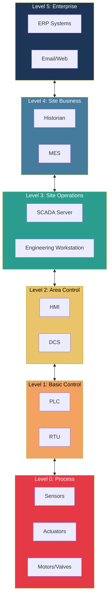
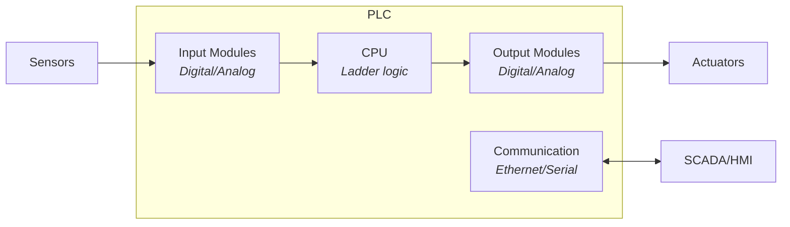
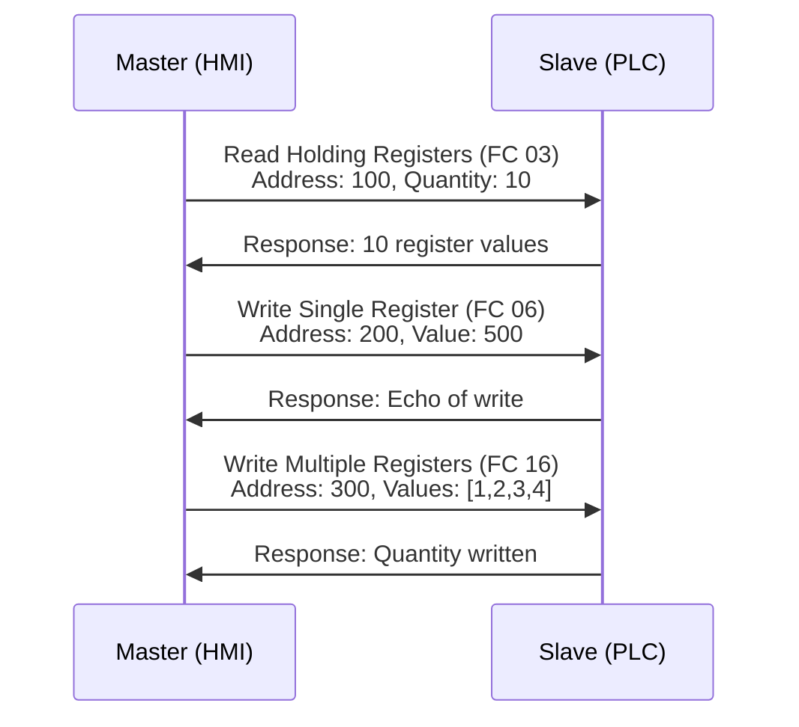
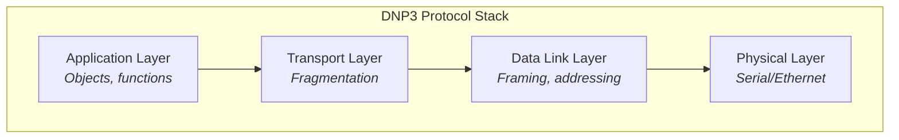
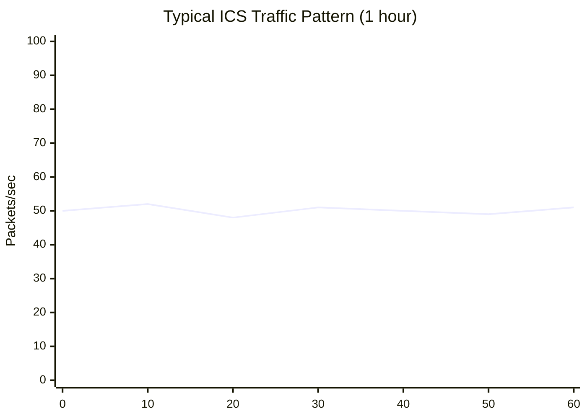

# ICS Fundamentals

Understanding Industrial Control Systems is essential for building effective anomaly detection.

## What is ICS?

Industrial Control Systems (ICS) are used to monitor and control industrial processes in sectors like:

- **Energy** - Power generation, transmission, distribution
- **Water** - Treatment plants, distribution systems
- **Manufacturing** - Assembly lines, process control
- **Oil & Gas** - Refineries, pipelines, drilling
- **Transportation** - Rail systems, traffic control

## ICS Architecture

### Purdue Model Levels

| Level | Name            | Components         | Function                        |
| ----- | --------------- | ------------------ | ------------------------------- |
| 0     | Process         | Sensors, actuators | Physical world interaction      |
| 1     | Basic Control   | PLCs, RTUs         | Direct process control          |
| 2     | Area Control    | HMIs, DCS          | Operator interface, supervision |
| 3     | Site Operations | SCADA, EWS         | Site-wide monitoring            |
| 4     | Site Business   | Historian, MES     | Data analytics, scheduling      |
| 5     | Enterprise      | ERP, email         | Business systems                |

## Key Components

### PLC (Programmable Logic Controller)

**Characteristics:**

- Deterministic execution (scan cycle)
- Real-time response (milliseconds)
- Designed for reliability (24/7 operation)
- Programmed in IEC 61131-3 languages

### RTU (Remote Terminal Unit)

Similar to PLCs but designed for:

- Remote/unmanned locations
- Wide-area communication (radio, cellular)
- Environmental hardening
- Battery backup operation

### HMI (Human-Machine Interface)

Operator interface providing:

- Process visualization
- Alarm management
- Setpoint adjustment
- Historical trending

### SCADA (Supervisory Control and Data Acquisition)

Central system for:

- Aggregating data from multiple PLCs/RTUs
- Providing enterprise-wide visibility
- Historical data storage
- Alarm correlation

## ICS Protocols

### Modbus TCP

The most common ICS protocol. Simple, request-response based.

**Function Codes:**

| Code | Function                 | Type  |
| ---- | ------------------------ | ----- |
| 01   | Read Coils               | Read  |
| 02   | Read Discrete Inputs     | Read  |
| 03   | Read Holding Registers   | Read  |
| 04   | Read Input Registers     | Read  |
| 05   | Write Single Coil        | Write |
| 06   | Write Single Register    | Write |
| 15   | Write Multiple Coils     | Write |
| 16   | Write Multiple Registers | Write |

### DNP3 (Distributed Network Protocol)

Used primarily in electric and water utilities.

**Key Features:**

- Event-based reporting (unsolicited responses)
- Time synchronization
- Secure authentication (SA v5)
- Object-oriented data model

### OPC-UA (Open Platform Communications Unified Architecture)

Modern, IT-friendly protocol for industrial interoperability.

**Characteristics:**

- Platform independent
- Built-in security (encryption, authentication)
- Complex data types
- Pub/Sub and client-server models
- Information modeling

## Traffic Characteristics

ICS traffic is fundamentally different from IT traffic:

| Characteristic | IT Traffic        | ICS Traffic         |
| -------------- | ----------------- | ------------------- |
| Volume         | High, variable    | Low, predictable    |
| Patterns       | Irregular         | Highly periodic     |
| Endpoints      | Dynamic           | Static, known       |
| Protocols      | HTTP, SQL, etc.   | Modbus, DNP3, OPC   |
| Tolerance      | Retries OK        | Real-time critical  |
| Lifespan       | Short connections | Long-lived sessions |

### Traffic Patterns

**Normal characteristics:**

- Consistent polling intervals (100ms - 10s typical)
- Predictable packet sizes
- Fixed communication pairs
- Low variation in function codes

## Why This Matters for Anomaly Detection

The deterministic nature of ICS traffic creates both opportunities and challenges:

**Opportunities:**

- Easy to establish baselines
- Small deviations are significant
- Fewer false positives from "normal noise"

**Challenges:**

- Legitimate changes (maintenance) look anomalous
- Low traffic volume means fewer samples
- Protocol diversity requires multiple parsers
- Safety requirements prohibit active responses
