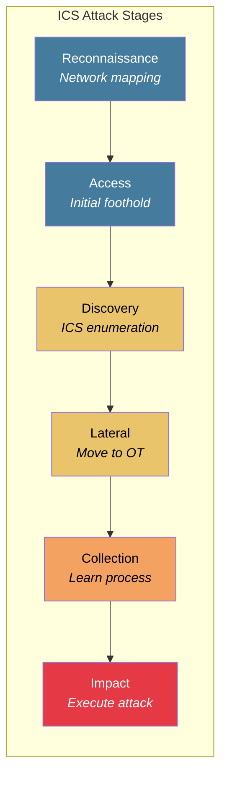
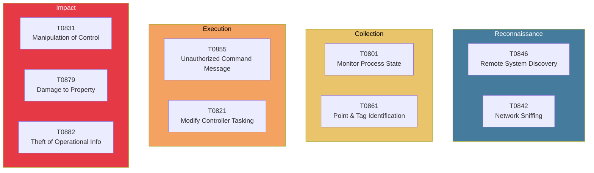
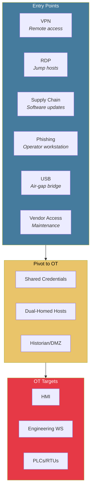
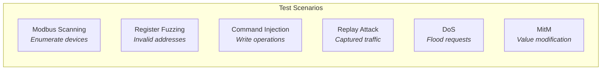

# ICS Threat Landscape

Understanding the threat landscape helps inform what anomalies to detect.

## Notable ICS Attacks

| Year | Attack | Target | Impact |
|------|--------|--------|--------|
| 2010 | Stuxnet | Iran nuclear | Centrifuge destruction |
| 2015 | BlackEnergy | Ukraine power | 230K without power |
| 2016 | Industroyer | Ukraine power | Automated grid attack |
| 2017 | Triton/TRISIS | Saudi plant | Safety system compromise |
| 2021 | Oldsmar | Florida water | Attempted poisoning |
| 2021 | Colonial Pipeline | US fuel | Pipeline shutdown |

## Attack Lifecycle

### Detection Opportunities

| Stage | Network Indicators | Our Detection |
|-------|-------------------|---------------|
| Reconnaissance | Port scans, device enumeration | Scan score feature |
| Discovery | Protocol probing, register reads | New function codes |
| Lateral Movement | IT→OT traffic patterns | Topology changes |
| Collection | Unusual read patterns | Read frequency anomaly |
| Impact | Write commands, setpoint changes | Value manipulation |

## MITRE ATT&CK for ICS

We map detections to the [MITRE ATT&CK for ICS](https://attack.mitre.org/techniques/ics/) framework.

### Relevant Techniques

### Detection Coverage Matrix

| Technique | ID | Detection Method | Confidence |
|-----------|------|------------------|------------|
| Remote System Discovery | T0846 | Scan pattern detection | High |
| Network Sniffing | T0842 | Passive (out of scope) | N/A |
| Monitor Process State | T0801 | Unusual read patterns | Medium |
| Point & Tag Identification | T0861 | Register enumeration | High |
| Unauthorized Command | T0855 | Invalid function codes | High |
| Modify Controller Tasking | T0821 | Program upload detection | High |
| Manipulation of Control | T0831 | Value anomaly detection | Medium |
| Damage to Property | T0879 | Process state deviation | Medium |

## Threat Actor Categories

### Nation-State

- **Motivation:** Espionage, sabotage, pre-positioning
- **Capability:** High (custom malware, zero-days)
- **Examples:** Stuxnet, Industroyer, Triton
- **Detection difficulty:** High (long dwell time, stealth)

### Cybercriminal

- **Motivation:** Financial gain (ransomware)
- **Capability:** Medium (commodity tools)
- **Examples:** Colonial Pipeline, JBS
- **Detection difficulty:** Medium (faster, noisier)

### Insider

- **Motivation:** Disgruntlement, sabotage
- **Capability:** Variable (legitimate access)
- **Examples:** Maroochy Shire sewage
- **Detection difficulty:** High (authorized user)

### Hacktivist

- **Motivation:** Political, attention
- **Capability:** Low-Medium
- **Examples:** Oldsmar water treatment
- **Detection difficulty:** Low (usually unsophisticated)

## Attack Vectors

## What We Can Detect

Our system focuses on **network-based** detection at the OT level:

### Detectable

| Category | Examples |
|----------|----------|
| Reconnaissance | Port scans, device enumeration, protocol probing |
| Protocol violations | Invalid function codes, malformed packets |
| Behavioral anomalies | Unusual timing, new communication pairs |
| Value manipulation | Out-of-range values, rapid changes |
| Command anomalies | Unexpected writes, dangerous commands |

### Not Detectable (Out of Scope)

| Category | Why |
|----------|-----|
| IT-side attacks | We monitor OT network only |
| Encrypted traffic | Can detect metadata but not content |
| Physical attacks | No sensor integration |
| Credential theft | No identity layer |
| Supply chain | Pre-deployment compromise |

## Adversary Emulation

For testing, we simulate these attack patterns:

See [Attack Scenarios](/simulation/attack-scenarios) for implementation details.
