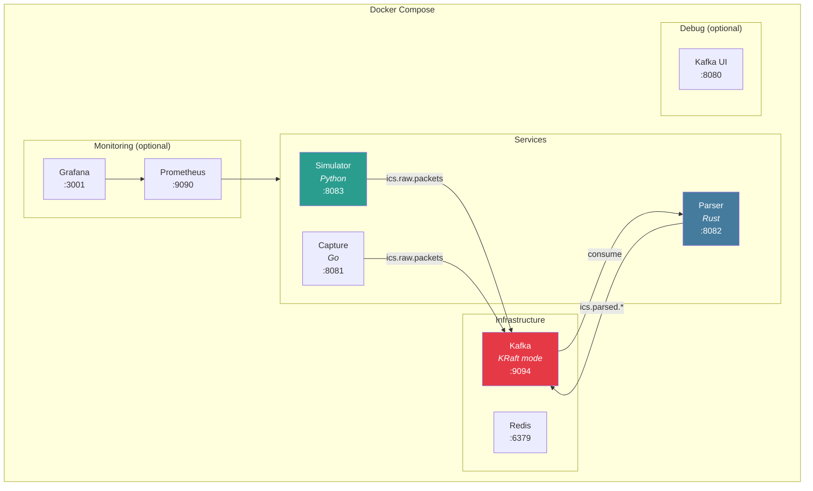

# Docker Setup

Run the complete system using Docker Compose.

## Architecture



## Quick Start

```bash
# Start everything for development
make dev
```

This starts:
- **Kafka** - Message broker (KRaft mode, no Zookeeper)
- **Redis** - Caching layer
- **Simulator** - Generates test Modbus traffic
- **Parser** - Parses ICS protocols

## Available Commands

| Command | Description |
|---------|-------------|
| `make up` | Start core infrastructure (Kafka, Redis) |
| `make dev` | Start infra + simulator + parser |
| `make simulator` | Start with simulator only |
| `make monitoring` | Add Prometheus + Grafana |
| `make debug` | Add Kafka UI for inspection |
| `make down` | Stop all services |
| `make clean` | Remove containers and volumes |
| `make logs` | Tail all container logs |

## Service Endpoints

| Service | URL | Description |
|---------|-----|-------------|
| Kafka | `localhost:9094` | External broker access |
| Redis | `localhost:6379` | Cache |
| Simulator | `localhost:8083` | Traffic generation API |
| Parser | `localhost:8082/metrics` | Prometheus metrics |
| Kafka UI | `localhost:8080` | Topic browser (debug profile) |
| Prometheus | `localhost:9090` | Metrics storage (monitoring profile) |
| Grafana | `localhost:3001` | Dashboards (monitoring profile) |

## Kafka Topics

The system creates these topics automatically:

| Topic | Description | Partitions |
|-------|-------------|------------|
| `ics.raw.packets` | Raw captured packets | 6 |
| `ics.parsed.modbus` | Parsed Modbus messages | 6 |
| `ics.parsed.dnp3` | Parsed DNP3 messages | 6 |
| `ics.parsed.opcua` | Parsed OPC-UA messages | 6 |
| `ics.features` | ML feature vectors | 6 |
| `ics.anomalies` | Anomaly scores | 6 |
| `ics.alerts` | Deduplicated alerts | 3 |

```bash
# List all topics
make kafka-topics

# Consume raw packets
make kafka-consume-raw

# Consume parsed messages
make kafka-consume-parsed
```

## Traffic Simulator

The simulator generates realistic Modbus TCP traffic for testing.

### API Endpoints

```bash
# Check status
curl http://localhost:8083/status

# Health check
curl http://localhost:8083/health

# Prometheus metrics
curl http://localhost:8083/metrics
```

### Configuration

```bash
# Change traffic rate (messages/second)
curl -X POST http://localhost:8083/config \
  -H "Content-Type: application/json" \
  -d '{"rate": 200}'

# Change protocol (modbus, dnp3, mixed)
curl -X POST http://localhost:8083/config \
  -H "Content-Type: application/json" \
  -d '{"protocol": "modbus"}'
```

### Attack Simulation

Inject attack patterns for testing detection:

```bash
# Start reconnaissance attack (device scanning)
curl -X POST http://localhost:8083/attack/start \
  -H "Content-Type: application/json" \
  -d '{"mode": "reconnaissance"}'

# Start write attack (unauthorized commands)
curl -X POST http://localhost:8083/attack/start \
  -H "Content-Type: application/json" \
  -d '{"mode": "write_attack"}'

# Stop attack
curl -X POST http://localhost:8083/attack/stop
```

**Available attack modes:**

| Mode | Description | Detection |
|------|-------------|-----------|
| `reconnaissance` | Device enumeration (FC 43) | High scan score |
| `write_attack` | Unauthorized write commands | Unusual write ratio |

## Profiles

Docker Compose profiles let you start optional services:

### Development (default)

```bash
make dev
# Starts: kafka, redis, kafka-init, simulator, parser
```

### With Monitoring

```bash
make monitoring
# Adds: prometheus, grafana
```

Access Grafana at http://localhost:3001 (admin/admin)

### With Debug Tools

```bash
make debug
# Adds: kafka-ui
```

Access Kafka UI at http://localhost:8080 to browse topics and messages.

### Live Capture (advanced)

```bash
docker compose --profile capture up -d
```

:::warning
Live capture requires:
- `NET_RAW` and `NET_ADMIN` capabilities
- Host network mode
- Root privileges or appropriate capabilities
:::

## Verify Setup

### 1. Check Services

```bash
docker compose ps
```

Expected output:
```
NAME            STATUS
ics-kafka       running (healthy)
ics-redis       running (healthy)
ics-simulator   running
ics-parser      running
```

### 2. Check Kafka Topics

```bash
make kafka-topics
```

### 3. Verify Data Flow

```bash
# Terminal 1: Watch raw packets
make kafka-consume-raw

# Terminal 2: Watch parsed messages
make kafka-consume-parsed
```

### 4. Check Metrics

```bash
# Simulator metrics
curl -s http://localhost:8083/metrics | grep simulator

# Parser metrics (when implemented)
curl -s http://localhost:8082/metrics
```

## Troubleshooting

### Kafka Not Starting

```bash
# Check logs
docker compose logs kafka

# Restart with clean state
make clean
make up
```

### Simulator Can't Connect to Kafka

```bash
# Verify Kafka is healthy
docker compose ps kafka

# Check network
docker network inspect ics-anomaly-detection_ics-network
```

### Parser Not Receiving Messages

```bash
# Check consumer group lag
docker compose exec kafka kafka-consumer-groups.sh \
  --bootstrap-server localhost:9092 \
  --describe --group ics-parser
```

## Resource Requirements

| Service | CPU | Memory |
|---------|-----|--------|
| Kafka | 1 core | 1 GB |
| Redis | 0.5 core | 256 MB |
| Simulator | 0.5 core | 256 MB |
| Parser | 1 core | 512 MB |
| Prometheus | 0.5 core | 512 MB |
| Grafana | 0.5 core | 256 MB |
| **Total** | **~4 cores** | **~3 GB** |
