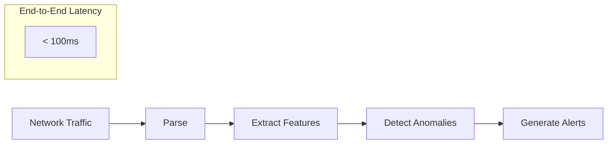
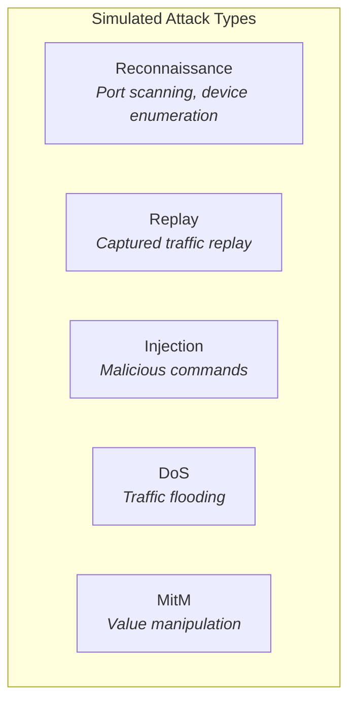

# Overview

The ICS Anomaly Detection Engine is a machine learning system for detecting anomalous behavior in Industrial Control System (ICS) network traffic.

## Why This Project?

Industrial Control Systems present unique challenges for anomaly detection:

| Challenge                 | Our Approach                                                                                                                                                                         |
| ------------------------- | ------------------------------------------------------------------------------------------------------------------------------------------------------------------------------------ |
| **Deterministic traffic** | Baseline learning with tight deviation bounds                                                                                                                                        |
| **Protocol diversity**    | Multi-protocol parser ([Modbus](https://en.wikipedia.org/wiki/Modbus), [DNP3](https://en.wikipedia.org/wiki/DNP3), [OPC-UA](https://en.wikipedia.org/wiki/OPC_Unified_Architecture)) |
| **Resource constraints**  | Optimized models for edge deployment                                                                                                                                                 |
| **Safety-critical**       | Passive monitoring only, no active responses                                                                                                                                         |
| **Rare attacks**          | Unsupervised learning + synthetic attack injection                                                                                                                                   |

## Key Features

### Real-Time Detection

### ML Model Ensemble

The detection engine combines multiple models for robust anomaly detection:

- **[Isolation Forest](https://en.wikipedia.org/wiki/Isolation_forest)** - Detects point anomalies (unusual single observations)
- **[LSTM Autoencoder](https://en.wikipedia.org/wiki/Autoencoder#Long_short-term_memory_autoencoders)** - Detects sequence anomalies (unusual patterns over time)
- **[One-Class SVM](https://en.wikipedia.org/wiki/Support-vector_machine#One-class_classification)** - Detects boundary violations (observations outside normal range)

### Attack Simulation

Built-in traffic simulator for testing and validation:

## Target Users

| User             | Use Case                            |
| ---------------- | ----------------------------------- |
| **ML Engineers** | Building ICS/OT security ML systems |
| **Students**     | Learning about ICS security and ML  |

## What You'll Learn

By exploring this project, you'll understand:

1. **ICS Protocols** - How Modbus, DNP3, and OPC-UA work
2. **Feature Engineering** - Extracting ML features from network traffic
3. **Anomaly Detection** - Unsupervised and semi-supervised approaches
4. **Production ML** - Model serving, monitoring, and versioning
5. **Real-Time Systems** - Stream processing with Kafka

## Next Steps

- [Installation](/getting-started/installation) - Set up the development environment
- [Quickstart](/getting-started/quickstart) - Run your first detection
- [Architecture](/architecture/system-context) - Understand the system design
