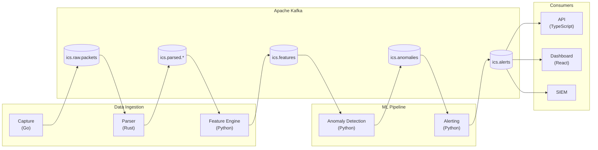

# ICS Network Anomaly Detection Engine

A machine learning system for detecting anomalies in Industrial Control System (ICS) network traffic, covers

- **Time-series anomaly detection** for ICS/OT environments
- **End-to-end ML pipelines** from data ingestion to alerting
- **Production-ready architecture** with monitoring and observability
- **Domain-specific security** understanding of ICS protocols and threats

## Project Goals

This project builds an end-to-end solution for ICS/OT cybersecurity ML engineering, with a focus on practical implementation and real-world applicability.

| Capability | Implementation |
|------------|----------------|
| Time-series analysis | Multi-variate anomaly detection on protocol features |
| Threat detection | Attack pattern recognition (reconnaissance, exploitation, C2) |
| Production ML | Ensemble models with hot-reload and monitoring |
| Real-time processing | Kafka streaming with sub-second latency |
| Simulation | Realistic traffic generation with injectable attack scenarios |

## Architecture



## Quick Links

- [Getting Started](/getting-started/overview) - Set up the development environment
- [Architecture](/architecture/system-context) - Deep dive into system design
- [Core Technology](/core-technology/go) - Technology choices and rationale
- [Code Structure](/code-structure/capture) - Package-by-package walkthrough
- [ML Pipeline](/ml-pipeline/data-ingestion) - How the models work
- [Simulation](/simulation/traffic-generator) - Generate test traffic

## Technology Stack

| Layer | Technology |
|-------|------------|
| Languages | Python, Go, Rust, TypeScript |
| ML Framework | PyTorch, scikit-learn |
| Stream Processing | Apache Kafka (KRaft mode) |
| State Storage | Redis |
| Frontend | React 19, Vite 7, Tailwind CSS 4 |
| Monitoring | Prometheus, Grafana |
| Containerization | Docker |

## Services

| Service | Port | Description |
|---------|------|-------------|
| Dashboard | 3090 | React monitoring UI |
| Docs | 3000 | Docusaurus documentation |
| Alerting API | 8084 | Alert/incident management |
| Simulator API | 8083 | Traffic simulation control |
| Kafka UI | 8080 | Topic browser (debug mode) |
| Grafana | 3001 | Dashboards (monitoring mode) |
| Prometheus | 9090 | Metrics (monitoring mode) |

## Quick Start

```bash
# Clone and install
git clone https://github.com/caverac/ics-anomaly-detection.git
cd ics-anomaly-detection
yarn install

# Start the full pipeline with dashboard
make dev-dashboard

# Open the dashboard
open http://localhost:3090
```

## Test Attack Simulation

```bash
# Start reconnaissance attack
curl -X POST http://localhost:8083/attack/start \
  -H "Content-Type: application/json" \
  -d '{"mode": "reconnaissance"}'

# View alerts
curl http://localhost:8084/alerts | jq

# View incidents
curl http://localhost:8084/incidents | jq
```
