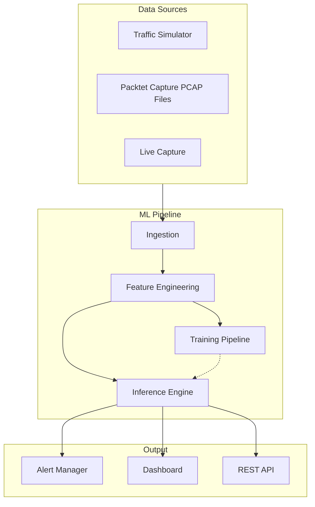

# ICS Network Anomaly Detection Engine

A production-grade machine learning system for detecting anomalies in Industrial Control System (ICS) network traffic, designed to demonstrate expertise in:

- **Time-series anomaly detection** for ICS/OT environments
- **End-to-end ML pipelines** from data ingestion to alerting
- **Production-ready architecture** with monitoring and observability
- **Domain-specific security** understanding of ICS protocols and threats

## Project Goals

This project is just an attempt to build an end-to-end solution for ICS/OT cybersecurity ML engineering, with a focus on practical implementation and real-world applicability. The key goals include:

| Capability | Implementation |
|------------|----------------|
| Time-series analysis | Multi-variate anomaly detection on protocol features |
| Threat detection | Attack pattern recognition (reconnaissance, exploitation, command & control C2) |
| Production ML | Model training, versioning, monitoring, A/B testing |
| Resource efficiency | Optimized for edge deployment constraints |
| Simulation | Realistic traffic generation with injectable attack scenarios |

## High-Level Architecture

## Quick Links

- [Getting Started](/getting-started/overview) - Set up the development environment
- [Architecture](/architecture/system-context) - Deep dive into system design
- [ML Pipeline](/ml-pipeline/data-ingestion) - How the models work
- [Simulation](/simulation/traffic-generator) - Generate test traffic

## Technology Stack

| Layer | Technology |
|-------|------------|
| Language | TypeScript (API, Dashboard), Python (ML) |
| ML Framework | PyTorch, scikit-learn |
| Stream Processing | Apache Kafka / Redis Streams |
| Storage | TimescaleDB (time-series), PostgreSQL (metadata) |
| Monitoring | Prometheus, Grafana |
| Containerization | Docker, Kubernetes |
