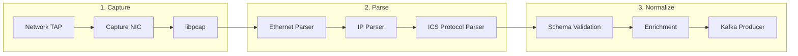
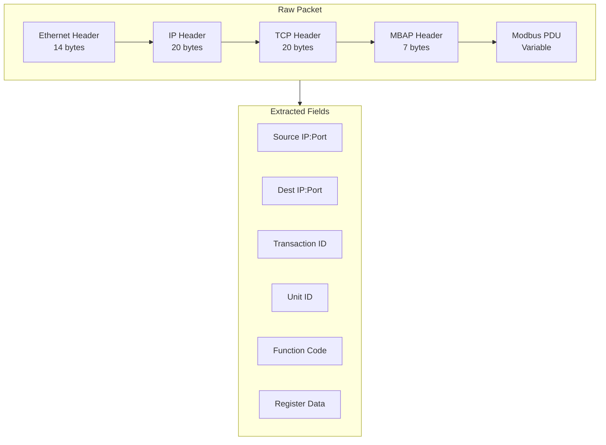
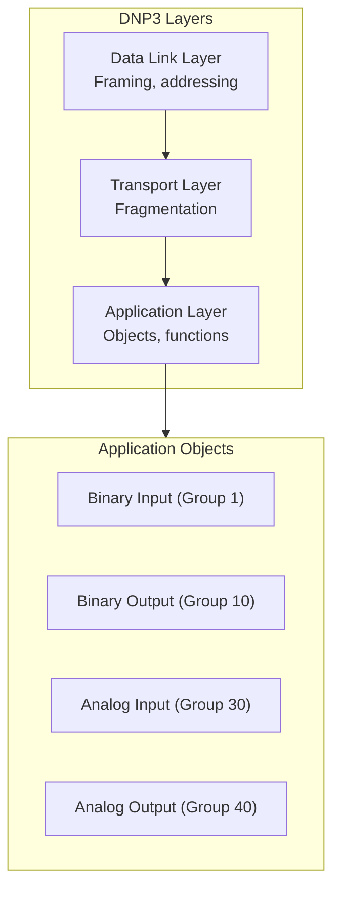
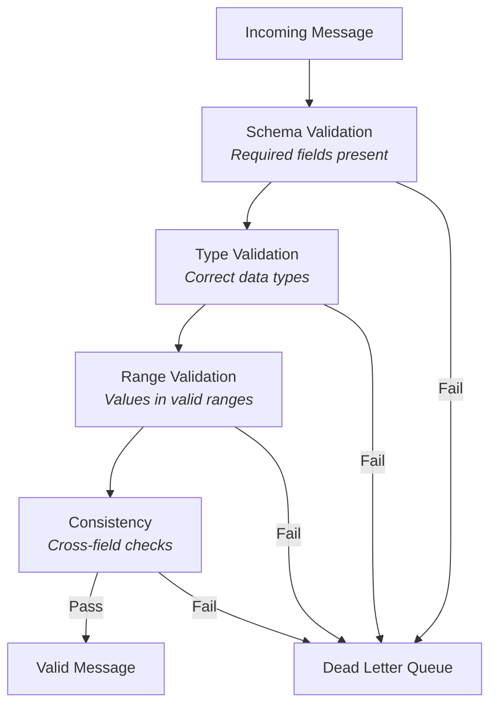
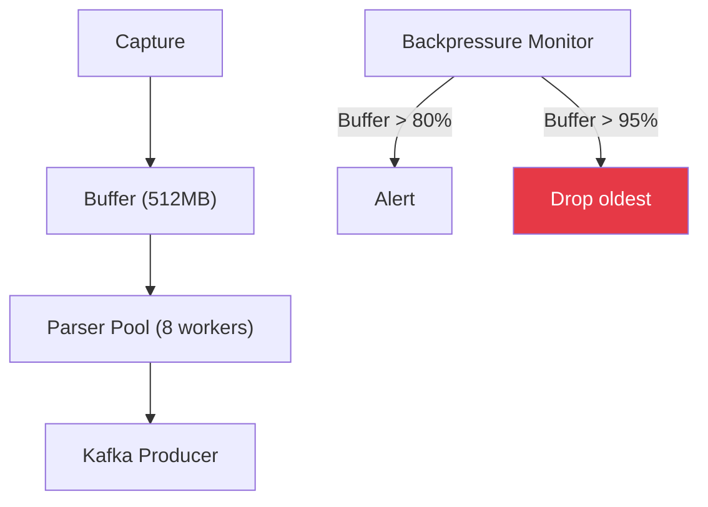

# Data Ingestion

How raw network traffic is captured and prepared for ML processing.

## Ingestion Pipeline



## Data Sources

### Live Capture

Real-time packet capture from network interface:

```go
// Capture configuration
type CaptureConfig struct {
    Interface   string        // Network interface name
    SnapLen     int32         // Max bytes per packet (1600)
    Promiscuous bool          // Capture all traffic
    Timeout     time.Duration // Read timeout
    BPFFilter   string        // Berkeley Packet Filter
}

// BPF filter for ICS protocols
filter := "tcp port 502 or tcp port 20000 or tcp port 4840"
```

### PCAP Replay

For offline analysis and testing:

```bash
# Replay PCAP at original timing
tcpreplay --intf1=lo --timer=gtod capture.pcap

# Replay at 10x speed
tcpreplay --intf1=lo --multiplier=10 capture.pcap
```

### Simulator

Generate synthetic traffic for testing:

```python
# Simulator generates configurable traffic patterns
simulator.generate(
    protocol="modbus",
    rate_per_second=100,
    duration_minutes=60,
    attack_scenario="reconnaissance"  # Optional
)
```

## Protocol Parsing

### Modbus TCP Parser



**MBAP Header Structure:**

| Field | Bytes | Description |
|-------|-------|-------------|
| Transaction ID | 2 | Request/response matching |
| Protocol ID | 2 | Always 0x0000 for Modbus |
| Length | 2 | Remaining bytes |
| Unit ID | 1 | Slave address |

**Output Schema:**

```typescript
interface ModbusMessage {
  timestamp: string          // ISO 8601
  src_ip: string
  src_port: number
  dst_ip: string
  dst_port: number
  transaction_id: number
  unit_id: number
  function_code: number
  is_request: boolean
  is_exception: boolean
  exception_code?: number

  // Function-specific data
  start_address?: number
  quantity?: number
  values?: number[]
  raw_payload: string        // Hex-encoded
}
```

### DNP3 Parser



**Output Schema:**

```typescript
interface DNP3Message {
  timestamp: string
  src_ip: string
  dst_ip: string
  source_address: number     // DNP3 address
  destination_address: number
  function_code: number
  is_request: boolean

  // Application layer
  objects: DNP3Object[]
  internal_indications?: number
  sequence_number: number
}
```

## Data Quality

### Validation Rules



**Validation Checks:**

| Check | Rule | Action on Fail |
|-------|------|----------------|
| Required fields | timestamp, src_ip, protocol | Send to DLQ |
| IP format | Valid IPv4/IPv6 | Send to DLQ |
| Port range | 0-65535 | Log warning, keep |
| Function code | Valid for protocol | Log warning, keep |
| Timestamp | Within 5 min of now | Log warning, adjust |

### Enrichment

Before publishing to Kafka:

```python
def enrich_message(msg: dict) -> dict:
    return {
        **msg,
        # Add processing metadata
        "ingest_timestamp": datetime.utcnow().isoformat(),
        "parser_version": "1.0.0",

        # Compute derived fields
        "session_id": compute_session_id(msg),
        "direction": determine_direction(msg),

        # Add context (from cache)
        "src_device_type": device_cache.get(msg["src_ip"]),
        "dst_device_type": device_cache.get(msg["dst_ip"]),
    }
```

## Kafka Topics

### Topic Configuration

```yaml
topics:
  ics.raw.modbus:
    partitions: 12
    replication_factor: 3
    retention_ms: 604800000  # 7 days
    key: src_ip + dst_ip      # Consistent partitioning

  ics.raw.dnp3:
    partitions: 12
    replication_factor: 3
    retention_ms: 604800000
    key: src_ip + dst_ip

  ics.raw.dlq:  # Dead letter queue
    partitions: 1
    replication_factor: 3
    retention_ms: 2592000000  # 30 days
```

### Message Format

```json
{
  "key": "192.168.1.10:192.168.1.100",
  "value": {
    "timestamp": "2024-01-15T10:30:00.123Z",
    "protocol": "modbus",
    "src_ip": "192.168.1.10",
    "dst_ip": "192.168.1.100",
    "function_code": 3,
    "unit_id": 1,
    "start_address": 100,
    "quantity": 10
  },
  "headers": {
    "parser_version": "1.0.0",
    "capture_interface": "eth0"
  }
}
```

## Performance

### Throughput Targets

| Stage | Target | Bottleneck |
|-------|--------|------------|
| Packet capture | 100K pps | Ring buffer size |
| Protocol parsing | 50K msg/s | CPU (parsing) |
| Kafka produce | 100K msg/s | Network/Kafka |

### Backpressure Handling


