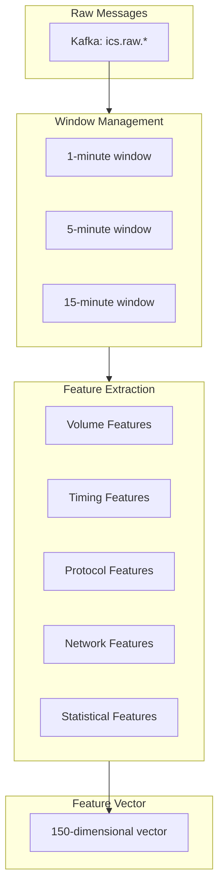
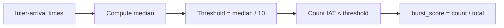
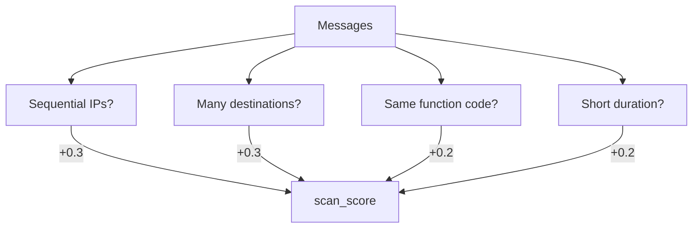

# Feature Engineering

Transforming raw ICS protocol messages into ML-ready feature vectors.

## Feature Engineering Pipeline



## Window Strategy

Features are computed over multiple time windows to capture patterns at different scales:

```mermaid
gantt
    title Feature Windows (time progression →)
    dateFormat s
    axisFormat %S

    section 1-minute
    Window 1 :a1, 0, 60s
    Window 2 :a2, 60, 60s
    Window 3 :a3, 120, 60s

    section 5-minute
    Window A :b1, 0, 300s
    Window B :b2, 300, 300s

    section 15-minute
    Window X :c1, 0, 900s
```



**Window Configuration:**

| Window | Duration | Emit Frequency | Use Case |
|--------|----------|----------------|----------|
| 1-minute | 60s | Every 60s | Rapid anomalies, bursts |
| 5-minute | 300s | Every 60s | Medium-term patterns |
| 15-minute | 900s | Every 60s | Baseline deviations |

**Why tumbling windows?**
- Deterministic behavior (reproducible)
- No double-counting events
- Simpler state management
- Aligned with ICS polling cycles

## Feature Categories

### Volume Features

Measure traffic quantity and diversity.

```python
class VolumeFeatures:
    """Traffic volume and diversity metrics."""

    @staticmethod
    def extract(messages: List[Message], window: str) -> dict:
        return {
            f"msg_count_{window}": len(messages),
            f"bytes_total_{window}": sum(m.payload_size for m in messages),
            f"unique_sources_{window}": len(set(m.src_ip for m in messages)),
            f"unique_destinations_{window}": len(set(m.dst_ip for m in messages)),
            f"unique_pairs_{window}": len(set((m.src_ip, m.dst_ip) for m in messages)),
            f"unique_function_codes_{window}": len(set(m.function_code for m in messages)),
        }
```

| Feature | Description | Normal Range |
|---------|-------------|--------------|
| `msg_count` | Total messages | 100-1000/min |
| `bytes_total` | Total bytes | 10KB-100KB/min |
| `unique_sources` | Distinct source IPs | 1-5 |
| `unique_destinations` | Distinct dest IPs | 5-20 |
| `unique_pairs` | Distinct src-dst pairs | 10-50 |

### Timing Features

Capture temporal patterns and regularity.

```python
class TimingFeatures:
    """Inter-arrival time and burst detection."""

    @staticmethod
    def extract(messages: List[Message], window: str) -> dict:
        timestamps = sorted(m.timestamp for m in messages)
        iats = np.diff(timestamps)  # Inter-arrival times

        return {
            f"iat_mean_{window}": np.mean(iats),
            f"iat_std_{window}": np.std(iats),
            f"iat_min_{window}": np.min(iats),
            f"iat_max_{window}": np.max(iats),
            f"iat_cv_{window}": np.std(iats) / np.mean(iats),  # Coefficient of variation
            f"burst_score_{window}": detect_bursts(iats),
            f"periodicity_score_{window}": compute_periodicity(iats),
        }
```

| Feature | Description | Anomaly Signal |
|---------|-------------|----------------|
| `iat_mean` | Average time between messages | Large deviation |
| `iat_std` | Variability in timing | High = irregular |
| `iat_cv` | Relative variability | High = unstable |
| `burst_score` | Burst detection (0-1) | > 0.7 = burst |
| `periodicity_score` | How periodic (0-1) | < 0.3 = aperiodic |

**Burst Detection Algorithm:**



### Protocol Features

Protocol-specific behavioral metrics.

```python
class ModbusFeatures:
    """Modbus-specific features."""

    @staticmethod
    def extract(messages: List[ModbusMessage], window: str) -> dict:
        reads = [m for m in messages if m.function_code in [1, 2, 3, 4]]
        writes = [m for m in messages if m.function_code in [5, 6, 15, 16]]
        errors = [m for m in messages if m.is_exception]

        return {
            f"read_count_{window}": len(reads),
            f"write_count_{window}": len(writes),
            f"read_write_ratio_{window}": len(reads) / max(len(writes), 1),
            f"error_count_{window}": len(errors),
            f"error_rate_{window}": len(errors) / max(len(messages), 1),
            f"function_code_entropy_{window}": entropy([m.function_code for m in messages]),
            f"unique_registers_{window}": len(set(m.start_address for m in messages)),
            f"register_range_{window}": max(m.start_address for m in messages) - min(m.start_address for m in messages),
        }
```

| Feature | Description | Anomaly Signal |
|---------|-------------|----------------|
| `read_write_ratio` | Read vs write operations | Low = unusual writes |
| `error_rate` | Exception responses | High = invalid commands |
| `function_code_entropy` | Diversity of operations | High = scanning |
| `unique_registers` | Distinct addresses accessed | High = enumeration |

### Network Features

Communication topology and patterns.

```python
class NetworkFeatures:
    """Network topology and communication patterns."""

    @staticmethod
    def extract(messages: List[Message], window: str, baseline: NetworkBaseline) -> dict:
        current_pairs = set((m.src_ip, m.dst_ip) for m in messages)
        new_pairs = current_pairs - baseline.known_pairs

        return {
            f"new_pairs_count_{window}": len(new_pairs),
            f"fan_out_ratio_{window}": compute_fan_out(messages),
            f"fan_in_ratio_{window}": compute_fan_in(messages),
            f"scan_score_{window}": detect_scanning(messages),
            f"topology_change_score_{window}": len(new_pairs) / max(len(current_pairs), 1),
        }
```

**Scan Detection:**



### Statistical Features

Higher-order statistics for distribution changes.

```python
class StatisticalFeatures:
    """Statistical distribution features."""

    @staticmethod
    def extract(messages: List[Message], window: str) -> dict:
        # Value-based features (for register reads)
        values = [v for m in messages for v in m.values or []]

        return {
            f"value_mean_{window}": np.mean(values) if values else 0,
            f"value_std_{window}": np.std(values) if values else 0,
            f"value_skewness_{window}": skew(values) if len(values) > 2 else 0,
            f"value_kurtosis_{window}": kurtosis(values) if len(values) > 3 else 0,
            f"value_entropy_{window}": entropy(values) if values else 0,
            f"value_range_{window}": max(values) - min(values) if values else 0,
            f"out_of_range_count_{window}": count_outliers(values),
        }
```

## Feature Vector Structure

The complete feature vector has ~150 dimensions:

```typescript
interface FeatureVector {
  // Metadata (not used in ML)
  timestamp: string
  window_end: string
  key: string  // src_ip:dst_ip

  // Volume (18 features: 6 × 3 windows)
  msg_count_1m: number
  msg_count_5m: number
  msg_count_15m: number
  // ... etc

  // Timing (21 features: 7 × 3 windows)
  iat_mean_1m: number
  iat_std_1m: number
  // ... etc

  // Protocol (24 features: 8 × 3 windows)
  read_count_1m: number
  write_count_1m: number
  // ... etc

  // Network (15 features: 5 × 3 windows)
  new_pairs_count_1m: number
  fan_out_ratio_1m: number
  // ... etc

  // Statistical (21 features: 7 × 3 windows)
  value_mean_1m: number
  value_std_1m: number
  // ... etc

  // Derived (computed from above)
  baseline_deviation_score: number
  temporal_consistency_score: number
}
```

## Normalization

Features are normalized before model input:

```python
class FeatureNormalizer:
    """Z-score normalization with stored statistics."""

    def __init__(self, stats_path: str):
        self.stats = load_stats(stats_path)  # {feature: {mean, std}}

    def normalize(self, features: dict) -> np.ndarray:
        normalized = []
        for feature_name in FEATURE_ORDER:
            value = features.get(feature_name, 0)
            mean = self.stats[feature_name]["mean"]
            std = self.stats[feature_name]["std"]

            # Z-score with clipping
            z = (value - mean) / max(std, 1e-8)
            z = np.clip(z, -5, 5)  # Clip extreme values
            normalized.append(z)

        return np.array(normalized, dtype=np.float32)
```

## Feature Store

Features are stored in TimescaleDB for training and analysis:

```sql
CREATE TABLE features (
    time        TIMESTAMPTZ NOT NULL,
    key         TEXT NOT NULL,
    protocol    TEXT NOT NULL,
    features    JSONB NOT NULL,
    anomaly_score FLOAT,
    PRIMARY KEY (time, key)
);

SELECT create_hypertable('features', 'time');

-- Index for training queries
CREATE INDEX idx_features_protocol ON features (protocol, time DESC);

-- Continuous aggregate for dashboards
CREATE MATERIALIZED VIEW features_hourly
WITH (timescaledb.continuous) AS
SELECT
    time_bucket('1 hour', time) AS bucket,
    protocol,
    AVG((features->>'msg_count_5m')::float) AS avg_msg_count,
    MAX((features->>'scan_score_15m')::float) AS max_scan_score
FROM features
GROUP BY bucket, protocol;
```
