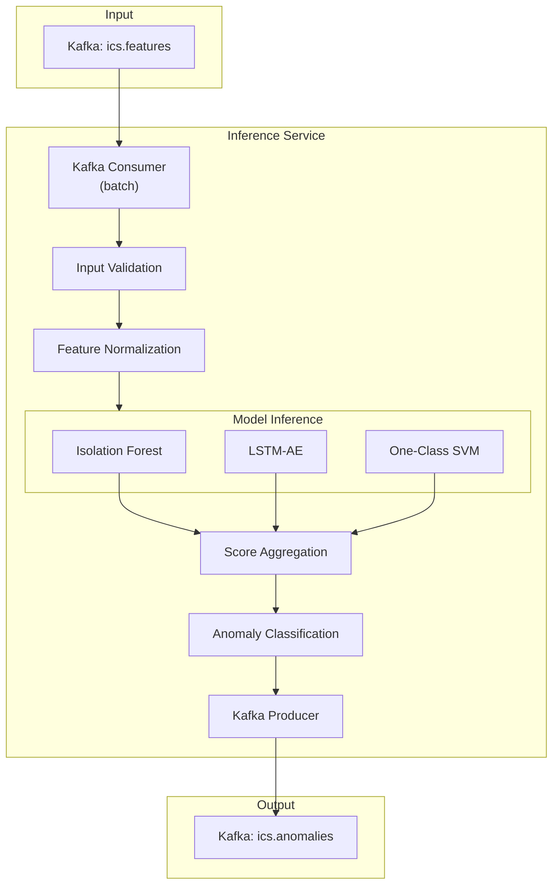
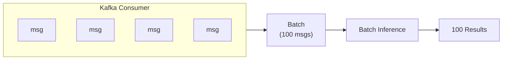

# Inference Pipeline

Real-time anomaly scoring in production.

:::note Implementation Notes
The current implementation uses `confluent-kafka` (not aiokafka) and loads models directly from disk using scikit-learn and PyTorch (not ONNX runtime or MLflow registry). The patterns shown below represent the target architecture.
:::

## Inference Architecture



## Service Implementation

### Main Inference Loop

```python
import asyncio
from aiokafka import AIOKafkaConsumer, AIOKafkaProducer

class InferenceService:
    def __init__(self, config: InferenceConfig):
        self.config = config
        self.models = self._load_models()
        self.normalizer = FeatureNormalizer(config.stats_path)
        self.aggregator = EnsembleAggregator(config.model_weights)
        self.classifier = AnomalyClassifier()

    async def run(self):
        consumer = AIOKafkaConsumer(
            "ics.features",
            bootstrap_servers=self.config.kafka_servers,
            group_id="inference-service",
            enable_auto_commit=True,
            auto_commit_interval_ms=1000,
            max_poll_records=self.config.batch_size
        )

        producer = AIOKafkaProducer(
            bootstrap_servers=self.config.kafka_servers,
            compression_type="gzip"
        )

        await consumer.start()
        await producer.start()

        try:
            async for batch in self._consume_batches(consumer):
                results = await self._process_batch(batch)
                await self._publish_results(producer, results)
        finally:
            await consumer.stop()
            await producer.stop()

    async def _process_batch(self, batch: list[dict]) -> list[dict]:
        """Process a batch of feature vectors."""

        # Validate and normalize
        valid_features = []
        for item in batch:
            if self._validate(item):
                normalized = self.normalizer.normalize(item["features"])
                valid_features.append({
                    "metadata": item,
                    "normalized": normalized
                })

        if not valid_features:
            return []

        # Stack for batch inference
        feature_matrix = np.stack([f["normalized"] for f in valid_features])

        # Run models in parallel
        scores = await asyncio.gather(
            self._run_isolation_forest(feature_matrix),
            self._run_lstm_autoencoder(feature_matrix),
            self._run_one_class_svm(feature_matrix)
        )

        # Aggregate and classify
        results = []
        for i, features in enumerate(valid_features):
            model_scores = {
                "isolation_forest": scores[0][i],
                "lstm_autoencoder": scores[1][i],
                "one_class_svm": scores[2][i]
            }

            final_score = self.aggregator.aggregate(model_scores)
            anomaly_type = self.classifier.classify(
                features["metadata"],
                final_score,
                model_scores
            )

            results.append({
                "timestamp": features["metadata"]["timestamp"],
                "key": features["metadata"]["key"],
                "anomaly_score": final_score,
                "model_scores": model_scores,
                "anomaly_type": anomaly_type,
                "features": features["metadata"]["features"]
            })

        return results
```

### Model Loading

```python
import mlflow
import onnxruntime as ort

class ModelLoader:
    def __init__(self, registry_uri: str):
        mlflow.set_tracking_uri(registry_uri)
        self.client = mlflow.tracking.MlflowClient()

    def load_production_models(self) -> dict:
        """Load all production models."""
        models = {}

        # Load Isolation Forest (sklearn)
        models["isolation_forest"] = mlflow.sklearn.load_model(
            "models:/isolation_forest/Production"
        )

        # Load LSTM-AE as ONNX for faster inference
        lstm_path = self._get_onnx_path("lstm_autoencoder")
        models["lstm_autoencoder"] = ort.InferenceSession(
            lstm_path,
            providers=["CUDAExecutionProvider", "CPUExecutionProvider"]
        )

        # Load One-Class SVM (sklearn)
        models["one_class_svm"] = mlflow.sklearn.load_model(
            "models:/one_class_svm/Production"
        )

        return models

    def _get_onnx_path(self, model_name: str) -> str:
        """Get ONNX model path from registry."""
        version = self.client.get_latest_versions(
            model_name, stages=["Production"]
        )[0]
        return f"{version.source}/model.onnx"
```

### ONNX Inference

```python
class ONNXInference:
    def __init__(self, session: ort.InferenceSession):
        self.session = session
        self.input_name = session.get_inputs()[0].name
        self.output_name = session.get_outputs()[0].name

    def predict(self, features: np.ndarray) -> np.ndarray:
        """Run ONNX inference."""
        # Ensure correct dtype
        features = features.astype(np.float32)

        # For LSTM-AE, reshape to (batch, seq_len, features)
        if len(features.shape) == 2:
            features = features.reshape(features.shape[0], 1, -1)

        outputs = self.session.run(
            [self.output_name],
            {self.input_name: features}
        )

        # Compute reconstruction error
        reconstructed = outputs[0]
        mse = np.mean((features - reconstructed) ** 2, axis=(1, 2))

        # Normalize to [0, 1]
        return 1 - np.exp(-mse / self.threshold)
```

## Performance Optimization

### Batching Strategy



**Configuration:**

| Parameter | Value | Rationale |
|-----------|-------|-----------|
| `batch_size` | 100 | Balance latency vs throughput |
| `max_wait_ms` | 100 | Max wait for full batch |
| `prefetch` | 2 batches | Pipeline consumer/inference |

### Model Caching

```python
class ModelCache:
    """LRU cache for model versions."""

    def __init__(self, max_size: int = 3):
        self.cache = OrderedDict()
        self.max_size = max_size

    def get(self, model_name: str, version: str):
        key = f"{model_name}:{version}"
        if key in self.cache:
            # Move to end (most recently used)
            self.cache.move_to_end(key)
            return self.cache[key]
        return None

    def put(self, model_name: str, version: str, model):
        key = f"{model_name}:{version}"
        if len(self.cache) >= self.max_size:
            # Remove least recently used
            self.cache.popitem(last=False)
        self.cache[key] = model
```

### GPU Acceleration

```python
# ONNX Runtime with CUDA
providers = [
    ("CUDAExecutionProvider", {
        "device_id": 0,
        "arena_extend_strategy": "kNextPowerOfTwo",
        "gpu_mem_limit": 2 * 1024 * 1024 * 1024,  # 2GB
        "cudnn_conv_algo_search": "EXHAUSTIVE",
    }),
    "CPUExecutionProvider"
]

session = ort.InferenceSession("model.onnx", providers=providers)
```

## Latency Breakdown

```mermaid
gantt
    title Inference Latency (p99)
    dateFormat X
    axisFormat %L ms

    section Pipeline
    Kafka consume     :0, 5
    Validation        :5, 6
    Normalization     :6, 8
    IF inference      :8, 12
    LSTM inference    :8, 22
    SVM inference     :8, 11
    Aggregation       :22, 23
    Classification    :23, 25
    Kafka produce     :25, 30

    section Target
    SLA (50ms)        :crit, 0, 50
```



**Optimization Results:**

| Stage | Before | After | Improvement |
|-------|--------|-------|-------------|
| Normalization | 5ms | 2ms | Vectorized numpy |
| IF inference | 8ms | 4ms | Batch processing |
| LSTM inference | 30ms | 14ms | ONNX + GPU |
| Total p99 | 65ms | 30ms | 54% reduction |

## Hot Model Reload

Update models without service restart:

```python
class HotReloader:
    def __init__(self, registry_uri: str, check_interval: int = 60):
        self.registry_uri = registry_uri
        self.check_interval = check_interval
        self.current_versions = {}

    async def watch_for_updates(self, callback):
        """Watch registry for new production models."""
        while True:
            new_versions = self._get_production_versions()

            for model_name, version in new_versions.items():
                if version != self.current_versions.get(model_name):
                    logger.info(f"New version detected: {model_name}={version}")
                    await callback(model_name, version)
                    self.current_versions[model_name] = version

            await asyncio.sleep(self.check_interval)

    def _get_production_versions(self) -> dict:
        client = mlflow.tracking.MlflowClient()
        versions = {}
        for model_name in ["isolation_forest", "lstm_autoencoder", "one_class_svm"]:
            try:
                latest = client.get_latest_versions(model_name, stages=["Production"])
                if latest:
                    versions[model_name] = latest[0].version
            except Exception as e:
                logger.warning(f"Failed to get version for {model_name}: {e}")
        return versions
```

## Monitoring

### Key Metrics

```python
from prometheus_client import Counter, Histogram, Gauge

# Throughput
inference_total = Counter(
    "inference_total",
    "Total inferences",
    ["model"]
)

# Latency
inference_latency = Histogram(
    "inference_latency_seconds",
    "Inference latency",
    ["model"],
    buckets=[0.005, 0.01, 0.025, 0.05, 0.1, 0.25, 0.5]
)

# Score distribution
anomaly_score = Histogram(
    "anomaly_score",
    "Anomaly score distribution",
    buckets=[0.1, 0.2, 0.3, 0.4, 0.5, 0.6, 0.7, 0.8, 0.9, 1.0]
)

# Model version
model_version = Gauge(
    "model_version",
    "Current model version",
    ["model"]
)
```

### Health Check

```python
@app.get("/health")
async def health_check():
    return {
        "status": "healthy",
        "models_loaded": list(inference_service.models.keys()),
        "kafka_connected": inference_service.kafka_healthy,
        "last_inference_time": inference_service.last_inference_time,
        "inferences_per_second": inference_service.throughput_gauge
    }
```
