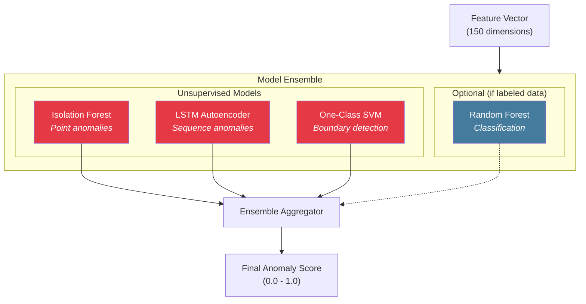
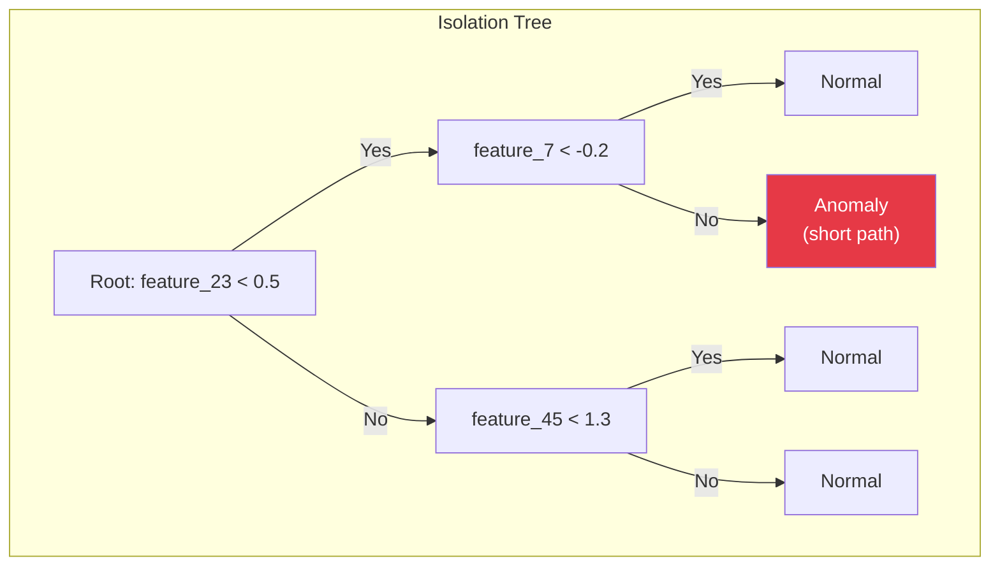
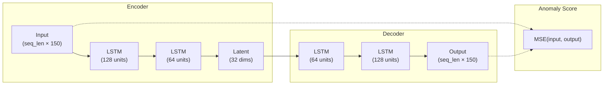
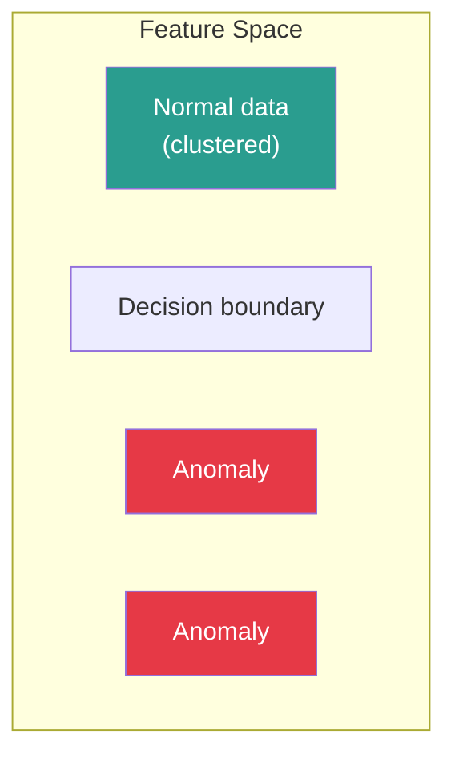
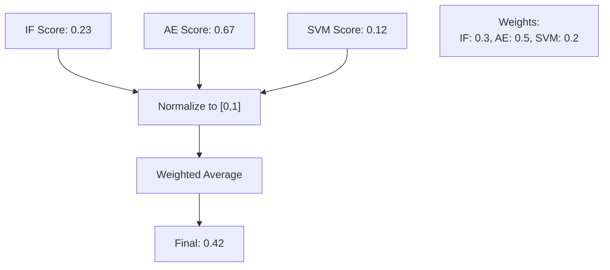

# ML Models

The detection engine uses an ensemble of complementary anomaly detection models.

## Model Architecture



## Isolation Forest

Detects point anomalies by isolating observations.

### How It Works



**Intuition:** Anomalies are easier to isolate (require fewer splits) than normal points.

### Configuration

```python
from sklearn.ensemble import IsolationForest

model = IsolationForest(
    n_estimators=100,       # Number of trees
    max_samples="auto",     # Samples per tree
    contamination=0.01,     # Expected anomaly rate
    max_features=1.0,       # Features per tree
    bootstrap=False,
    random_state=42,
    n_jobs=-1               # Parallel training
)
```

### Strengths & Weaknesses

| Strengths | Weaknesses |
|-----------|------------|
| Fast training & inference | No temporal context |
| Works with high dimensions | Sensitive to contamination param |
| No assumptions about distribution | Can miss subtle anomalies |
| Interpretable (path length) | Point-based only |

---

## LSTM Autoencoder

Detects sequence anomalies through reconstruction error.

### Architecture



### Implementation

```python
import torch
import torch.nn as nn

class LSTMAutoencoder(nn.Module):
    def __init__(self, input_dim=150, hidden_dim=128, latent_dim=32, seq_len=10):
        super().__init__()
        self.seq_len = seq_len

        # Encoder
        self.encoder_lstm1 = nn.LSTM(input_dim, hidden_dim, batch_first=True)
        self.encoder_lstm2 = nn.LSTM(hidden_dim, latent_dim, batch_first=True)

        # Decoder
        self.decoder_lstm1 = nn.LSTM(latent_dim, hidden_dim, batch_first=True)
        self.decoder_lstm2 = nn.LSTM(hidden_dim, input_dim, batch_first=True)

    def forward(self, x):
        # x: (batch, seq_len, input_dim)
        # Encode
        enc1, _ = self.encoder_lstm1(x)
        enc2, (hidden, cell) = self.encoder_lstm2(enc1)

        # Decode
        dec1, _ = self.decoder_lstm1(enc2)
        dec2, _ = self.decoder_lstm2(dec1)

        return dec2

    def compute_anomaly_score(self, x):
        reconstructed = self.forward(x)
        mse = torch.mean((x - reconstructed) ** 2, dim=(1, 2))
        return mse.detach().numpy()
```

### Training Configuration

```yaml
lstm_autoencoder:
  sequence_length: 10      # 10 feature vectors (10 minutes)
  batch_size: 64
  epochs: 100
  learning_rate: 0.001
  hidden_dim: 128
  latent_dim: 32
  dropout: 0.2
  early_stopping:
    patience: 10
    min_delta: 0.001
```

### Strengths & Weaknesses

| Strengths | Weaknesses |
|-----------|------------|
| Captures temporal patterns | Slower inference |
| Learns complex sequences | Requires sequence data |
| Good for subtle anomalies | Training complexity |
| Reconstruction interpretable | Hyperparameter sensitive |

---

## One-Class SVM

Learns a boundary around normal data.

### How It Works



### Configuration

```python
from sklearn.svm import OneClassSVM

model = OneClassSVM(
    kernel="rbf",           # Radial basis function
    gamma="scale",          # Kernel coefficient
    nu=0.01,                # Upper bound on anomaly fraction
    shrinking=True,
    cache_size=500,         # MB for kernel cache
    max_iter=1000
)
```

### Strengths & Weaknesses

| Strengths | Weaknesses |
|-----------|------------|
| Clear decision boundary | Slow on large datasets |
| Works with non-linear data | Sensitive to kernel params |
| Robust to outliers in training | Memory intensive |
| Good for dense clusters | Binary output (in/out) |

---

## Ensemble Aggregation

Combining model outputs for robust detection.

### Aggregation Strategy



### Implementation

```python
class EnsembleAggregator:
    def __init__(self, weights: dict = None):
        self.weights = weights or {
            "isolation_forest": 0.3,
            "lstm_autoencoder": 0.5,
            "one_class_svm": 0.2
        }

    def aggregate(self, scores: dict) -> float:
        """
        Aggregate normalized scores from multiple models.

        Args:
            scores: {"model_name": score} where score in [0, 1]

        Returns:
            Final anomaly score in [0, 1]
        """
        weighted_sum = sum(
            self.weights[model] * score
            for model, score in scores.items()
            if model in self.weights
        )

        total_weight = sum(
            self.weights[model]
            for model in scores.keys()
            if model in self.weights
        )

        return weighted_sum / total_weight
```

### Score Normalization

Each model's raw output is normalized to [0, 1]:

| Model | Raw Output | Normalization |
|-------|------------|---------------|
| Isolation Forest | Anomaly score (-1 to 1) | `(score + 1) / 2` |
| LSTM Autoencoder | MSE (0 to ∞) | `1 - exp(-mse / threshold)` |
| One-Class SVM | Distance (-∞ to ∞) | `sigmoid(-distance)` |

---

## Model Selection by Use Case

| Use Case | Primary Model | Why |
|----------|--------------|-----|
| Scanning detection | Isolation Forest | Point anomalies, fast |
| Command sequence attacks | LSTM Autoencoder | Temporal patterns |
| New device detection | One-Class SVM | Boundary violation |
| High-throughput | Isolation Forest | Fastest inference |
| Resource-constrained | Isolation Forest | Lowest memory |

## ONNX Export

Models are exported to ONNX for production inference:

```python
import torch.onnx

# Export LSTM Autoencoder
dummy_input = torch.randn(1, 10, 150)
torch.onnx.export(
    model,
    dummy_input,
    "lstm_autoencoder.onnx",
    input_names=["input"],
    output_names=["output"],
    dynamic_axes={
        "input": {0: "batch_size"},
        "output": {0: "batch_size"}
    }
)
```

Benefits:
- 2-3x faster inference
- Language-agnostic deployment
- Hardware acceleration (TensorRT, OpenVINO)
