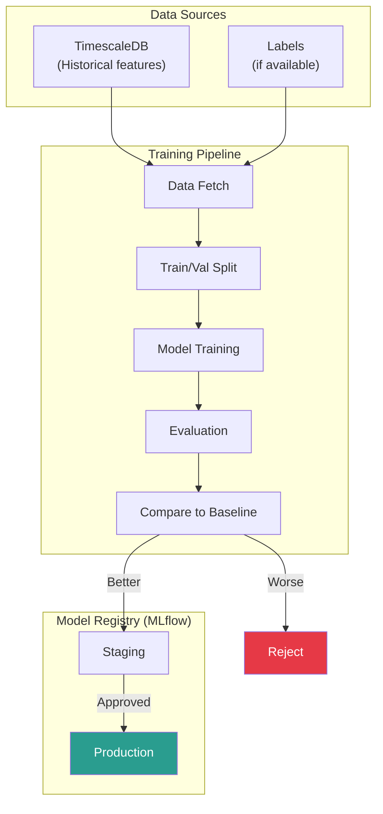
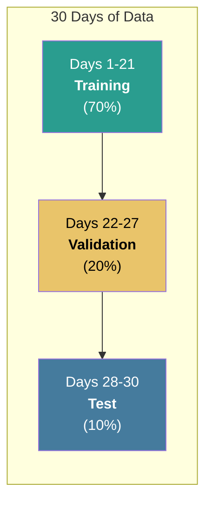
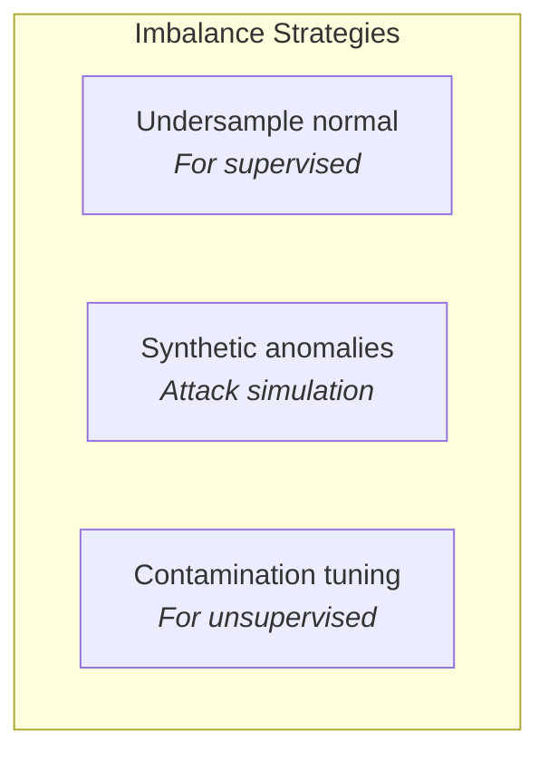
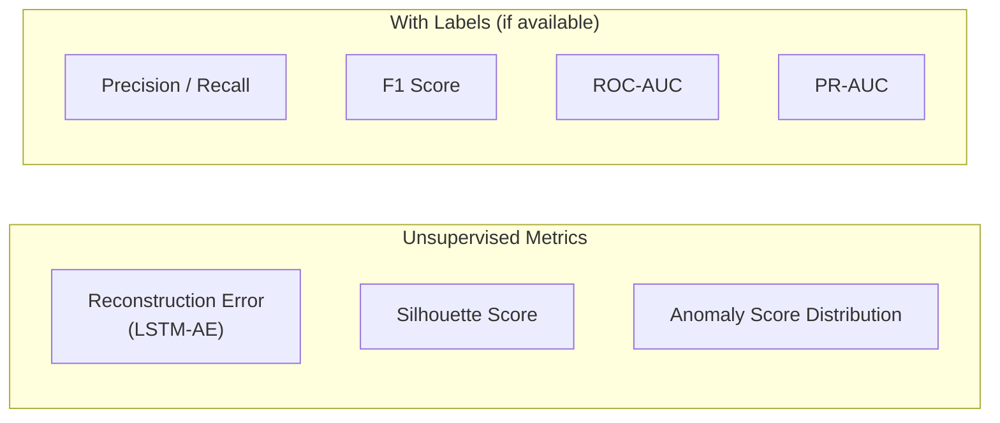
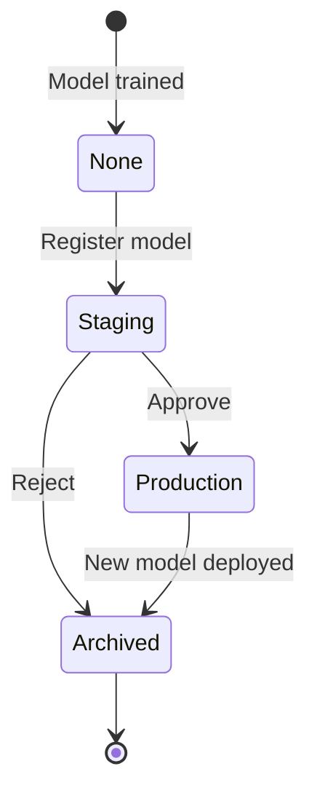
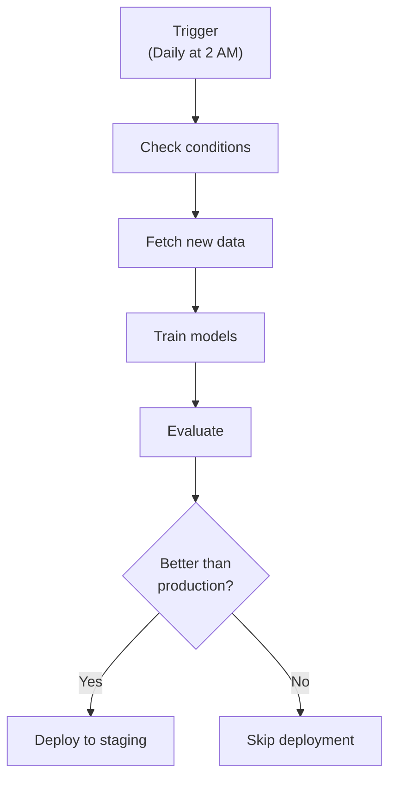

# Training Pipeline

How models are trained, validated, and versioned.

:::note Current Status
The training pipeline described below is the target architecture. Currently, models are trained offline and loaded from disk. MLflow integration, automated retraining, and data drift detection are planned features.
:::

## Training Architecture



## Data Preparation

### Fetching Training Data

```python
from datetime import datetime, timedelta
import pandas as pd

def fetch_training_data(
    start_date: datetime,
    end_date: datetime,
    protocols: list[str] = ["modbus", "dnp3"]
) -> pd.DataFrame:
    """
    Fetch feature vectors from TimescaleDB.
    """
    query = """
        SELECT
            time,
            key,
            protocol,
            features,
            anomaly_score,
            label  -- NULL if unlabeled
        FROM features
        WHERE time >= %(start)s
          AND time < %(end)s
          AND protocol = ANY(%(protocols)s)
        ORDER BY time
    """

    df = pd.read_sql(query, conn, params={
        "start": start_date,
        "end": end_date,
        "protocols": protocols
    })

    # Expand JSON features to columns
    features_df = pd.json_normalize(df["features"])
    return pd.concat([df.drop("features", axis=1), features_df], axis=1)
```

### Train/Validation Split



**Important:** Time-based split preserves temporal ordering (no data leakage).

```python
def temporal_split(df: pd.DataFrame) -> tuple:
    """Split data chronologically."""
    df = df.sort_values("time")

    n = len(df)
    train_end = int(n * 0.7)
    val_end = int(n * 0.9)

    train = df.iloc[:train_end]
    val = df.iloc[train_end:val_end]
    test = df.iloc[val_end:]

    return train, val, test
```

### Handling Imbalanced Data

ICS anomalies are rare (~0.1-1% of traffic).



```python
# For unsupervised models, assume mostly normal data
# Tune contamination based on expected anomaly rate

isolation_forest = IsolationForest(
    contamination=0.01  # Expect 1% anomalies
)

# For LSTM-AE, train only on normal data
normal_data = df[df["label"] != "anomaly"]
```

## Training Process

### Isolation Forest Training

```python
import mlflow
from sklearn.ensemble import IsolationForest

def train_isolation_forest(train_data: np.ndarray, config: dict) -> IsolationForest:
    with mlflow.start_run(run_name="isolation_forest"):
        # Log parameters
        mlflow.log_params(config)

        # Train model
        model = IsolationForest(**config)
        model.fit(train_data)

        # Log model
        mlflow.sklearn.log_model(model, "model")

        return model
```

### LSTM Autoencoder Training

```python
import torch
from torch.utils.data import DataLoader

def train_lstm_autoencoder(
    train_loader: DataLoader,
    val_loader: DataLoader,
    config: dict
) -> LSTMAutoencoder:

    model = LSTMAutoencoder(
        input_dim=config["input_dim"],
        hidden_dim=config["hidden_dim"],
        latent_dim=config["latent_dim"],
        seq_len=config["seq_len"]
    )

    optimizer = torch.optim.Adam(model.parameters(), lr=config["lr"])
    criterion = nn.MSELoss()

    best_val_loss = float("inf")
    patience_counter = 0

    with mlflow.start_run(run_name="lstm_autoencoder"):
        mlflow.log_params(config)

        for epoch in range(config["epochs"]):
            # Training
            model.train()
            train_loss = 0
            for batch in train_loader:
                optimizer.zero_grad()
                reconstructed = model(batch)
                loss = criterion(reconstructed, batch)
                loss.backward()
                optimizer.step()
                train_loss += loss.item()

            # Validation
            model.eval()
            val_loss = 0
            with torch.no_grad():
                for batch in val_loader:
                    reconstructed = model(batch)
                    val_loss += criterion(reconstructed, batch).item()

            # Log metrics
            mlflow.log_metrics({
                "train_loss": train_loss / len(train_loader),
                "val_loss": val_loss / len(val_loader)
            }, step=epoch)

            # Early stopping
            if val_loss < best_val_loss:
                best_val_loss = val_loss
                patience_counter = 0
                torch.save(model.state_dict(), "best_model.pt")
            else:
                patience_counter += 1
                if patience_counter >= config["patience"]:
                    break

        # Load best model and log
        model.load_state_dict(torch.load("best_model.pt"))
        mlflow.pytorch.log_model(model, "model")

        return model
```

## Evaluation

### Metrics



### Evaluation Code

```python
from sklearn.metrics import precision_recall_curve, roc_auc_score

def evaluate_model(
    model,
    test_data: np.ndarray,
    test_labels: np.ndarray = None
) -> dict:
    """Evaluate anomaly detection model."""

    # Get anomaly scores
    scores = model.predict_scores(test_data)

    metrics = {
        "score_mean": np.mean(scores),
        "score_std": np.std(scores),
        "score_p95": np.percentile(scores, 95),
        "score_p99": np.percentile(scores, 99),
    }

    # If labels available, compute classification metrics
    if test_labels is not None:
        # Find optimal threshold using validation set
        precision, recall, thresholds = precision_recall_curve(
            test_labels, scores
        )
        f1_scores = 2 * (precision * recall) / (precision + recall + 1e-8)
        optimal_idx = np.argmax(f1_scores)
        optimal_threshold = thresholds[optimal_idx]

        predictions = (scores >= optimal_threshold).astype(int)

        metrics.update({
            "optimal_threshold": optimal_threshold,
            "precision": precision[optimal_idx],
            "recall": recall[optimal_idx],
            "f1": f1_scores[optimal_idx],
            "roc_auc": roc_auc_score(test_labels, scores),
        })

    return metrics
```

## Model Registry

### MLflow Model Lifecycle



### Registration

```python
import mlflow

def register_model(run_id: str, model_name: str) -> str:
    """Register a trained model in MLflow registry."""

    model_uri = f"runs:/{run_id}/model"

    # Register model
    result = mlflow.register_model(
        model_uri=model_uri,
        name=model_name
    )

    # Transition to staging
    client = mlflow.tracking.MlflowClient()
    client.transition_model_version_stage(
        name=model_name,
        version=result.version,
        stage="Staging"
    )

    return result.version
```

### Promotion to Production

```python
def promote_model(model_name: str, version: str):
    """Promote a model from staging to production."""

    client = mlflow.tracking.MlflowClient()

    # Archive current production model
    for mv in client.search_model_versions(f"name='{model_name}'"):
        if mv.current_stage == "Production":
            client.transition_model_version_stage(
                name=model_name,
                version=mv.version,
                stage="Archived"
            )

    # Promote new model
    client.transition_model_version_stage(
        name=model_name,
        version=version,
        stage="Production"
    )
```

## Automated Retraining

### Schedule



### Retraining Triggers

| Trigger                 | Condition                  | Action              |
| ----------------------- | -------------------------- | ------------------- |
| Scheduled               | Daily at 2 AM UTC          | Full retrain        |
| Performance degradation | F1 drops > 10%             | Alert + retrain     |
| Data drift              | Feature distribution shift | Alert + investigate |
| Manual                  | Operator request           | Immediate retrain   |

### Data Drift Detection

```python
from scipy.stats import ks_2samp

def detect_drift(
    baseline_features: np.ndarray,
    current_features: np.ndarray,
    threshold: float = 0.05
) -> dict:
    """
    Detect data drift using Kolmogorov-Smirnov test.
    """
    drift_results = {}

    for i, feature_name in enumerate(FEATURE_NAMES):
        stat, p_value = ks_2samp(
            baseline_features[:, i],
            current_features[:, i]
        )

        drift_results[feature_name] = {
            "ks_statistic": stat,
            "p_value": p_value,
            "drift_detected": p_value < threshold
        }

    drifted_features = [
        f for f, r in drift_results.items()
        if r["drift_detected"]
    ]

    return {
        "total_features": len(FEATURE_NAMES),
        "drifted_features": len(drifted_features),
        "drift_ratio": len(drifted_features) / len(FEATURE_NAMES),
        "details": drift_results
    }
```
