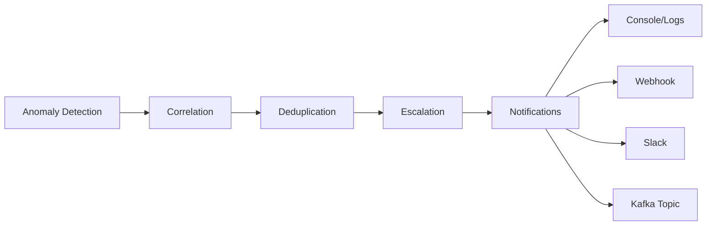
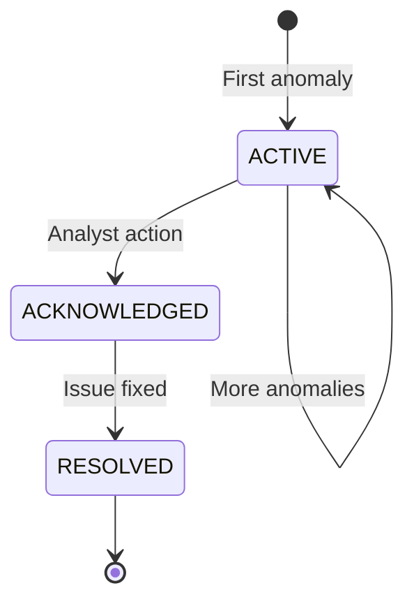

# Alerting Configuration

Configure how anomaly alerts are generated and delivered.

## Alert Pipeline



## Configuration

The alerting service is configured via environment variables:

### Core Settings

| Variable                  | Default              | Description      |
| ------------------------- | -------------------- | ---------------- |
| `KAFKA_BOOTSTRAP_SERVERS` | `kafka:9092`         | Kafka connection |
| `KAFKA_INPUT_TOPIC`       | `ics.anomalies`      | Source topic     |
| `KAFKA_OUTPUT_TOPIC`      | `ics.alerts`         | Output topic     |
| `REDIS_URL`               | `redis://redis:6379` | State storage    |
| `API_PORT`                | `8084`               | REST API port    |

### Correlation Settings

| Variable                     | Default | Description                      |
| ---------------------------- | ------- | -------------------------------- |
| `CORRELATION_WINDOW_SECONDS` | `300`   | Group anomalies within 5 minutes |

Anomalies are grouped into incidents by correlation key: `{src_ip}:{dst_ip}:{protocol}`

### Deduplication Settings

| Variable                    | Default | Description               |
| --------------------------- | ------- | ------------------------- |
| `DEDUP_SUPPRESSION_SECONDS` | `60`    | Suppress duplicate alerts |

Prevents alert fatigue by suppressing repeated alerts for the same correlation key within the suppression window.

### Escalation Settings

| Variable                  | Default | Description                 |
| ------------------------- | ------- | --------------------------- |
| `ESCALATION_P3_THRESHOLD` | `5`     | Anomalies to escalate to P3 |
| `ESCALATION_P2_THRESHOLD` | `10`    | Anomalies to escalate to P2 |
| `ESCALATION_P1_THRESHOLD` | `20`    | Anomalies to escalate to P1 |

Priority escalation rules:

- **P4**: Initial incident (< 5 anomalies)
- **P3**: 5+ anomalies in correlation window
- **P2**: 10+ anomalies OR HIGH severity
- **P1**: 20+ anomalies OR CRITICAL severity OR multi-target attack

### Notification Settings

| Variable            | Default | Description                  |
| ------------------- | ------- | ---------------------------- |
| `WEBHOOK_ENABLED`   | `false` | Enable webhook notifications |
| `WEBHOOK_URL`       | -       | Webhook endpoint URL         |
| `SLACK_ENABLED`     | `false` | Enable Slack notifications   |
| `SLACK_WEBHOOK_URL` | -       | Slack incoming webhook URL   |

## Notification Channels

### Console (Default)

All alerts are logged to stdout with structured JSON:

```json
{
  "event": "alert_generated",
  "alert_id": "a1b2c3d4...",
  "severity": "HIGH",
  "anomaly_type": "RECONNAISSANCE",
  "source_ip": "192.168.1.50"
}
```

### Webhook

Enable generic webhook notifications:

```yaml
# docker-compose.yml
alerting:
  environment:
    WEBHOOK_ENABLED: 'true'
    WEBHOOK_URL: 'https://your-endpoint.com/alerts'
```

Webhook payload:

```json
{
  "id": "a1b2c3d4-e5f6-7890-abcd-ef1234567890",
  "severity": "HIGH",
  "title": "RECONNAISSANCE detected from 192.168.1.50",
  "description": "Elevated fc_unique_count (8) indicates device scanning",
  "source": {
    "src_ip": "192.168.1.50",
    "dst_ip": "192.168.1.10",
    "protocol": "modbus"
  },
  "ensemble_score": 0.89,
  "created_at": "2024-01-15T10:30:00Z"
}
```

### Slack

Enable Slack notifications:

```yaml
alerting:
  environment:
    SLACK_ENABLED: 'true'
    SLACK_WEBHOOK_URL: 'https://hooks.slack.com/services/xxx/yyy/zzz'
```

Creates formatted Slack messages with:

- Severity-colored attachment
- Alert title and description
- Source/destination IPs
- Anomaly score
- Link to dashboard (if configured)

### Kafka Topic

All alerts are published to `ics.alerts` topic for downstream consumers:

```bash
# Consume alerts
docker compose exec kafka kafka-console-consumer.sh \
  --bootstrap-server localhost:9092 \
  --topic ics.alerts \
  --from-latest
```

## Severity Mapping

Anomaly types map to default severities:

| Anomaly Type          | Default Severity | Rationale                       |
| --------------------- | ---------------- | ------------------------------- |
| `COMMAND_INJECTION`   | CRITICAL         | Direct process impact           |
| `PROTOCOL_VIOLATION`  | CRITICAL         | Active attack indicator         |
| `UNAUTHORIZED_ACCESS` | HIGH             | Potential reconnaissance/attack |
| `DATA_EXFILTRATION`   | HIGH             | Information theft               |
| `RECONNAISSANCE`      | HIGH             | Attack precursor                |
| `VOLUME_ANOMALY`      | MEDIUM           | May indicate issues             |
| `TIMING_ANOMALY`      | MEDIUM           | May indicate collection         |
| `UNKNOWN`             | MEDIUM           | Requires investigation          |

## Alert Suppression

### Automatic Deduplication

Duplicate alerts (same correlation key within suppression window) are automatically suppressed:

```
Alert 1: 10:30:00 - RECONNAISSANCE from 192.168.1.50 → Generated
Alert 2: 10:30:15 - RECONNAISSANCE from 192.168.1.50 → Suppressed (within 60s)
Alert 3: 10:30:45 - RECONNAISSANCE from 192.168.1.50 → Suppressed
Alert 4: 10:31:30 - RECONNAISSANCE from 192.168.1.50 → Generated (after 60s)
```

### Viewing Suppression Stats

```bash
curl http://localhost:8084/stats
# {"dedup_suppressed": 340, ...}
```

## Incident Management

### Incident Lifecycle



### API Operations

```bash
# List active incidents
curl "http://localhost:8084/incidents?status=ACTIVE"

# Acknowledge incident
curl -X POST http://localhost:8084/incidents/{id}/acknowledge

# Resolve incident
curl -X POST http://localhost:8084/incidents/{id}/resolve
```

## Example Configuration

Complete docker-compose environment:

```yaml
alerting:
  image: ics-anomaly-detection/alerting:latest
  environment:
    # Kafka
    KAFKA_BOOTSTRAP_SERVERS: kafka:9092
    KAFKA_INPUT_TOPIC: ics.anomalies
    KAFKA_OUTPUT_TOPIC: ics.alerts
    KAFKA_GROUP_ID: alerting-service

    # Redis
    REDIS_URL: redis://redis:6379

    # Correlation
    CORRELATION_WINDOW_SECONDS: 300

    # Deduplication
    DEDUP_SUPPRESSION_SECONDS: 60

    # Escalation
    ESCALATION_P3_THRESHOLD: 5
    ESCALATION_P2_THRESHOLD: 10
    ESCALATION_P1_THRESHOLD: 20

    # Notifications
    WEBHOOK_ENABLED: 'true'
    WEBHOOK_URL: 'https://alerts.example.com/webhook'
    SLACK_ENABLED: 'true'
    SLACK_WEBHOOK_URL: 'https://hooks.slack.com/services/xxx'

    # API
    API_PORT: 8084
  ports:
    - '8084:8084'
  depends_on:
    - kafka
    - redis
```
