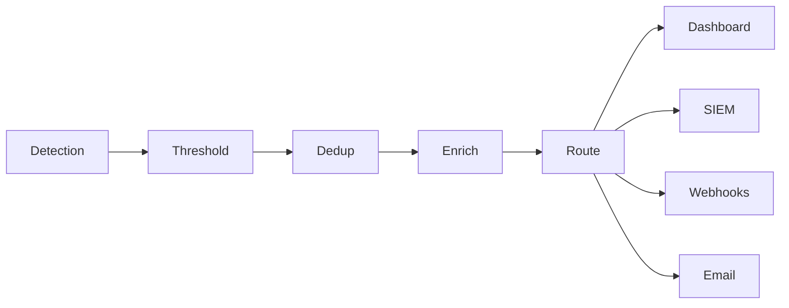

# Alerting Configuration

Configure how anomaly alerts are generated and delivered.

## Alert Pipeline



## Threshold Configuration

```yaml
# config/alerting.yaml
thresholds:
  global:
    anomaly_score: 0.7  # Minimum score to alert

  per_type:
    RECONNAISSANCE:
      score: 0.6
      cooldown_minutes: 5
    PROTOCOL_VIOLATION:
      score: 0.5
      cooldown_minutes: 1
    VALUE_MANIPULATION:
      score: 0.8
      cooldown_minutes: 0  # Always alert

  adaptive:
    enabled: true
    baseline_window_hours: 168  # 1 week
    sensitivity: 2.0  # Standard deviations
```

## Notification Channels

### SIEM Integration

```yaml
siem:
  type: "syslog"
  host: "siem.example.com"
  port: 514
  protocol: "tcp"
  format: "cef"  # or "leef", "json"
```

### Webhooks

```yaml
webhooks:
  - name: "slack"
    url: "https://hooks.slack.com/services/xxx"
    severity: ["critical", "high"]
    template: |
      {
        "text": "ICS Alert: {{ .Type }} from {{ .SourceIP }}",
        "attachments": [{
          "color": "{{ if eq .Severity \"critical\" }}danger{{ else }}warning{{ end }}",
          "fields": [
            {"title": "Score", "value": "{{ .Score }}", "short": true},
            {"title": "Time", "value": "{{ .Timestamp }}", "short": true}
          ]
        }]
      }

  - name: "pagerduty"
    url: "https://events.pagerduty.com/v2/enqueue"
    severity: ["critical"]
    headers:
      Content-Type: "application/json"
```

### Email

```yaml
email:
  smtp_host: "smtp.example.com"
  smtp_port: 587
  from: "alerts@ics-detection.local"
  recipients:
    critical: ["soc-critical@example.com"]
    high: ["soc-team@example.com"]
```

## Suppression Rules

Prevent alert fatigue:

```yaml
suppression:
  rules:
    - name: "Maintenance window"
      schedule:
        days: ["saturday"]
        hours: ["02:00-06:00"]
      action: "suppress"
      reason: "Scheduled maintenance"

    - name: "Known scanner"
      match:
        source_ip: "192.168.1.200"
        type: "RECONNAISSANCE"
      action: "suppress"
      reason: "Authorized vulnerability scanner"
```
