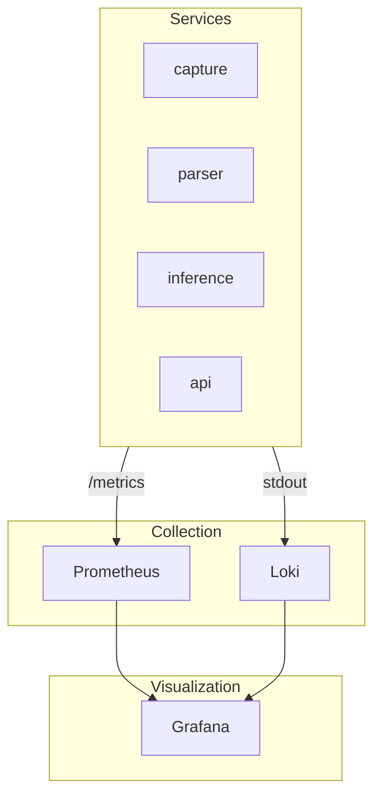

# Monitoring

System observability and health monitoring.

## Monitoring Stack



## Key Dashboards

### System Overview

Monitor overall system health:

- Ingestion rate (packets/sec)
- Inference throughput
- Alert generation rate
- Error rates
- Resource utilization

### ML Performance

Track model effectiveness:

- Anomaly score distribution
- Per-model latency
- Model drift indicators
- False positive rate (if labels available)

### Alert Investigation

For SOC analysts:

- Real-time alert feed
- Alert trends over time
- Top sources/destinations
- MITRE ATT&CK heatmap

## Health Checks

Each service exposes health endpoints:

```bash
# Check service health
curl http://localhost:8080/health

# Response
{
  "status": "healthy",
  "checks": {
    "kafka": "ok",
    "database": "ok",
    "models_loaded": true
  }
}
```

## Alerting Rules

Example Prometheus alerting rules:

```yaml
groups:
  - name: ics-anomaly-detection
    rules:
      - alert: HighErrorRate
        expr: rate(parse_errors_total[5m]) > 0.01
        for: 5m
        labels:
          severity: warning
        annotations:
          summary: "High parse error rate"

      - alert: InferenceSlow
        expr: histogram_quantile(0.99, inference_latency_seconds_bucket) > 0.1
        for: 2m
        labels:
          severity: critical
        annotations:
          summary: "Inference latency exceeded SLA"

      - alert: KafkaLagHigh
        expr: kafka_consumer_lag > 10000
        for: 5m
        labels:
          severity: warning
        annotations:
          summary: "Kafka consumer falling behind"
```
