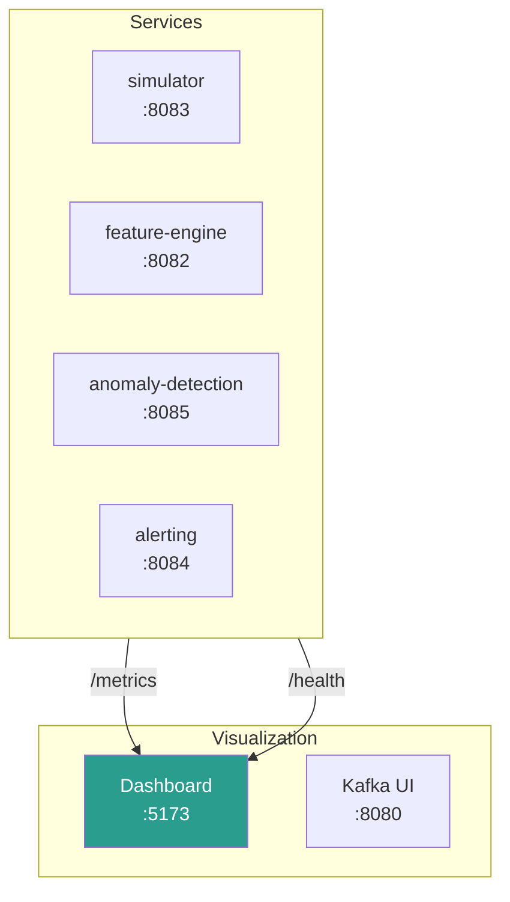

# Monitoring

System observability and health monitoring.

## Monitoring Stack



## Health Endpoints

Each service exposes health and metrics endpoints:

| Service           | Health                       | Metrics                       |
| ----------------- | ---------------------------- | ----------------------------- |
| Simulator         | http://localhost:8083/health | http://localhost:8083/metrics |
| Feature Engine    | http://localhost:8082/health | http://localhost:8082/metrics |
| Anomaly Detection | http://localhost:8085/health | http://localhost:8085/metrics |
| Alerting          | http://localhost:8084/health | http://localhost:8084/metrics |

### Health Check Examples

```bash
# Check simulator
curl http://localhost:8083/health
# {"status": "healthy", "running": true}

# Check alerting service
curl http://localhost:8084/health
# {"status": "healthy", "kafka_connected": true, "redis_connected": true}

# Check all services
for port in 8082 8083 8084 8085; do
  echo "Port $port: $(curl -s http://localhost:$port/health | jq -r .status)"
done
```

## Dashboard

The React dashboard (http://localhost:5173) provides real-time monitoring:

### Overview Tab

- System health status
- Pipeline throughput metrics
- Recent alerts feed
- Anomaly score trends

### Alerts Tab

- Alert list with filtering (severity, status, type)
- Alert detail view
- Acknowledge/resolve actions

### Incidents Tab

- Active incident tracking
- Correlation visualization
- Priority escalation status

## Kafka Monitoring

### Kafka UI

Access Kafka UI at http://localhost:8080 (when running with `make debug`):

- Topic browser
- Consumer group status
- Message inspection
- Broker health

### Topic Health

```bash
# List topics
docker compose exec kafka kafka-topics.sh \
  --bootstrap-server localhost:9092 \
  --list

# Check topic details
docker compose exec kafka kafka-topics.sh \
  --bootstrap-server localhost:9092 \
  --describe --topic ics.features

# Check consumer lag
docker compose exec kafka kafka-consumer-groups.sh \
  --bootstrap-server localhost:9092 \
  --describe --group anomaly-detection
```

### Expected Topics

| Topic               | Partitions | Retention |
| ------------------- | ---------- | --------- |
| `ics.raw.packets`   | 6          | 7 days    |
| `ics.parsed.modbus` | 6          | 7 days    |
| `ics.features`      | 6          | 7 days    |
| `ics.anomalies`     | 6          | 7 days    |
| `ics.alerts`        | 6          | 7 days    |

## Key Metrics

### Throughput

```bash
# Messages sent by simulator
curl -s http://localhost:8083/metrics | grep simulator_messages_sent

# Features extracted
curl -s http://localhost:8082/metrics | grep feature_engine_windows

# Anomalies detected
curl -s http://localhost:8085/metrics | grep anomaly_detection_inferences
```

### Latency

```bash
# Inference latency
curl -s http://localhost:8085/metrics | grep inference_latency
```

### Alerts

```bash
# Alert statistics
curl http://localhost:8084/stats
```

## Docker Monitoring

### Container Status

```bash
# All containers
docker compose ps

# Resource usage
docker stats --no-stream

# Container logs
docker compose logs -f --tail 100 anomaly-detection
```

### Log Aggregation

All services log structured JSON to stdout:

```bash
# Follow all logs
docker compose logs -f

# Filter by service
docker compose logs -f alerting

# Search logs
docker compose logs | grep -i error
```

## Alerting on System Issues

### Basic Health Monitoring Script

```bash
#!/bin/bash
# health-check.sh

SERVICES=(
  "http://localhost:8083/health"
  "http://localhost:8084/health"
  "http://localhost:8085/health"
)

for url in "${SERVICES[@]}"; do
  status=$(curl -s -o /dev/null -w "%{http_code}" "$url")
  if [ "$status" != "200" ]; then
    echo "ALERT: $url returned $status"
  fi
done
```

### Prometheus Alerting Rules (Example)

```yaml
groups:
  - name: ics-anomaly-detection
    rules:
      - alert: ServiceDown
        expr: up{job="ics-services"} == 0
        for: 1m
        labels:
          severity: critical
        annotations:
          summary: 'Service {{ $labels.instance }} is down'

      - alert: HighErrorRate
        expr: rate(simulator_errors_total[5m]) > 0.01
        for: 5m
        labels:
          severity: warning
        annotations:
          summary: 'High error rate in simulator'

      - alert: KafkaLagHigh
        expr: kafka_consumer_lag > 10000
        for: 5m
        labels:
          severity: warning
        annotations:
          summary: 'Kafka consumer falling behind'
```

## Grafana Integration

:::note Planned Feature
Full Grafana dashboards with pre-configured panels are planned. Currently, use the React dashboard or direct API/Kafka monitoring.
:::

Dashboard configurations are provisioned in `/config/grafana/provisioning/dashboards/`:

- **pipeline-overview.json** - End-to-end pipeline metrics
- (Additional dashboards planned)

## Quick Health Check

```bash
# Full system check
make status

# Or manually:
echo "=== Services ==="
docker compose ps --format "table {{.Name}}\t{{.Status}}"

echo -e "\n=== Health ==="
curl -s http://localhost:8083/health | jq
curl -s http://localhost:8084/health | jq

echo -e "\n=== Kafka Topics ==="
docker compose exec kafka kafka-topics.sh \
  --bootstrap-server localhost:9092 --list

echo -e "\n=== Recent Alerts ==="
curl -s "http://localhost:8084/alerts?limit=5" | jq '.[].title'
```
