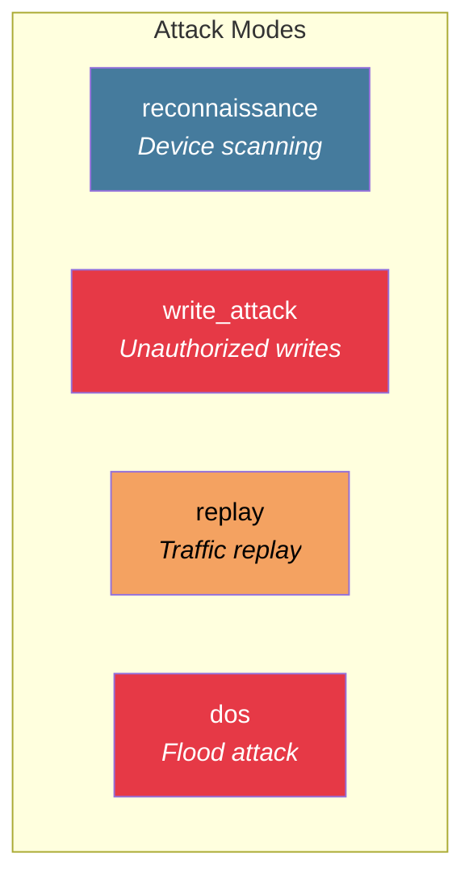
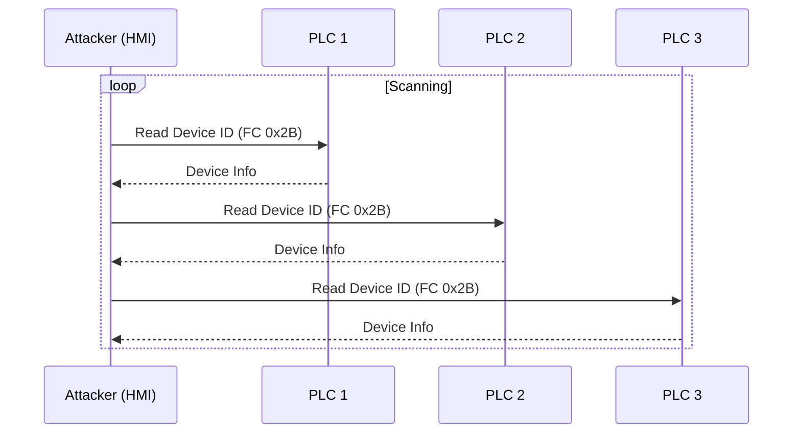
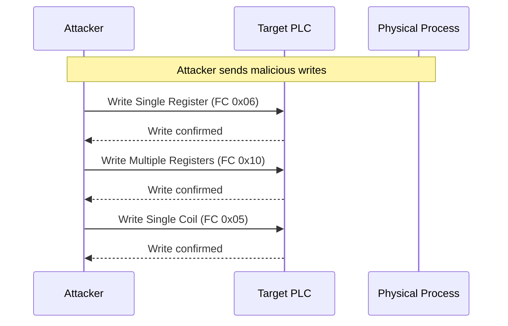

# Attack Scenarios

Pre-built attack scenarios for testing the detection engine.

## Available Attack Modes

The simulator supports four attack modes that can be triggered via API:



## Scenario: Reconnaissance

Simulates device enumeration using Read Device Identification (FC 0x2B).

### Attack Pattern



### Trigger

```bash
curl -X POST http://localhost:8083/attack/start \
  -H "Content-Type: application/json" \
  -d '{"mode": "reconnaissance"}'
```

### Expected Detection

| Feature | Normal | During Attack |
|---------|--------|---------------|
| `fc_unique_count` | 2-4 | 5+ (includes 0x2B) |
| `fc_diagnostic_ratio` | < 0.1 | > 0.5 |

**Expected Alert:** `RECONNAISSANCE` severity `HIGH`

---

## Scenario: Write Attack

Simulates unauthorized write operations targeting PLC registers.

### Attack Pattern



### Trigger

```bash
curl -X POST http://localhost:8083/attack/start \
  -H "Content-Type: application/json" \
  -d '{"mode": "write_attack"}'
```

### Expected Detection

| Feature | Normal | During Attack |
|---------|--------|---------------|
| `fc_write_ratio` | < 0.2 | > 0.5 |
| `fc_read_ratio` | > 0.8 | < 0.5 |

**Expected Alert:** `COMMAND_INJECTION` severity `CRITICAL`

---

## Scenario: Replay Attack

:::note Planned Feature
Replay attack simulation (replaying captured traffic) is defined but not fully implemented. Currently behaves the same as normal traffic.
:::

### Trigger

```bash
curl -X POST http://localhost:8083/attack/start \
  -H "Content-Type: application/json" \
  -d '{"mode": "replay"}'
```

---

## Scenario: DoS Flood

:::note Planned Feature
DoS flood simulation is defined but not fully implemented. Currently behaves the same as normal traffic.
:::

### Trigger

```bash
curl -X POST http://localhost:8083/attack/start \
  -H "Content-Type: application/json" \
  -d '{"mode": "dos"}'
```

### Expected Detection (when implemented)

| Feature | Normal | During Attack |
|---------|--------|---------------|
| `message_count` | 100/min | 60000+/min |
| `iat_mean` | 600ms | < 1ms |

**Expected Alert:** `VOLUME_ANOMALY` severity `CRITICAL`

---

## Running Attacks

### Via API

```bash
# Start an attack
curl -X POST http://localhost:8083/attack/start \
  -H "Content-Type: application/json" \
  -d '{"mode": "reconnaissance"}'

# Check current status
curl http://localhost:8083/status

# Stop attack (returns to normal traffic)
curl -X POST http://localhost:8083/attack/stop
```

### Via Make Targets

```bash
# Start reconnaissance attack
make attack-recon

# Stop any running attack
make attack-stop
```

## Monitoring Attack Effects

### Watch Feature Changes

```bash
# Consume features topic to see impact
docker compose exec kafka kafka-console-consumer.sh \
  --bootstrap-server localhost:9092 \
  --topic ics.features \
  --from-latest
```

### Watch Anomaly Scores

```bash
# Consume anomalies topic
docker compose exec kafka kafka-console-consumer.sh \
  --bootstrap-server localhost:9092 \
  --topic ics.anomalies \
  --from-latest
```

### View in Dashboard

Open http://localhost:5173 to see:
- Real-time anomaly score changes
- Alert generation
- Feature deviations

## Creating Custom Scenarios

The current simulator uses hardcoded attack modes. To add new scenarios:

1. Add mode to `AttackConfig` validation in `main.py`
2. Implement logic in `ModbusGenerator.generate_message()`
3. Handle the mode in the generator switch statement

Example extension point in `packages/simulator/src/main.py`:

```python
def generate_message(self, attack_mode: Optional[str] = None) -> dict:
    if attack_mode == "reconnaissance":
        function_code = 0x2B  # Read Device Identification
    elif attack_mode == "write_attack":
        function_code = random.choice([0x06, 0x10, 0x05])
    elif attack_mode == "my_custom_attack":
        # Add your custom logic here
        function_code = 0x08  # Diagnostics
    else:
        # Normal weighted selection
        ...
```
