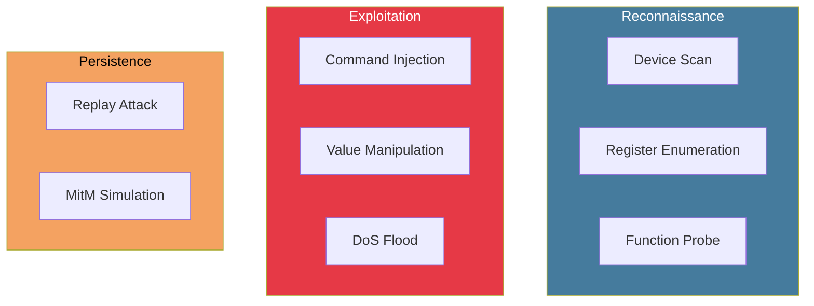
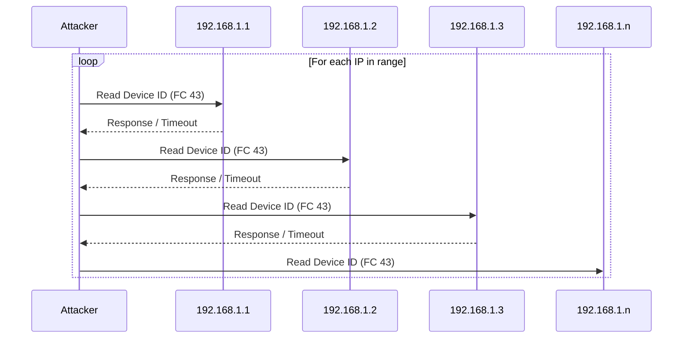
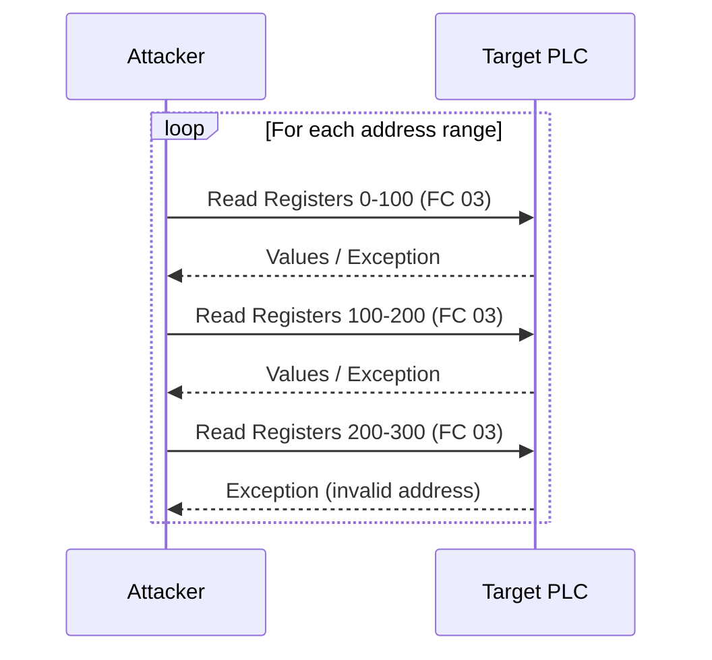
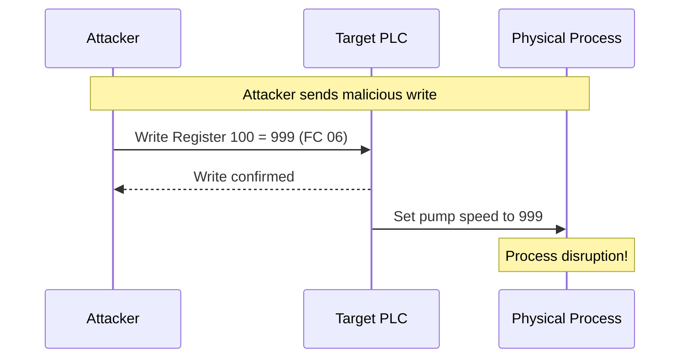

# Attack Scenarios

Pre-built attack scenarios for testing the detection engine.

## Available Scenarios



## Scenario: Device Scan

Enumerate devices on the ICS network.

### Attack Pattern



### Configuration

```yaml
# attacks/device_scan.yaml
name: "device_scan"
description: "Enumerate Modbus devices on subnet"
mitre_technique: "T0846"

parameters:
  target_subnet: "192.168.1.0/24"
  scan_rate: 10  # IPs per second
  function_code: 43  # Read Device Identification
  timeout_ms: 500

phases:
  - name: "scan"
    duration_seconds: 60
    actions:
      - type: "sequential_ip_scan"
        start_ip: "192.168.1.1"
        end_ip: "192.168.1.254"
```

### Expected Detection

| Feature | Normal | During Attack |
|---------|--------|---------------|
| `unique_destinations_5m` | 5-10 | 50+ |
| `scan_score_15m` | < 0.1 | > 0.8 |
| `failed_connections_5m` | 0-2 | 200+ |

**Alert:** `RECONNAISSANCE` severity `HIGH`

---

## Scenario: Register Enumeration

Discover register addresses and values.

### Attack Pattern



### Configuration

```yaml
# attacks/register_enum.yaml
name: "register_enumeration"
description: "Enumerate all registers on target PLC"
mitre_technique: "T0861"

parameters:
  target_ip: "192.168.1.10"
  target_unit_id: 1
  scan_rate: 50  # Requests per second
  register_step: 100

phases:
  - name: "holding_registers"
    duration_seconds: 30
    actions:
      - type: "register_scan"
        function_code: 3
        start_address: 0
        end_address: 10000
        quantity: 100

  - name: "input_registers"
    duration_seconds: 30
    actions:
      - type: "register_scan"
        function_code: 4
        start_address: 0
        end_address: 10000
        quantity: 100
```

### Expected Detection

| Feature | Normal | During Attack |
|---------|--------|---------------|
| `unique_registers_5m` | 10-50 | 500+ |
| `read_count_1m` | 60 | 3000+ |
| `function_code_entropy_5m` | Low | Medium |

**Alert:** `RECONNAISSANCE` severity `MEDIUM`

---

## Scenario: Command Injection

Send unauthorized write commands.

### Attack Pattern



### Configuration

```yaml
# attacks/command_injection.yaml
name: "command_injection"
description: "Inject malicious write commands"
mitre_technique: "T0855"

parameters:
  target_ip: "192.168.1.10"
  target_unit_id: 1

phases:
  - name: "single_write"
    duration_seconds: 10
    actions:
      - type: "write_register"
        function_code: 6
        address: 100
        value: 999  # Out of normal range

  - name: "multiple_writes"
    duration_seconds: 20
    actions:
      - type: "write_multiple"
        function_code: 16
        address: 200
        values: [0, 0, 0, 0, 0]  # Clear all outputs
```

### Expected Detection

| Feature | Normal | During Attack |
|---------|--------|---------------|
| `write_count_1m` | 0-2 | 10+ |
| `read_write_ratio_5m` | > 50 | < 5 |
| `out_of_range_values_5m` | 0 | 1+ |

**Alert:** `VALUE_MANIPULATION` severity `CRITICAL`

---

## Scenario: DoS Flood

Overwhelm PLC with requests.

### Attack Pattern


### Configuration

```yaml
# attacks/dos_flood.yaml
name: "dos_flood"
description: "Flood target with requests"
mitre_technique: "T0814"

parameters:
  target_ip: "192.168.1.10"
  target_unit_id: 1
  flood_rate: 1000  # Requests per second

phases:
  - name: "flood"
    duration_seconds: 60
    actions:
      - type: "flood"
        function_code: 3
        address: 0
        quantity: 10
```

### Expected Detection

| Feature | Normal | During Attack |
|---------|--------|---------------|
| `msg_count_1m` | 60 | 60000+ |
| `burst_score_1m` | < 0.2 | > 0.9 |
| `iat_mean_1m` | 1000ms | 1ms |

**Alert:** `TIMING_ANOMALY` severity `CRITICAL`

---

## Scenario: Replay Attack

Replay captured legitimate traffic.

### Configuration

```yaml
# attacks/replay.yaml
name: "replay_attack"
description: "Replay captured traffic"
mitre_technique: "T0839"

parameters:
  pcap_file: "captured_traffic.pcap"
  target_offset_ip: "0.0.0.0"  # Keep original IPs
  speed_multiplier: 1.0

phases:
  - name: "replay"
    duration_seconds: 300
    actions:
      - type: "pcap_replay"
        file: "{{ pcap_file }}"
        multiplier: "{{ speed_multiplier }}"
```

---

## Running Attacks

### Via API

```bash
# Start an attack scenario
curl -X POST http://localhost:8081/attack/start \
  -H "Content-Type: application/json" \
  -d '{
    "scenario": "device_scan",
    "parameters": {
      "target_subnet": "192.168.1.0/24",
      "scan_rate": 20
    }
  }'

# Check attack status
curl http://localhost:8081/attack/status

# Stop attack
curl -X POST http://localhost:8081/attack/stop
```

### Via CLI

```bash
# Run scenario
./simulator attack run device_scan \
  --target-subnet 192.168.1.0/24 \
  --rate 20

# List available scenarios
./simulator attack list

# Show scenario details
./simulator attack describe command_injection
```

## Creating Custom Scenarios

```yaml
# attacks/custom.yaml
name: "my_custom_attack"
description: "Custom attack scenario"
mitre_technique: "T0000"

parameters:
  target_ip:
    type: string
    required: true
  intensity:
    type: float
    default: 1.0
    min: 0.1
    max: 10.0

phases:
  - name: "phase_1"
    duration_seconds: 30
    actions:
      - type: "custom_action"
        script: |
          # Python code for custom attack logic
          for i in range(100):
              send_modbus_read(target_ip, address=i*10)
              await sleep(1 / intensity)
```
