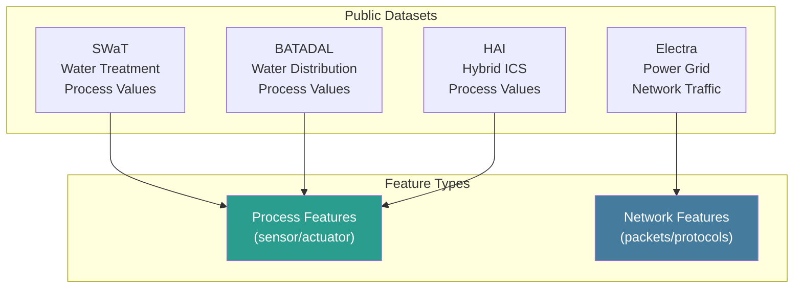
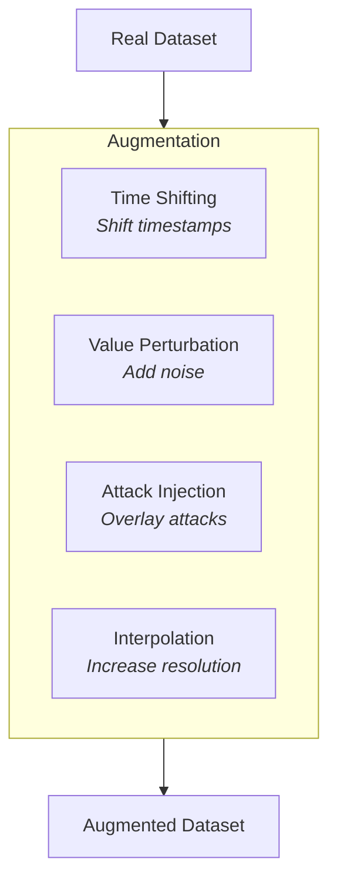

# Datasets

Public and synthetic datasets for training and evaluation.

## Public ICS Datasets

### SWaT (Secure Water Treatment)

The most widely-used ICS security dataset.

| Attribute | Value |
|-----------|-------|
| Source | iTrust, SUTD |
| Domain | Water treatment |
| Duration | 11 days (7 normal, 4 attack) |
| Attacks | 36 attack scenarios |
| Size | ~950MB |
| Format | CSV |

**Download:** [iTrust Datasets](https://itrust.sutd.edu.sg/itrust-labs_datasets/)

```python
# Load SWaT dataset
import pandas as pd

swat = pd.read_csv("SWaT_Dataset_Attack_v0.csv")

# Columns include:
# - Timestamp
# - Sensor values (LIT101, FIT201, etc.)
# - Actuator states (MV101, P101, etc.)
# - Attack label (Normal/Attack)
```

**Attack Types:**
- Single-stage attacks (sensor manipulation)
- Multi-stage attacks (coordinated)
- Stealthy attacks (gradual changes)

### BATADAL (Battle of the Attack Detection Algorithms)

Water distribution network dataset with labeled attacks.

| Attribute | Value |
|-----------|-------|
| Source | University of Exeter |
| Domain | Water distribution |
| Duration | 1 year simulation |
| Attacks | 14 attack scenarios |
| Format | CSV |

**Download:** [BATADAL Website](https://www.batadal.net/)

### HAI (HIL-based Augmented ICS)

Hardware-in-the-loop testbed data.

| Attribute | Value |
|-----------|-------|
| Source | NIST |
| Domain | Power/Water hybrid |
| Duration | Multiple runs |
| Attacks | Various scenarios |
| Format | CSV |

### Electra Dataset

Power grid ICS dataset.

| Attribute | Value |
|-----------|-------|
| Source | Mississippi State |
| Domain | Power grid |
| Protocol | DNP3, Modbus |
| Format | PCAP |

## Dataset Comparison



## Using Datasets

### Loading SWaT for Training

```python
from pathlib import Path
import pandas as pd
import numpy as np

def load_swat_dataset(path: Path) -> tuple[np.ndarray, np.ndarray]:
    """Load and preprocess SWaT dataset."""

    df = pd.read_csv(path)

    # Select sensor/actuator columns (exclude timestamp, label)
    feature_cols = [c for c in df.columns if c not in ["Timestamp", "Normal/Attack"]]

    # Handle missing values
    df[feature_cols] = df[feature_cols].fillna(method="ffill")

    # Convert to numpy
    X = df[feature_cols].values.astype(np.float32)

    # Labels: 0=Normal, 1=Attack
    y = (df["Normal/Attack"] == "Attack").astype(np.int32).values

    return X, y

# Split by time (no shuffle for time series)
def temporal_train_test_split(X, y, test_ratio=0.2):
    split_idx = int(len(X) * (1 - test_ratio))
    return X[:split_idx], X[split_idx:], y[:split_idx], y[split_idx:]
```

### Converting PCAP to Features

For network-based datasets:

```python
from scapy.all import rdpcap, TCP

def pcap_to_features(pcap_path: str) -> pd.DataFrame:
    """Extract features from PCAP file."""

    packets = rdpcap(pcap_path)
    records = []

    for pkt in packets:
        if TCP in pkt and pkt[TCP].dport == 502:  # Modbus
            record = {
                "timestamp": float(pkt.time),
                "src_ip": pkt.src,
                "dst_ip": pkt.dst,
                "src_port": pkt[TCP].sport,
                "dst_port": pkt[TCP].dport,
                "payload_len": len(pkt[TCP].payload),
            }

            # Parse Modbus if payload exists
            if len(pkt[TCP].payload) >= 8:
                payload = bytes(pkt[TCP].payload)
                record["function_code"] = payload[7]

            records.append(record)

    return pd.DataFrame(records)
```

## Synthetic Data Generation

For scenarios not covered by public datasets:

### Augmentation Strategies



### Attack Injection

```python
def inject_attack(
    df: pd.DataFrame,
    attack_type: str,
    start_idx: int,
    duration: int
) -> pd.DataFrame:
    """Inject synthetic attack into dataset."""

    df = df.copy()
    end_idx = start_idx + duration

    if attack_type == "sensor_spike":
        # Sudden value spike
        col = "LIT101"  # Tank level sensor
        df.loc[start_idx:end_idx, col] *= 2.0

    elif attack_type == "gradual_drift":
        # Slow drift over time
        col = "FIT201"  # Flow sensor
        drift = np.linspace(0, 0.5, duration)
        df.loc[start_idx:end_idx, col] *= (1 + drift)

    elif attack_type == "replay":
        # Replay historical values
        replay_source = df.loc[start_idx-1000:start_idx-1000+duration]
        df.loc[start_idx:end_idx] = replay_source.values

    # Update labels
    df.loc[start_idx:end_idx, "label"] = "Attack"
    df.loc[start_idx:end_idx, "attack_type"] = attack_type

    return df
```

## Dataset Schema

Our system expects data in this schema:

### Feature Dataset (TimescaleDB)

```sql
CREATE TABLE training_data (
    time            TIMESTAMPTZ NOT NULL,
    key             TEXT NOT NULL,        -- src_ip:dst_ip
    protocol        TEXT NOT NULL,
    features        JSONB NOT NULL,       -- Feature vector
    label           TEXT,                 -- NULL, "normal", "attack"
    attack_type     TEXT,                 -- If attack: type name
    source_dataset  TEXT,                 -- "swat", "batadal", "synthetic"
    PRIMARY KEY (time, key)
);
```

### Label Schema

```json
{
  "label": "attack",
  "attack_type": "command_injection",
  "mitre_technique": "T0855",
  "severity": "critical",
  "description": "Unauthorized write to pump control register",
  "ground_truth_source": "manual_annotation"
}
```

## Data Quality Checks

```python
def validate_dataset(df: pd.DataFrame) -> dict:
    """Validate dataset quality."""

    issues = []

    # Check for missing timestamps
    if df["timestamp"].isna().any():
        issues.append("Missing timestamps")

    # Check for duplicate timestamps
    if df["timestamp"].duplicated().any():
        issues.append("Duplicate timestamps")

    # Check time ordering
    if not df["timestamp"].is_monotonic_increasing:
        issues.append("Timestamps not monotonic")

    # Check feature ranges
    for col in feature_columns:
        if df[col].isna().sum() > len(df) * 0.01:
            issues.append(f"High missing rate in {col}")

    # Check label balance
    if "label" in df.columns:
        attack_ratio = (df["label"] == "attack").mean()
        if attack_ratio < 0.001 or attack_ratio > 0.5:
            issues.append(f"Unusual attack ratio: {attack_ratio:.2%}")

    return {
        "valid": len(issues) == 0,
        "issues": issues,
        "stats": {
            "rows": len(df),
            "time_range": (df["timestamp"].min(), df["timestamp"].max()),
            "attack_ratio": attack_ratio if "label" in df.columns else None
        }
    }
```
