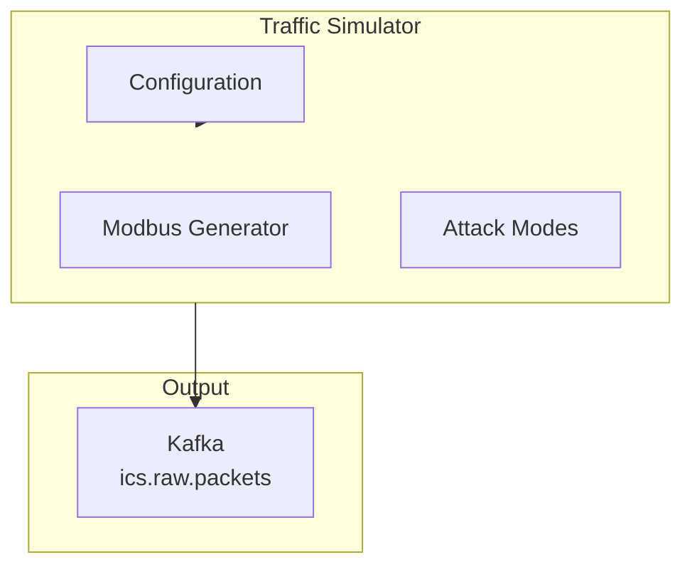

# Traffic Generator

Generate realistic ICS network traffic for testing and development.

## Overview

The simulator is a Python FastAPI service that generates synthetic Modbus traffic and publishes directly to Kafka. It runs continuously and can be configured to simulate normal traffic or attack scenarios.



## Quick Start

```bash
# Start the full pipeline (includes simulator)
make dev

# Or run simulator standalone
docker compose up simulator

# Check simulator status
curl http://localhost:8083/status

# View health
curl http://localhost:8083/health
```

## Configuration

### Environment Variables

| Variable             | Default           | Description             |
| -------------------- | ----------------- | ----------------------- |
| `KAFKA_BROKERS`      | `localhost:9092`  | Kafka bootstrap servers |
| `KAFKA_TOPIC`        | `ics.raw.packets` | Output topic            |
| `SIMULATOR_RATE`     | `100`             | Messages per second     |
| `SIMULATOR_PROTOCOL` | `modbus`          | Protocol to simulate    |
| `METRICS_PORT`       | `8083`            | API/metrics port        |

### Simulated Devices

The simulator includes pre-configured device profiles:

**PLCs (Modbus Slaves):**
| IP | Unit ID | Type | Register Range |
|----|---------|------|----------------|
| 192.168.1.10 | 1 | PLC | 0-100 |
| 192.168.1.11 | 2 | PLC | 100-200 |
| 192.168.1.12 | 3 | PLC | 200-300 |
| 192.168.1.20 | 1 | RTU | 0-50 |

**HMIs (Modbus Masters):**
| IP | Type |
|----|------|
| 192.168.1.100 | HMI |
| 192.168.1.101 | HMI |

## Modbus Traffic Generation

### Function Code Distribution

Normal traffic follows weighted distribution:

| Function Code | Name                     | Weight |
| ------------- | ------------------------ | ------ |
| 0x03          | Read Holding Registers   | 60%    |
| 0x04          | Read Input Registers     | 20%    |
| 0x06          | Write Single Register    | 10%    |
| 0x10          | Write Multiple Registers | 5%     |
| 0x01          | Read Coils               | 3%     |
| 0x05          | Write Single Coil        | 2%     |

### Message Structure

Generated messages include full MBAP header and PDU:

```python
{
    "timestamp": "2024-01-15T10:30:00.123456+00:00",
    "src_ip": "192.168.1.100",      # HMI
    "dst_ip": "192.168.1.10",        # PLC
    "src_port": 52341,               # Ephemeral
    "dst_port": 502,                 # Modbus
    "protocol": "tcp",
    "ics_protocol": "modbus",
    "payload_size": 12,
    "payload_hex": "0001000006010300640005"
}
```

## API Endpoints

### Health Check

```http
GET http://localhost:8083/health
```

```json
{
  "status": "healthy",
  "running": true
}
```

### Status

```http
GET http://localhost:8083/status
```

```json
{
  "running": true,
  "rate": 100,
  "protocol": "modbus",
  "attack_mode": null
}
```

### Configure Traffic

```http
POST http://localhost:8083/config
Content-Type: application/json

{
  "rate": 200,
  "protocol": "modbus"
}
```

### Start Attack Mode

```http
POST http://localhost:8083/attack/start
Content-Type: application/json

{
  "mode": "reconnaissance"
}
```

Available modes: `reconnaissance`, `write_attack`, `replay`, `dos`

### Stop Attack

```http
POST http://localhost:8083/attack/stop
```

### Prometheus Metrics

```http
GET http://localhost:8083/metrics
```

Exposes:

- `simulator_messages_sent_total{protocol}` - Total messages by protocol
- `simulator_errors_total` - Error count
- `simulator_message_latency_seconds` - Generation latency

## Attack Modes

### Reconnaissance

Simulates device scanning with Read Device Identification (FC 0x2B):

```bash
curl -X POST http://localhost:8083/attack/start \
  -H "Content-Type: application/json" \
  -d '{"mode": "reconnaissance"}'
```

**Detection signals:**

- Function code 0x2B (unusual)
- High scan_score
- Increased unique destinations

### Write Attack

Simulates unauthorized writes:

```bash
curl -X POST http://localhost:8083/attack/start \
  -H "Content-Type: application/json" \
  -d '{"mode": "write_attack"}'
```

**Detection signals:**

- Elevated write operations (FC 5, 6, 16)
- Low read/write ratio
- Unusual write patterns

## Example Usage

```bash
# Start normal traffic at 50 msg/sec
curl -X POST http://localhost:8083/config \
  -H "Content-Type: application/json" \
  -d '{"rate": 50}'

# Monitor status
watch -n 1 'curl -s http://localhost:8083/status | jq'

# Start reconnaissance attack
curl -X POST http://localhost:8083/attack/start \
  -H "Content-Type: application/json" \
  -d '{"mode": "reconnaissance"}'

# Watch for anomalies in Kafka UI (localhost:8080)

# Stop attack
curl -X POST http://localhost:8083/attack/stop
```
