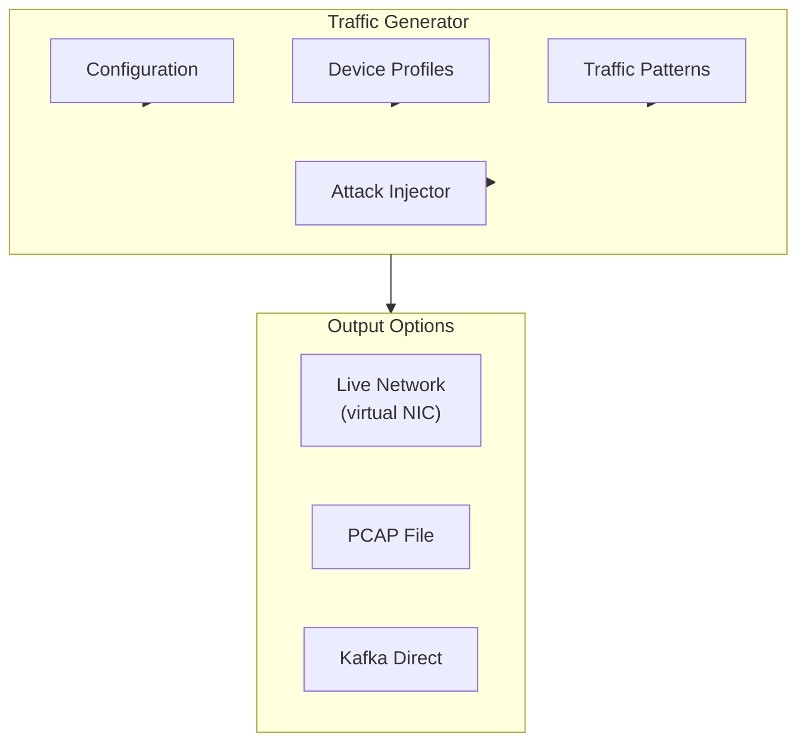

# Traffic Generator

Generate realistic ICS network traffic for testing and development.

## Overview



## Quick Start

```bash
# Start generator with default config
docker compose run simulator

# Generate 1 hour of normal Modbus traffic
curl -X POST http://localhost:8081/traffic/generate \
  -H "Content-Type: application/json" \
  -d '{
    "protocol": "modbus",
    "duration_minutes": 60,
    "rate_per_second": 100
  }'
```

## Configuration

### Device Profiles

Define simulated ICS devices:

```yaml
# profiles/water_treatment.yaml
devices:
  - id: "plc-01"
    type: "plc"
    ip: "192.168.1.10"
    protocol: "modbus"
    unit_id: 1
    registers:
      - address: 0
        count: 10
        type: "holding"
        description: "Tank levels"
        range: [0, 1000]
      - address: 100
        count: 5
        type: "input"
        description: "Flow rates"
        range: [0, 500]

  - id: "plc-02"
    type: "plc"
    ip: "192.168.1.11"
    protocol: "modbus"
    unit_id: 2
    registers:
      - address: 0
        count: 20
        type: "holding"
        description: "Pump controls"
        range: [0, 1]  # Binary

  - id: "hmi-01"
    type: "hmi"
    ip: "192.168.1.100"
    polls:
      - target: "plc-01"
        function: 3  # Read holding registers
        interval_ms: 1000
      - target: "plc-02"
        function: 3
        interval_ms: 500
```

### Traffic Patterns

Define normal traffic behavior:

```yaml
# patterns/normal.yaml
patterns:
  - name: "periodic_polling"
    description: "HMI polls PLCs at fixed intervals"
    weight: 0.7  # 70% of traffic
    timing:
      type: "periodic"
      interval_ms: 1000
      jitter_ms: 50  # ±50ms variation

  - name: "operator_interaction"
    description: "Occasional operator writes"
    weight: 0.05
    timing:
      type: "poisson"
      lambda: 0.01  # ~1 per 100 seconds
    operations:
      - function: 6  # Write single register
        probability: 0.8
      - function: 16  # Write multiple registers
        probability: 0.2

  - name: "shift_change"
    description: "Increased activity during shift changes"
    weight: 0.25
    timing:
      type: "scheduled"
      windows:
        - start: "06:00"
          end: "07:00"
        - start: "14:00"
          end: "15:00"
        - start: "22:00"
          end: "23:00"
```

## Generator Implementation

### Core Generator

```python
import asyncio
from dataclasses import dataclass

@dataclass
class GeneratorConfig:
    protocol: str
    rate_per_second: float
    duration_seconds: int
    profile_path: str
    pattern_path: str
    output: str  # "network", "pcap", "kafka"

class TrafficGenerator:
    def __init__(self, config: GeneratorConfig):
        self.config = config
        self.profile = load_profile(config.profile_path)
        self.patterns = load_patterns(config.pattern_path)
        self.output = self._create_output(config.output)

    async def generate(self):
        """Main generation loop."""
        start_time = time.time()
        end_time = start_time + self.config.duration_seconds

        while time.time() < end_time:
            # Select pattern based on weights and time
            pattern = self._select_pattern()

            # Generate message according to pattern
            message = self._generate_message(pattern)

            # Send to output
            await self.output.send(message)

            # Wait according to rate
            await asyncio.sleep(1 / self.config.rate_per_second)

    def _select_pattern(self) -> Pattern:
        """Select traffic pattern based on weights and current time."""
        current_time = datetime.now().time()

        # Filter patterns active at current time
        active_patterns = [
            p for p in self.patterns
            if p.is_active(current_time)
        ]

        # Weighted random selection
        weights = [p.weight for p in active_patterns]
        return random.choices(active_patterns, weights=weights)[0]

    def _generate_message(self, pattern: Pattern) -> bytes:
        """Generate a protocol message based on pattern."""
        # Select source and destination
        src = self._select_source(pattern)
        dst = self._select_destination(pattern)

        # Generate timing
        timestamp = self._generate_timestamp(pattern.timing)

        # Generate protocol-specific content
        if self.config.protocol == "modbus":
            return self._generate_modbus(src, dst, pattern)
        elif self.config.protocol == "dnp3":
            return self._generate_dnp3(src, dst, pattern)
```

### Modbus Generator

```python
class ModbusGenerator:
    def generate_request(
        self,
        src: Device,
        dst: Device,
        function_code: int,
        **kwargs
    ) -> bytes:
        """Generate a Modbus TCP request."""

        # MBAP Header
        transaction_id = self._next_transaction_id()
        protocol_id = 0x0000
        unit_id = dst.unit_id

        # PDU based on function code
        if function_code == 3:  # Read Holding Registers
            address = kwargs.get("address", 0)
            quantity = kwargs.get("quantity", 10)
            pdu = struct.pack(">BHH", function_code, address, quantity)

        elif function_code == 6:  # Write Single Register
            address = kwargs.get("address", 0)
            value = kwargs.get("value", self._generate_value(dst, address))
            pdu = struct.pack(">BHH", function_code, address, value)

        elif function_code == 16:  # Write Multiple Registers
            address = kwargs.get("address", 0)
            values = kwargs.get("values", [0] * 10)
            pdu = struct.pack(
                f">BHH B{'H' * len(values)}",
                function_code, address, len(values),
                len(values) * 2, *values
            )

        # Combine MBAP + PDU
        length = len(pdu) + 1  # +1 for unit_id
        mbap = struct.pack(">HHHB", transaction_id, protocol_id, length, unit_id)

        return mbap + pdu

    def generate_response(self, request: bytes, dst: Device) -> bytes:
        """Generate a Modbus response for a request."""
        # Parse request
        transaction_id = struct.unpack(">H", request[0:2])[0]
        function_code = request[7]

        if function_code == 3:  # Read Holding Registers
            address = struct.unpack(">H", request[8:10])[0]
            quantity = struct.unpack(">H", request[10:12])[0]

            # Generate values based on device state
            values = self._get_register_values(dst, address, quantity)
            byte_count = quantity * 2

            pdu = struct.pack(
                f">BB{'H' * quantity}",
                function_code, byte_count, *values
            )

        # Build response
        length = len(pdu) + 1
        mbap = struct.pack(">HHHB", transaction_id, 0, length, dst.unit_id)

        return mbap + pdu
```

## Output Modes

### Network Output (Virtual NIC)

```python
from scapy.all import sendp, Ether, IP, TCP

class NetworkOutput:
    def __init__(self, interface: str = "lo"):
        self.interface = interface

    async def send(self, message: GeneratedMessage):
        """Send message as raw packet."""
        packet = (
            Ether() /
            IP(src=message.src_ip, dst=message.dst_ip) /
            TCP(sport=message.src_port, dport=message.dst_port) /
            message.payload
        )
        sendp(packet, iface=self.interface, verbose=False)
```

### PCAP Output

```python
from scapy.all import PcapWriter

class PcapOutput:
    def __init__(self, filename: str):
        self.writer = PcapWriter(filename, append=True, sync=True)

    async def send(self, message: GeneratedMessage):
        """Write message to PCAP file."""
        packet = self._build_packet(message)
        self.writer.write(packet)
```

### Kafka Output

```python
class KafkaOutput:
    def __init__(self, bootstrap_servers: str, topic: str):
        self.producer = KafkaProducer(bootstrap_servers=bootstrap_servers)
        self.topic = topic

    async def send(self, message: GeneratedMessage):
        """Send parsed message directly to Kafka."""
        # Skip network layer, send structured data
        self.producer.send(
            self.topic,
            key=f"{message.src_ip}:{message.dst_ip}".encode(),
            value=message.to_json().encode()
        )
```

## Realistic Variations

### Value Simulation

Process values follow realistic patterns:

```python
class ValueSimulator:
    """Simulate realistic process values."""

    def __init__(self, config: dict):
        self.config = config
        self.state = {}

    def get_value(self, register: Register, timestamp: datetime) -> int:
        """Generate a realistic value for a register."""

        if register.type == "level":
            # Tank level with slow drift
            return self._simulate_level(register, timestamp)

        elif register.type == "flow":
            # Flow rate with noise
            return self._simulate_flow(register, timestamp)

        elif register.type == "temperature":
            # Temperature with daily cycle
            return self._simulate_temperature(register, timestamp)

        elif register.type == "binary":
            # On/off state
            return self._simulate_binary(register, timestamp)

    def _simulate_level(self, register: Register, timestamp: datetime) -> int:
        """Simulate tank level with fill/drain cycles."""
        # Sinusoidal pattern with noise
        period_hours = register.config.get("period_hours", 4)
        phase = (timestamp.hour * 60 + timestamp.minute) / (period_hours * 60) * 2 * np.pi

        base_level = register.range[0] + (register.range[1] - register.range[0]) / 2
        amplitude = (register.range[1] - register.range[0]) / 4

        value = base_level + amplitude * np.sin(phase)
        noise = np.random.normal(0, amplitude * 0.05)

        return int(np.clip(value + noise, register.range[0], register.range[1]))
```

### Timing Jitter

```python
class TimingSimulator:
    """Add realistic timing variations."""

    def add_jitter(self, base_interval_ms: float, jitter_ms: float) -> float:
        """Add Gaussian jitter to interval."""
        jitter = np.random.normal(0, jitter_ms / 3)  # 99.7% within ±jitter_ms
        return max(base_interval_ms + jitter, 1)  # Minimum 1ms

    def add_network_delay(self, base_delay_ms: float = 1) -> float:
        """Simulate network propagation delay."""
        # Log-normal distribution for network delay
        return np.random.lognormal(np.log(base_delay_ms), 0.5)
```
